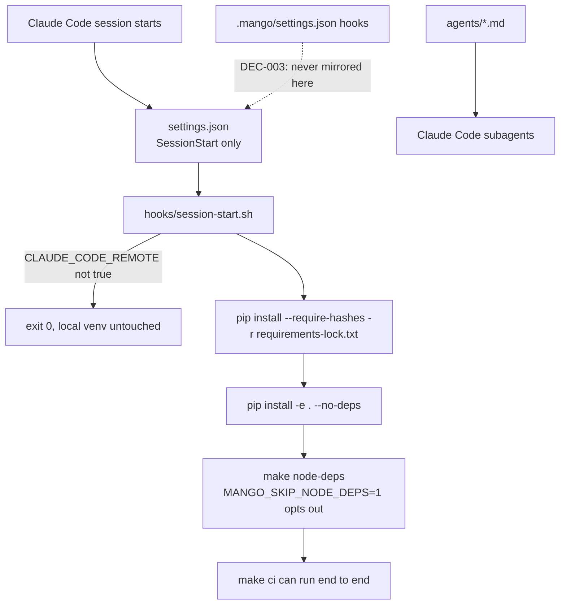

# AGENTS.md — Claude Code project settings

**Scope:** `settings.json`, `hooks/session-start.sh`, `agents/`, `rules/`
**Owner:** nemotron-reasoner → implementer; this is the only directory Claude Code itself reads
**Protected path:** partly — `.claude/settings.json`, `.claude/settings.local.json`, `.claude/hooks/**` and `.claude/agents/**` each match a `protected_paths` pattern and need `ALLOW_GITHUB_CHANGES=1`, the `infra-reviewed` label and an attestation row. The `.claude/` root and `rules/` do not.
**Reviewed:** 2026-09-19

## What this does

This is the file Claude Code actually reads, which is the whole reason the
directory matters. `settings.json` registers one hook and one hook only — the
SessionStart dependency install — because everything else a session could be
made to do is a behaviour change for every session and a human decision. The
install itself is the CI recipe verbatim: a session that cannot run `make ci`
cannot be trusted to report on it, so the hook fails loudly rather than leaving
a half-provisioned container.

## Map

## Key files

| File | Role |
| --- | --- |
| `settings.json` | Registers the SessionStart hook and nothing else, by deliberate comment. The `.mango/` tool-guard hooks are not mirrored here. |
| `hooks/session-start.sh` | Installs the Python lock with `--require-hashes`, then `-e . --no-deps`, then `make node-deps`. Synchronous on purpose. |
| `agents/` | Claude Code subagent definitions — `directory-doc-author` and `directory-doc-auditor`, each with its own `tools:` allowlist. Not the governed persona set; that is `.mango/agents/`. |
| `rules/` | Path-scoped authoring rules (`docs-specs.md`, `docs-decisions.md`) that attach by glob to the tree they describe. |

## Invariants

- **The `.mango` lifecycle hooks stay out of this file.**
  `test_mango_hooks_stay_dormant` scans every command bound here and fails on
  any `.mango/hooks` path. Binding one reverses DEC-003.
- **Every declared hook command names a script that exists**, in *both* settings
  files (`test_every_declared_hook_names_a_script_that_exists`), and every
  command is routed through `bash` because the scripts are mode 644
  (`test_hook_scripts_share_one_mode_convention`).
- **The install is the CI recipe, not an approximation**
  (`test_the_python_install_is_the_ci_recipe`,
  `test_node_install_shares_the_ci_recipe`). A failed step names itself on
  stderr and exits non-zero (`test_a_failed_install_is_named_and_fails_the_hook`).
- **`gitleaks` is the one declared gap**
  (`test_gitleaks_is_the_one_declared_gap`): the hook does not install it, CI
  does, and `make secrets` fails closed without it.

## Commands

| Task | Command |
| --- | --- |
| Install Node deps, the way the hook does | `make node-deps` |
| Full deterministic gate the hook provisions for | `make ci` |
| Every governance-marked gate | `make test-governance` |
| Install the pinned gitleaks the hook skips | `make secrets-install` |

## Agents and skills

| Stage | Agent | Skills |
| --- | --- | --- |
| plan | `.mango/agents/planner.md` | `spec-authoring`, `openspec-peer-review` |
| build | `.mango/agents/nemotron-reasoner.md` | `harness-engineering`, `protected-path-attestation` |
| verify | `.mango/agents/verifier.md` | `validation-runner`, `repo-invariant-review` |

## Gotchas

- **`.mango/settings.json` is not read by anything.** If you are hunting a hook
  that is not firing, this file is where it would have to be bound, and
  DEC-003 says it is not. Declaring a guard there and expecting it to run is
  the most expensive mistake available in this tree.
- **The hook is a no-op on a workstation.** It exits 0 unless
  `CLAUDE_CODE_REMOTE=true`, so nothing you observe locally proves the remote
  path works. Read the script, not your shell.
- **Installing in the background would be worse.** An agent may run `make ci`
  on its first turn; the race between that and a backgrounded install is
  exactly the failure the synchronous install prevents. Do not "optimise" it.
- **A missing `pnpm` is survivable, a missing lock is not.** No `pnpm` skips
  Node deps with a warning and exit 0; a failed hashed install exits 1, because
  ruff, mypy and pytest would be absent and no gate could be trusted.
- **`agents/` here is not `.mango/agents/`.** These are Claude Code subagents
  with no broker-enforced grant and no entry in `ACTIVE_TO_CANONICAL`; the
  governed three-role loop is defined in `.mango/agents/`, whose `*.md`
  namespace is asserted to hold exactly those three personas.
