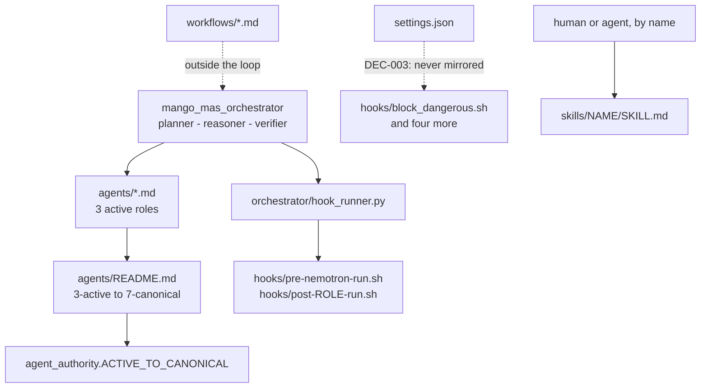

# AGENTS.md — Mango agent surface

**Scope:** `settings.json`, `agents/`, `hooks/`, `skills/`, `workflows/`
**Owner:** planner → orchestrator; every subdirectory here is a control surface, not a feature
**Protected path:** partly — `.mango/agents/**`, `.mango/hooks/**`, `.mango/skills/**`, `.mango/settings.json` and `.mango/settings.local.json` each match a `protected_paths` pattern; the `.mango/` root itself and `.mango/workflows/` do not. A write to a protected member needs `ALLOW_GITHUB_CHANGES=1`, the `infra-reviewed` label and an attestation row.
**Reviewed:** 2026-09-19

## What this does

This is where the repository declares *who the agents are and what may fire*,
separately from the code that enforces it. Nothing under here executes on its
own: the orchestrator loads personas by name, `HookRunner` fires scripts by
name, and a human or agent invokes a skill by name in prose. That indirection is
the hazard — a file here can be perfectly written and reach nothing at all, and
the tree gives no signal. Read the protected-path line before editing anything.

## Map

## Key files

| File | Role |
| --- | --- |
| `settings.json` | Claude Code hook bindings that are **dormant by DEC-003** — declared here and deliberately not mirrored into `.claude/settings.json`, the file Claude Code reads. |
| `agents/` | The active persona set. Its `*.md` namespace *is* the role list; see its own README rather than adding files. |
| `agents/README.md` | The authoritative 3-active → 7-canonical mapping, derived exposure table and `EXECUTION_IDENTITY` rationale. |
| `agents/hooks.json` | The `tier-a-enforcement` profile binding the `scripts/` shims. Read by no runtime in this repository. |
| `hooks/` | Two disjoint populations: dormant lifecycle hooks and the live orchestrator post-turn recorders. |
| `skills/` | The one skill root, 17 skills, invoked by name. Not auto-discovered by Claude Code. |
| `workflows/` | `sdlc-orchestrator` and `narrow-critic` — workflow agents, explicitly outside the execution loop. |

## Invariants

- **The persona namespace is closed in both directions.**
  `test_every_active_role_has_a_persona_file` and
  `test_every_persona_file_is_a_declared_active_role` compare `agents/*.md`
  (minus `README`) against `agent_authority.ACTIVE_TO_CANONICAL`. Adding *any*
  other `.md` there fails the second one.
- **`.mango/skills` is the only skill root**
  (`test_no_skill_directory_exists_outside_dot_mango`). A second root reads as
  authoritative and confers nothing.
- **Hook commands in both settings files route through `bash`**
  (`test_every_declared_hook_command_is_routed_through_bash`) because every
  tracked `.sh` here is mode 644.
- **No hard-coded thresholds.** Everything numeric comes from
  `harness/shared/governance-policy.json` through `policy_loader`.

## Commands

| Task | Command |
| --- | --- |
| Governance validators | `make validate` |
| Every governance-marked gate | `make test-governance` |
| Full deterministic gate | `make ci` |
| Pre-PR review checklist | `make review` |

## Agents and skills

| Stage | Agent | Skills |
| --- | --- | --- |
| plan | `.mango/agents/planner.md` | `spec-authoring`, `openspec-peer-review` |
| build | `.mango/agents/nemotron-reasoner.md` | `harness-engineering`, `protected-path-attestation` |
| verify | `.mango/agents/verifier.md` | `validation-runner`, `repo-invariant-review` |

## Gotchas

- **The hooks in `settings.json` do nothing.** PreToolUse, Stop, PreCompact and
  SessionStart are all declared, all point at real scripts, and none of them
  ever run: DEC-003 keeps them out of `.claude/settings.json`, and
  `test_mango_hooks_stay_dormant` fails the moment one is bound there. This is
  the single biggest trap in the tree — a reader sees a guard that is not a
  guard. Waking one is a human decision in its own reviewed change.
- **Do not add a file to `agents/`.** Several suites read that directory, and its
  `*.md` set is asserted to equal the active-role list exactly. A note, a
  template or a second README lands as an undeclared role holding the empty
  grant. This document covers `agents/` on purpose.
- **Adding a skill is three edits, not one.** The directory, the root README's
  "(N) reusable skills" count, and the README layout tree — plus a
  `WIRED_SKILLS` or `STANDALONE_SKILLS` entry in
  `test_agent_surface_liveness.py`, where a standalone reason under 120
  characters fails.
- **`.mango/.state/` is runtime, not source.** Hooks create it; `.gitignore`
  covers it; `test_precompact_hook_writes_only_into_ignored_state` pins that the
  PreCompact hook writes nowhere else.
