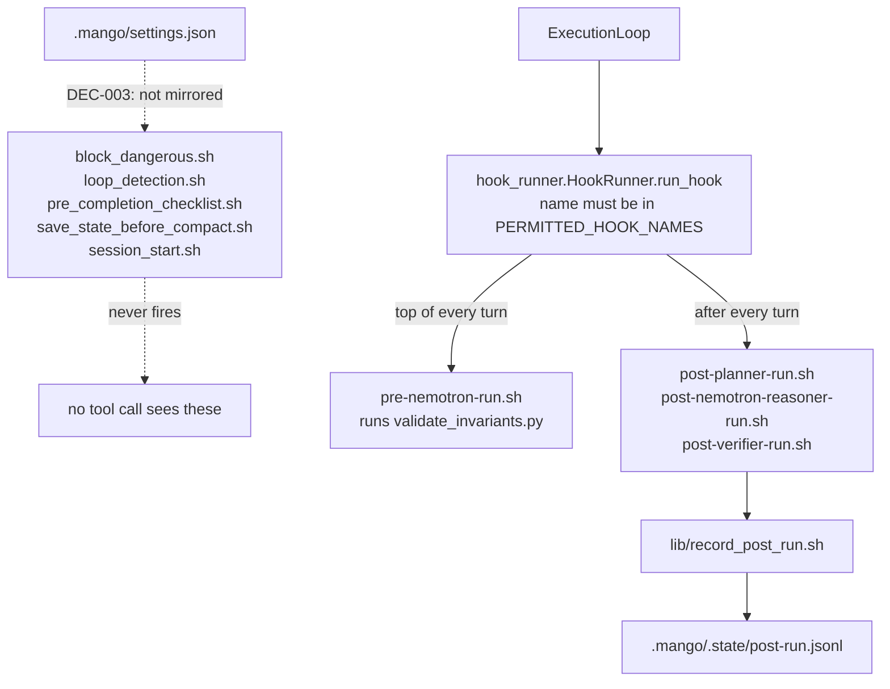

# AGENTS.md — Mango hook scripts

**Scope:** `pre-nemotron-run.sh`, `post-verifier-run.sh`, `lib/record_post_run.sh`, `block_dangerous.sh`
**Owner:** nemotron-reasoner → implementer; a change here changes what fires around every agent turn
**Protected path:** yes — `.mango/hooks/**`. A write needs `ALLOW_GITHUB_CHANGES=1`, the `infra-reviewed` label and an attestation row in the PR description.
**Reviewed:** 2026-09-19

## What this does

Two populations share one directory, and telling them apart is the whole job.
Five scripts are Claude Code lifecycle hooks that `.mango/settings.json`
declares and DEC-003 keeps dormant — correct, reviewed, and never executed.
Four are orchestrator hooks that `harness/shared/orchestrator/hook_runner.py`
fires on every agent turn, where *presence of the file on disk is the
enablement switch* (NS-21). Deleting one of those does not fail; it silently
stops the thing it was doing.

## Map

## Key files

| File | Role |
| --- | --- |
| `pre-nemotron-run.sh` | **Live.** Fired at the top of every agent turn; runs `harness/shared/validate_invariants.py` and exits non-zero if it is missing. |
| `post-verifier-run.sh` | **Live.** One of three post-turn entrypoints (`post-planner-run.sh` and `post-nemotron-reasoner-run.sh` are identical); each sources the shared body. |
| `lib/record_post_run.sh` | The shared body: appends one JSONL record of status, run id, agent and tool-call spend, encoded through `python3` so a value cannot break the line. |
| `block_dangerous.sh` | Dormant PreToolUse(Bash) deny for destructive command patterns. |
| `loop_detection.sh` | Dormant PreToolUse(Edit\|Write); asks for confirmation after four edits to one file. |
| `pre_completion_checklist.sh` | Dormant Stop hook forcing a verification pass before the turn ends. |
| `save_state_before_compact.sh` | Dormant PreCompact hook; writes only into the gitignored `.mango/.state/`. |
| `session_start.sh` | Dormant SessionStart hook; points the agent at CLAUDE.md, NEXT_STEPS.md and `docs/specs/`. |

## Invariants

- **Every script belongs to one of the two namespaces.**
  `test_every_hook_script_belongs_to_a_namespace` fails a script that is
  neither a name in `agent_prompts.PERMITTED_HOOK_NAMES` nor registered by
  `.mango/settings.json`; `test_the_partition_is_not_vacuous` keeps both halves
  non-empty.
- **The live hooks must exist on disk.** `run_hook` no-ops on a missing file,
  so only `test_the_live_pre_run_hook_exists_on_disk` and
  `test_every_live_post_run_hook_exists_on_disk` notice a deletion — and the
  first also asserts `pre-nemotron-run.sh` still names `validate_invariants.py`.
- **Mode 644, zero exceptions** (`test_hook_scripts_share_one_mode_convention`),
  which is why every declared command is routed through `bash`.
- **No hook may name a file that does not exist**
  (`test_hook_references_only_paths_that_exist`). `PLAN.md`, `NOTES.md` and
  `.mango/FAILURE_MEMORY.md` were all named here and none existed.

## Commands

| Task | Command |
| --- | --- |
| Every governance-marked gate | `make test-governance` |
| Governance validators | `make validate` |
| Full deterministic gate | `make ci` |
| Regression tier only | `make test-regression` |

## Agents and skills

| Stage | Agent | Skills |
| --- | --- | --- |
| plan | `.mango/agents/planner.md` | `spec-authoring`, `openspec-peer-review` |
| build | `.mango/agents/nemotron-reasoner.md` | `harness-engineering`, `protected-path-attestation` |
| verify | `.mango/agents/verifier.md` | `validation-runner`, `gate-mutation-proof` |

## Gotchas

- **Five of these scripts are inert.** They read as live guards and are not.
  `test_mango_hooks_stay_dormant` fails if one is bound in
  `.claude/settings.json`, so "fixing" a dormant hook by wiring it up reverses
  DEC-003 and needs its own reviewed change. Keep them *correct* anyway: a hook
  that is wrong while dormant fails the day someone wakes it.
- **Never `chmod +x`.** The mode convention is 644 and the invocation is the
  thing that is fixed, not the bit. A mixed mode fails the whole suite.
- **A renamed post-run hook goes silently missing.** `run_hook` skips a file
  that is not there, so NS-21 observation just stops. The role list comes from
  `ACTIVE_TO_CANONICAL`, so a new active role owes a new `post-ROLE-run.sh`.
- **A new script here needs a namespace before it needs a body.** Name it after
  a permitted hook or register it in `.mango/settings.json`; otherwise it runs
  nowhere and is reviewed by nobody.
- **Comments are stripped before the path scan.** Recording "this used to name
  `NOTES.md`" in a full-line comment is safe; writing that path in code is not.
