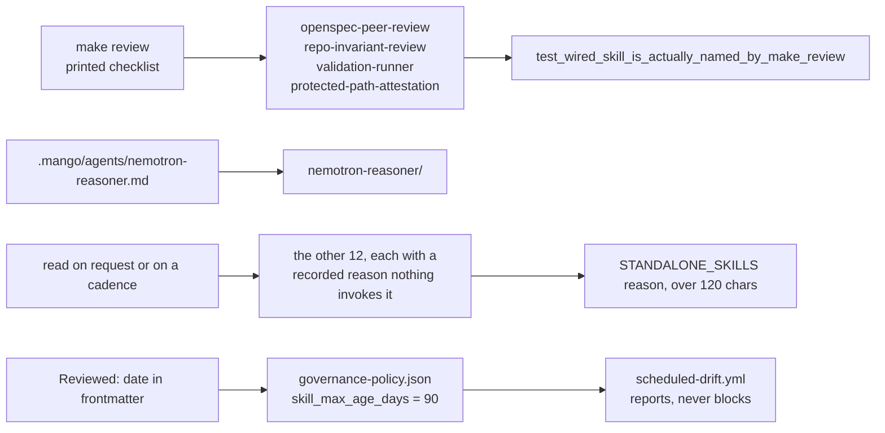

# AGENTS.md — Skill library

**Scope:** `validation-runner/SKILL.md`, `openspec-peer-review/`, `spec-authoring/`, `gate-mutation-proof/`
**Owner:** verifier → peer-reviewer; a skill is a review procedure, and a wrong one is a review that passes for the wrong reason
**Protected path:** yes — `.mango/skills/**`. A write needs `ALLOW_GITHUB_CHANGES=1`, the `infra-reviewed` label and an attestation row in the PR description.
**Reviewed:** 2026-09-19

## What this does

Seventeen procedures an agent or human follows by hand, each one `SKILL.md` in
its own directory. They exist because the judgement half of a gate cannot be
mechanised: `make validate` can prove a budget was exceeded, but choosing the
cohesive seam to split on is `god-file-decomposer`. Every skill is therefore
classified — either something invokes it, or a recorded decision says nothing
does. An unclassified skill is one nobody decided about.

## Map

## Key files

| File | Role |
| --- | --- |
| `validation-runner/` | The single entry point for the full validation matrix; produces a structured PASS/FAIL with evidence. Named by `make review`. |
| `openspec-peer-review/` | Independent Architecture / SDLC / QA / Product review. Required for spec-driven work and anything touching core models, the orchestrator or personas. |
| `repo-invariant-review/` | Predicts concrete CI failures — protected paths, size budget, architectural drift — before they go red. |
| `protected-path-attestation/` | Produces the per-change attestation block a protected-path PR must carry. |
| `gate-mutation-proof/` | Mutate, assert fail, restore, assert pass. Deliberately unwirable: a recipe that mutates the tree can leave it mutated. |
| `spec-authoring/` | Authors `docs/specs/<feature>.md` against the template; the structural half is `make specs`. |
| `nemotron-reasoner/` | The reasoner's operational cheatsheet, loaded through its persona at runtime rather than by a target. |
| `coverage-gate/` | The operator's guide to the coverage gate that `make coverage-python` already enforces. |

## Invariants

- **Every `SKILL.md` carries a `Reviewed:` date inside its frontmatter**
  (`test_skill_declares_a_reviewed_date`,
  `test_reviewed_line_is_inside_the_frontmatter`). Presence blocks; age does
  not — a clock-dependent assertion turns unrelated PRs red at a date boundary.
- **Staleness has one source.** `skill_max_age_days` (90) lives in
  `governance-policy.json`; `test_no_skill_declares_a_horizon_that_disagrees_with_the_policy`
  stops a skill restating a different number.
- **Every skill is wired or declared standalone**
  (`test_skill_is_either_reachable_or_declared_standalone`), a wired one must
  actually be named by the `Makefile`, and a standalone reason under 120
  characters fails.
- **Every `make` target a `SKILL.md` names must exist**
  (`test_every_make_target_a_skill_names_exists`).
- **This is the only skill root** (`test_no_skill_directory_exists_outside_dot_mango`).

## Commands

| Task | Command |
| --- | --- |
| Print the checklist that names the wired skills | `make review` |
| Every governance-marked gate | `make test-governance` |
| Governance validators | `make validate` |
| Full deterministic gate | `make ci` |

## Agents and skills

| Stage | Agent | Skills |
| --- | --- | --- |
| plan | `.mango/agents/planner.md` | `spec-authoring`, `openspec-peer-review` |
| build | `.mango/agents/nemotron-reasoner.md` | `harness-engineering`, `god-file-decomposer` |
| verify | `.mango/agents/verifier.md` | `validation-runner`, `repo-invariant-review`, `gate-mutation-proof` |

## Gotchas

- **This is not `.claude/skills/`.** Claude Code auto-discovers nothing here.
  A skill runs because a human, a persona or `make review`'s printed checklist
  names it in prose. Writing an excellent `SKILL.md` and stopping there means
  it is never invoked, and no gate will say so.
- **Adding a directory breaks two documentation tests at once.** The root
  README states "(N) reusable skills" — `test_the_stated_skill_count_matches_reality`
  compares N to the directory count — and
  `test_every_skill_directory_is_listed` requires the new name in the README
  layout tree. Both are scoped to the tree block, so prose elsewhere does not
  satisfy them.
- **Naming a `make` target that does not exist fails CI**, not the skill run.
  Check with `grep '^<target>:' Makefile` before writing the line.
- **Classification is mandatory and adversarial.** A new skill needs a
  `WIRED_SKILLS` or `STANDALONE_SKILLS` entry in
  `harness/shared/tests/test_agent_surface_liveness.py`, and "n/a" as a reason
  is caught by length.
- **Editing anything here without the `infra-reviewed` label fails CI** at the
  protected-path gate. That is the gate working.
