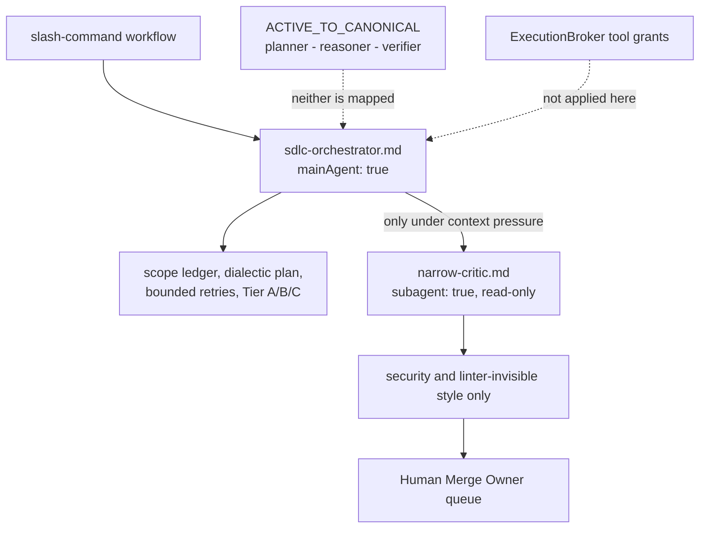

# AGENTS.md — Workflow agents

**Scope:** `sdlc-orchestrator.md`, `narrow-critic.md`, `mainAgent`, `subagent`
**Owner:** planner → orchestrator; these are prompts for a slash-command workflow, not roles the broker governs
**Protected path:** no — `.mango/workflows/**` matches no `protected_paths` pattern, unlike its three sibling directories `.mango/agents/**`, `.mango/hooks/**` and `.mango/skills/**`. Ordinary review applies.
**Reviewed:** 2026-09-19

## What this does

Two agent definitions that are deliberately *outside* the planner →
nemotron-reasoner → verifier loop. They are invoked by slash-command workflows,
not by `mango_mas_orchestrator.execute_agent()`; they are absent from
`agent_authority.ACTIVE_TO_CANONICAL`, so they receive no broker-enforced tool
grant and no execution identity. They live here rather than in `.mango/agents/`
for a mechanical reason: a persona file there that is not a declared active role
fails `test_every_persona_file_is_a_declared_active_role`.

## Map

## Key files

| File | Role |
| --- | --- |
| `sdlc-orchestrator.md` | `mainAgent: true`, `permissionMode: acceptEdits`. The unified SDLC executor: scope ledger, dialectic planning with a human gate, a hard cap of three attempts against one failing test, then Tier A mechanical gates, Tier B objective gate, Tier C human merge gate. |
| `narrow-critic.md` | `subagent: true`, `commandExecutionPolicy: sandbox`, tools limited to `view_file` and `grep_search`. Reports security findings and linter-invisible style violations on a completed diff; has no write tools and must not request edits. |

## Invariants

- **Neither file is an active role.** `.mango/agents/README.md` records this
  under "Workflow and orchestration agents", and
  `test_agent_harness_wiring.py` pins `EXPECTED_ACTIVE_ROLES` to exactly
  `planner`, `nemotron-reasoner`, `verifier`.
- **Read-only means the tools list, not the prose.** `narrow-critic`'s isolation
  comes from the `branch` worktree and its tools allowlist; both are required,
  and neither is enforced by anything in this repository.
- **The Tier A / Tier B / Tier C ordering is load-bearing.** Tier B runs only
  after Tier A exits zero, and critic approval never substitutes for Tier C.
- **No test loosened to reach green**, stated in `sdlc-orchestrator.md`'s
  prohibitions; the skip half of that rule is the one mechanical check —
  `make verify-zero-skips` fails on any unapproved skip (INV-2).

## Commands

| Task | Command |
| --- | --- |
| The Tier A gate these prompts name | `make lint` |
| Governance validators | `make validate` |
| Pre-PR review checklist | `make review` |
| Full deterministic gate | `make ci` |

## Agents and skills

| Stage | Agent | Skills |
| --- | --- | --- |
| plan | `.mango/agents/planner.md` | `spec-authoring`, `openspec-peer-review` |
| build | `.mango/agents/nemotron-reasoner.md` | `harness-engineering` |
| verify | `.mango/agents/verifier.md` | `validation-runner`, `shadow-channel-analysis` |

## Gotchas

- **`sdlc-orchestrator.md` names a skill that does not exist.** Its frontmatter
  declares `skills: - skills/definition-of-done`, and there is no
  `definition-of-done` under `.mango/skills/`. Nothing fails, because no gate
  reads workflow frontmatter — the closure tests cover `.mango/agents/` only.
  Treat every path in these two files as unchecked until you have run `ls`.
- **Its Tier A section points at `.agents/hooks.json`.** The file in this
  repository is `.mango/agents/hooks.json`; `.agents/` does not exist. The
  shims it reaches (`scripts/verify-tier-a.sh`) are real; the path to them is
  not.
- **`artifacts/` is written, never tracked.** The scope ledger, plan,
  escalation and objective-gate documents all land under `artifacts/`, which is
  not in the repository. Do not expect to review them from a diff.
- **Moving either file into `.mango/agents/` breaks the persona closure.** It
  would register as an undeclared active role, receive the empty grant, and
  read as authoritative while conferring nothing.
