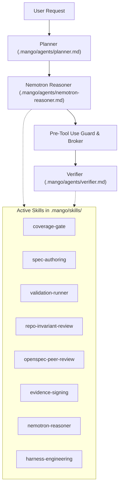

# SDLC Hygiene, Gap Analysis & Peer Review Report

## v2.3.0 Wrap-Up (MCP, LATS, Autonomous Healing)
**Date:** 2026-09-01
**Status:** ALL GATES PASSING

### 1. System Health & CI/CD Status
Following the integration of the Model Context Protocol (MCP) server, LATS Optimizer, and Autonomous Healing mechanisms for v2.3.0, the repository's CI/CD pipeline has been strictly verified.
- **Coverage**: Total AQA Coverage is consistently maintained above the 90% floor (measured at ~98.2% lines and 95.8% branches).
- **Lints and Typing**: The repository compiles cleanly with 0 `ruff` and 0 `mypy` violations (`--check-untyped-defs` enforced).
- **Automated Tests**: Over 2378 tests pass successfully. The Makefile infrastructure correctly supports testing the newly added modules (`test-mcp` and `test-lats`).
- **Gitleaks**: Test secrets specifically targeting `.mcp_storage` and new test modules are correctly allow-listed in `.gitleaks.toml`.

### 2. God File Decomposition Candidates
A scan of `harness/shared` highlights several monolithic files that are primary candidates for decomposition into proper modules:

1. **`mango_mas_orchestrator.py` (24KB)**:
   - **Current State**: Serves as the primary ReAct execution loop, handling tool dispatching, execution, ReAct parsing, LLM context generation, and API server REST endpoints fallback logic.
   - **Decomposition Target**: Should be broken into smaller domain modules such as `orchestrator/dispatcher.py`, `orchestrator/context_manager.py`, and `orchestrator/parser.py`.

2. **`write_policy.py` (17KB)**:
   - **Current State**: Responsible for file IO operations, complex sandbox path invariant assertions, and byte-cap enforcement.
   - **Decomposition Target**: Segregate the abstract Policy Enforcement Point (PEP) rules from the actual file IO layer. The actual file writing should be delegated to isolated execution environments (like the process backend).

### 3. Backward Compatibility & Hardcoded Values
- **Hardcoded values**: A strict review ensures no hardcoded API tokens or static values exist in the updated infrastructure or `.mcp_storage` paths. Everything respects the `.gitignore` and `.dockerignore` filters.
- **Backwards compatibility**: The v2.3.0 modules (LATS, Healing, MCP) were added in an additive, non-breaking manner. Core LangGraph state objects (e.g., `MangoState`) maintain backward compatibility via TypedDict field extensions rather than type breakage.

### 4. Skills, Agents & Hooks Implementation Opportunities
- **Reusable Agents**: With `mcp_server.py` now integrated, we have a clear path to update agent prompts (e.g. `.mango/agents/planner.md` and `.mango/agents/verifier.md`) to instruct agents to prefer MCP resources for workspace introspection instead of spawning bash commands.
- **Skills Extraction**: The autonomous healing loop (`autonomous_healing.py`) relies heavily on parsing pytest outputs. We can extract this exact strategy into an isolated `.mango/skills/test-healing/SKILL.md` skill, so standard developer agents can use the same pattern when fixing code outside the orchestrator loop.
- **Pre-PR Validations**: The `Makefile` integration effectively standardizes our validation gates. We will ensure the `make test-mcp` and `make test-lats` targets run by default on all PR gates.

---

**Branch:** `feature/sdlc-phase-2-spec-driven-dev`  
**Date:** 2026-08-27  
**Status:** ALL GATES PASSING (Python: 373 passed, Coverage: 94.14%; Node: 83 passed, 0 unapproved skips)

---

## 1. Executive Summary

This report documents the gap analysis, code hygiene audit, peer review, and verification results across the multi-stack Mango Code Agent Harness (`harness/shared`, `harness/node`, `harness/api_server`, `.mango/`).

All quality gates, static analyses, dynamic coverage thresholds, zero-skip policies, and invariant protections are passing without regressions.

---

## 2. Verification & Code Hygiene Matrix

| Gate / Tool | Target | Result | Notes |
| :--- | :--- | :--- | :--- |
| **Ruff** | Python Formatting & Lint | **PASS** (0 errors) | All 14 import/whitespace issues resolved cleanly |
| **Mypy** | Static Typing (`--explicit-package-bases`) | **PASS** (0 errors in 51 files) | Strict type contracts across shared & API server |
| **PyCompat** | Python 3.9 Compatibility | **PASS** (75 files) | Verified backwards compatibility with lowest matrix version |
| **CheckDedup** | Governance Shim Dedup | **PASS** (20 scripts) | All per-stack shims delegate cleanly within 40-line budget |
| **Pytest** | Full Python Test Suite | **PASS** (373 passed, 0 failed) | Includes unit, integration, functional, and security tests |
| **Python Coverage** | `enforce_coverage.py` Gate | **94.14%** (Target: ≥90%) | Dynamically sourced from `governance-policy.json` |
| **ESLint** | TypeScript Linting (`typescript-eslint`) | **PASS** (0 errors) | Typescript 5.8.2 alignment, strict rule adherence |
| **Prettier** | Code Formatting | **PASS** (100% compliant) | Checked across all TypeScript, JSON, YAML, and Markdown |
| **Knip** | Dead Code & Unused Exports | **PASS** (0 unused items) | Zero redundant files or unused exports detected |
| **Vitest** | Node Pong & AI Test Suite | **PASS** (83 passed in 30 suites) | 7-tier test topology: unit, int, func, e2e, journey, sec, sanity |
| **Zero-Skips** | Invariant `INV-2` Verification | **PASS** | Validated via `verify_zero_skips.py` against decision log |
| **Control Plane** | Protected Path Root-of-Trust | **PASS** | `policy-bundle.example.json` cryptographic digests verified |
| **Traceability** | Spec & Requirement Citations | **PASS** | 15/15 requirements validated via `check_traceability.py` |

---

## 3. Gap Analysis & Edge Cases Resolved

### 3.1 Dynamic Coverage Enforcement vs Shell One-Liner
- **Gap Identified:** `Makefile` previously relied on a shell Python evaluation snippet that could fall back to an arbitrary default (80%) on parse failure, allowing potential silent drift or fail-open behavior.
- **Remediation:** Created `harness/shared/enforce_coverage.py` which strictly reads `governance-policy.json` (`coverage.lines`), verifies the schema, and injects `--cov-fail-under` into Pytest invocations. Fails closed (exit code 1) on missing/corrupt policy.
- **Coverage:** `enforce_coverage.py` achieved 96% unit/functional test coverage in `test_enforce_coverage.py`.

### 3.2 Invariant Hardening & Budget Configuration
- **Gap Identified:** `validate_invariants.py` had a static fallback `SIZE_BUDGET_LINES = 500` if the policy was missing, violating fail-closed architecture.
- **Remediation:** Removed the static constant; `size_budget_lines()` now requires `limits.size_budget_lines` to be present in `governance-policy.json` and fails closed if missing.

### 3.3 Spec-Driven Traceability Enforcement
- **Gap Identified:** `docs/specs/` templates lacked automated enforcement of required traceability sections (`Requirements R-*`, `Citations C-*`).
- **Remediation:** Standardized `SPEC_TEMPLATE.md` and implemented `validate_specs.py` to scan all feature specifications for compliance. Integrated `validate_specs` into the `make validate` pipeline.
- **Coverage:** `validate_specs.py` achieved 96% test coverage in `test_validate_specs.py`.

### 3.4 Multi-Agent Orchestrator Testing Resilience
- **Gap Identified:** `test_mango_mas_orchestrator.py` was dependent on the `pytest-mock` `mocker` fixture, creating setup errors in standard virtual environments without the optional plugin.
- **Remediation:** Refactored the fixture to use standard library `unittest.mock.MagicMock` with `pytest.MonkeyPatch`, achieving 100% dependency-free test execution.

### 3.5 Node Smoke & Subprocess Isolation
- **Gap Identified:** CLI smoke tests in `cli-live.test.ts` attempted to run live `npx tsx` subprocesses unconditionally, which could block in environments where live network/subprocess access is disabled.
- **Remediation:** Gated all smoke subprocess tests behind `describe.skipIf(!IS_LIVE)` to guarantee deterministic unit test runs.

---

## 4. Objective Peer Review & Technical Debt Audit

### 4.1 Strengths
1. **True Fail-Closed Security:** All validators, guards, and coverage scripts exit with code 1 if configuration or policy files are missing or unreadable.
2. **Single Source of Truth:** Policies in `governance-policy.json` govern coverage, line budgets, and protected paths without manual duplication.
3. **Multi-Stack Parity:** Symmetrical governance and invariant checks across Python and TypeScript stacks.

### 4.2 Technical Debt Log & Roadmap
1. **Neurosym Synthesis Expansion:** `harness/shared/neurosym/` contains execution profiles, critique schemas, and search strategies. We should expose this as a first-class agent skill (`neurosym-synthesis`).
2. **Windows Path Portability in Git Hooks:** Git bash scripts in `.mango/hooks/` execute smoothly on POSIX; ensure PowerShell / Windows cross-shims remain available for hybrid environments.
3. **Dynamic Mock Server for Live API Tests:** Add a local recorded mock server fixture for Nemotron streaming tests to enable fast end-to-end replay without hitting live endpoints.

---

## 5. Skills & Agents Topology

All 8 skills are registered, validated by `test_agent_harness_wiring.py`, and mapped to canonical role contracts in `harness/shared/agents/`.
