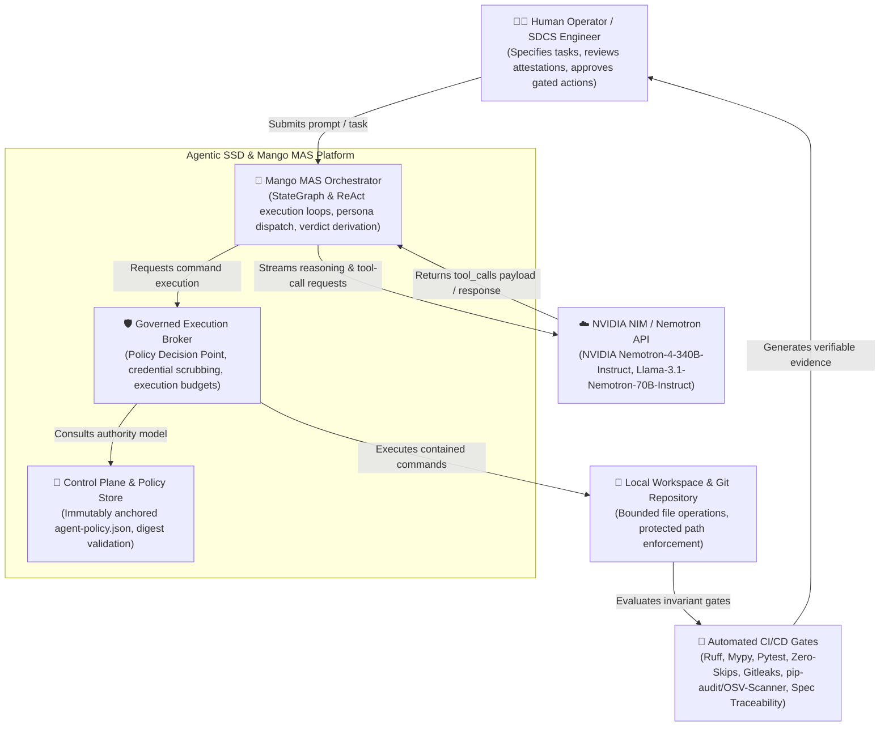
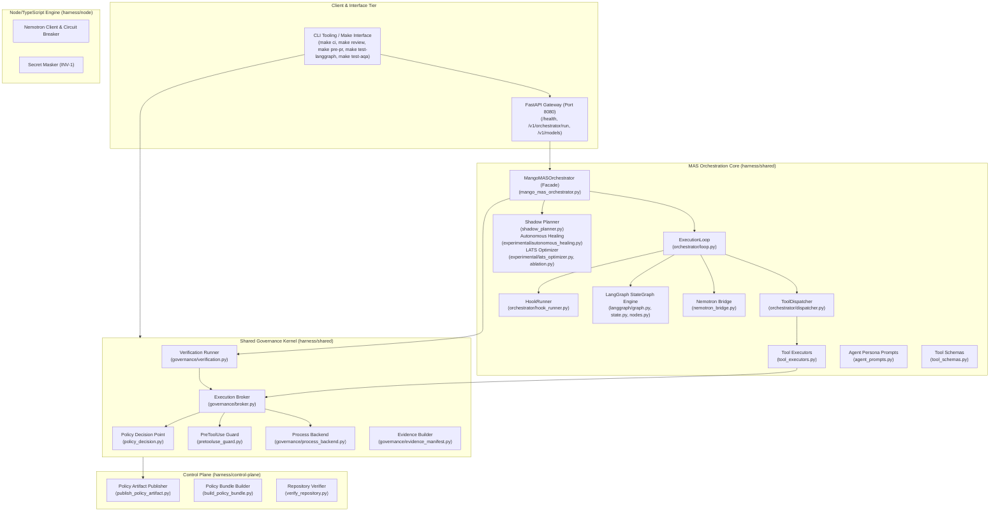
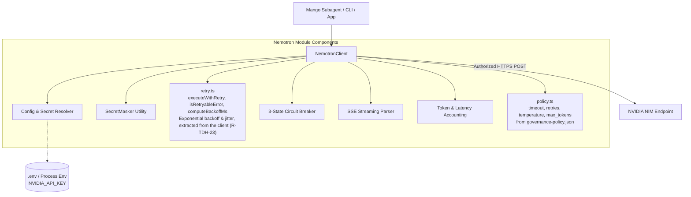

# C4 Architecture: Agentic SSD & Mango MAS Platform

> **Consolidated from** two documents (tech-debt hardening plan R-TDH-24): this
> file, the canonical model at v2.4.0, and `harness/docs/C4_ARCHITECTURE.md`, a
> v2.1.9 snapshot now deleted. Everything the snapshot had that this file lacked
> is folded in: the external-dependency context view (§1.1), the detailed
> `harness/shared` container view (§2.1), the Node-stack Nemotron component
> diagram (§3.2), the CI gate chain with its rationale (§4.8) and the INV-16
> cognitive/execution boundary (§4.9). Where the two disagreed the newer
> statement is kept: the snapshot's `.agents` skill-registry container is
> dropped (`.mango/skills/` is the only skill root), its monolithic
> orchestrator node is now the facade plus the `orchestrator/` package, its
> `1564 tests` label is dropped (the README carries the current count), and the
> version below is this file's, not the snapshot's 2.1.9.

**Version:** 2.4.0 (2026 Standards - God File Decomposition)  
**Standard:** C4 Model for Visualising Software Architecture (Context, Containers, Components, Code)  
**Governing Harness:** Agentic SSD Gate Harness Contract v2.1 (`harness/CONTRACT.md`) (INV-1..INV-16)

---

## 1. Level 1: System Context Diagram

The System Context diagram illustrates the high-level boundaries between human operators, autonomous agent personas, the Mango MAS Orchestrator (and its LangGraph StateGraph engine), external LLM inference providers (NVIDIA Nemotron / NIM), and the local system environment.



### 1.1 External dependencies view (from the v2.1.9 snapshot)

The System Context diagram illustrates the high-level actors, the Autonomous Mango Multi-Agent Ecosystem, and external cloud infrastructure.
The view below keeps the external parties the diagram above folds into `CIGates` and `LocalFS`:
the external tool broker / PDP that is authoritative for high-risk actions but not on the live path
(mirrored in-process by `policy_decision.decide`), the remote Git server, and the Context7 MCP
documentation engine.


---

## 2. Level 2: Container Diagram

The Container diagram zooms into the Agentic SSD system boundaries, displaying its primary runtimes, APIs, LangGraph StateGraph engine overlay, and policy enforcement engines.



### 2.1 Detailed container view of `harness/shared` (from the v2.1.9 snapshot)

The Container diagram shows the runtime environments, repositories, tools, and execution processes.
Component-level detail for the shared runtime, the control plane and the AQA engine; the
`orchestrator/` decomposition and the `experimental/` move post-date the snapshot and are
reflected in §2 above.

```mermaid
graph TD
    User([Developer / Engineer]) --> CLI[Terminal CLI / PowerShell / Bash]

    subgraph "Repository Runtime Containers"
        subgraph ".mango Agent Runtime"
            MA[Mango Agent Core]
            SubAgents[Subagents: nemotron-reasoner, planner, verifier]
            Personas[Persona Topology: Web Presenter, Node Bridge]
            Hooks[Lifecycle Hooks: PreToolUse, Stop, SessionStart, PreNemotron]
            Skills[Skills: repo-invariant-review, openspec-peer-review, nemotron-reasoner]
            AgentMetaTools["Continuous Learning & MCPs: knowledge_gap_log, query_docs (Context7) — Planned"]
            Memory[(Local JSON Memory: gaps.json, hypotheses.json)]
            MA --> SubAgents
            SubAgents --> Personas
            MA --> Hooks
            MA --> Skills
            MA --> AgentMetaTools
            AgentMetaTools --> Memory
        end

        subgraph "Node.js Container - harness/node"
            TSClient[NemotronClient<br/>TypeScript Adapter & Circuit Breaker]
            VitestRunner[Vitest Test Runner<br/>Multi-Tier Matrix]
        end

        subgraph "Python Shared Runtime - harness/shared"
            PyBridge[nemotron_bridge.py<br/>Python Adapter — HTTP, auth, response shape]
            RetryPolicy[retry_policy.py<br/>Pure backoff arithmetic<br/>no I/O, no clock, no network]
            Orchestrator[mango_mas_orchestrator.py facade<br/>+ orchestrator/ loop, dispatcher, hook_runner]
            DebugDump[debug_dump.py<br/>Credential redaction + debug dumps]
            MetaTools[meta_tools.py<br/>Meta-Learning Tools + file_lock]
            PyBridge -->|asks for a delay| RetryPolicy
            Orchestrator -->|redacts history through| DebugDump
            subgraph "Cognitive Boundary — INV-16 (one-directional)"
                Signal[cognitive_signal.py<br/>CognitiveSignal envelope + JSONL sink]
                Shadow[shadow_planner.py<br/>Shadow-mode comparison channel<br/>MANGO_SHADOW_PLANNER, off by default]
                Shadow -->|emits, zero tool authority| Signal
            end
            subgraph "Gates — policy-sourced, fail-closed"
                CoverageGate[coverage_gate.py<br/>lines + branches as two floors<br/>from governance-policy.json]
                CoverageScope[coverage_scope.py<br/>which files the floors judge:<br/>per-file floor, optional-extra waivers,<br/>measured-set bound vs on-disk sources]
                CoverageGate -->|delegates membership to| CoverageScope
            end
            subgraph "governance/"
                Broker[broker.py<br/>ExecutionBroker + ProcessBackend<br/>INV-8/9/10 — contains, does not isolate]
                PDP[policy_decision.py<br/>In-process PDP<br/>mirrors tool_broker_reference.py]
                Actions[command_actions.py<br/>command → declared action; allowlist,<br/>unmodelled ⇒ an action no role holds]
                GovGuards[pretooluse_guard.py<br/>Policy Guards — resolved from the installed<br/>package; unavailability denies]
                Validators["Governance Validators<br/>traceability, zero-skips, remotes"]
                AllowlistGate["check_secret_allowlist.py<br/>every .gitleaks.toml allowlist entry must still<br/>suppress a real finding; keeps are scoped to the<br/>allowlist block itself — INV-1, DEC-035"]
                Attestation["attestation.py<br/>derives the protected-path attestation table<br/>from validate_invariants own matcher and<br/>discovery — imported, never reimplemented; DEC-038"]
                Evidence[evidence_manifest.py<br/>EvidenceBuilder — HMAC attestation]
                Broker --> PDP
                Broker --> Actions
                Broker --> GovGuards
            end
            WritePolicy["write_policy.py<br/>protected_paths at tool-call time<br/>+ any .git segment<br/>+ credential filenames"]
            Authority[agent_authority.py<br/>per-role tool exposure, derived from agent-policy.json]
            RootValidators["Root Validators<br/>policy, adoption, agent-policy"]
            Orchestrator -->|run_command| Broker
            Orchestrator -->|write_file target| WritePolicy
            Orchestrator -->|write_file / apply_patch role check| Broker
            Broker -->|write targets of a command| WritePolicy
            Orchestrator -->|tools_for_role / execution_identity| Authority
            Orchestrator -.->|guarded, observation-only| Shadow
        end

        subgraph "Control Plane - harness/control-plane"
            Publisher[publish_policy_artifact.py<br/>Versioned, digest-pinned policy artifact]
            Artifact[(policy-artifact.json<br/>committed, drift-gated)]
            Verifier[verify_repository.py<br/>External root-of-trust verifier]
            Publisher -->|attest, optional| Evidence
            Publisher --> Artifact
        end

        subgraph "Python AQA Engine - harness/{shared,api_server,control-plane}/tests"
            RootConftest["conftest.py (repository root)<br/>session hooks → _session_hooks.py<br/>skip evidence TSV (INV-2 Python half) + langgraph deselection<br/>DEC-030: at the rootdir so all three suites are covered"]
            AQA["Pytest AQA Suite<br/>coverage gate per policy — lines and branches"]
            CPTests["control-plane suite<br/>colocated with its scripts (R-TDH-26)<br/>test_control_plane_layout.py is the meta-test"]
            RunpyExec["runpy.run_path() Executor<br/>In-Process CLI Coverage"]
            RootConftest --> AQA
            RootConftest --> CPTests
            AQA --> RunpyExec
            RunpyExec -->|executes in-process| Validators
            RunpyExec -->|executes in-process| PyBridge
            RunpyExec -->|executes in-process| GovGuards
            AQA -->|drift gate| Artifact
        end
    end

    CLI --> TSClient
    CLI --> PyBridge

    SubAgents --> TSClient
    SubAgents --> PyBridge
    Hooks --> GovGuards

    TSClient -->|HTTPS POST| NIM[NVIDIA Nemotron Ultra API]
    PyBridge -->|HTTPS POST| NIM
```



---

## 3. Level 3: Component Diagram (MAS Orchestration & Execution)

Detailed view of the internal components within `harness/shared/` responsible for governed tool execution, multi-agent loops, and LangGraph StateGraph topology.

```mermaid
classDiagram
    class MangoMASOrchestrator {
        +Path workspace_dir
        +str model
        +int max_iterations
        +execute_sequential_thinking_loop(task) str
        +execute_loop(task) LoopOutcome
        +execute_agent(agent_name, prompt, tools, budget) str
        -_run_hooks(agent_name, phase)
        -_dispatch_tool_calls(tool_calls, agent_name, budget)
    }

    class LangGraphEngine {
        +build_graph(policy, checkpointer) CompiledGraph
        +MangoState state_schema
        +GraphPolicy policy
    }

    class MangoState {
        +str task
        +str plan
        +str shadow_plan
        +float plan_divergence
        +int revision_count
        +dict gate_status
        +str verdict
        +int tool_budget_used
        +list patches (accumulator)
        +list findings (accumulator)
        +list test_results (accumulator)
        +list errors (accumulator)
    }

    class GraphNodes {
        +planner_node(state, config) dict
        +shadow_planner_node(state, config) dict
        +implementer_node(state, config) dict
        +evaluation_node(state, config) dict
        +plan_gate_node(state) dict
        +quality_gate_node(state) dict
        +clarify_node(state) dict
        +escalate_node(state) dict
        +peer_reviewer_node(state) dict
        +security_reviewer_node(state) dict
    }

    class ToolExecutors {
        +execute_write_file(workspace_dir, filepath, content) str
        +execute_read_file(workspace_dir, filepath, start_line, end_line) str
        +execute_apply_patch(workspace_dir, filepath, old_text, new_text) str
        +execute_run_command(broker, active_role, workspace_dir, command, timeout) str
        +authorize_write(broker, active_role, filepath) str
    }

    class ExecutionBroker {
        -_agent_policy_path: Final[Path]
        -_backend: ProcessBackend
        +execute_command(command, cwd, context, timeout, max_bytes) ExecutionResult
        -_policy_decision(action, context) str
    }

    class ProcessBackend {
        +is_available() bool
        +execute(command, cwd, timeout, max_bytes, env_override) ExecutionResult
        +_cap(text, max_bytes) tuple
    }

    class VerificationRunner {
        +run(cwd, target) HarnessCheck
        +derive_verdict(harness_check) Verdict
    }

    class NemotronBridge {
        +complete_chat(messages, tools, model, api_key, timeout) dict
        +mask_api_key(key) str
    }

    MangoMASOrchestrator --> LangGraphEngine : delegates graph orchestration
    LangGraphEngine --> MangoState : state channels
    LangGraphEngine --> GraphNodes : invokes nodes
    GraphNodes --> MangoMASOrchestrator : wraps execute_agent & _harness_verdict
    MangoMASOrchestrator --> ToolExecutors : invokes operations
    MangoMASOrchestrator --> NemotronBridge : requests chat completions
    MangoMASOrchestrator --> VerificationRunner : derives terminal verdict
    ToolExecutors --> ExecutionBroker : brokers run_command; asks the PDP for write/patch
    ExecutionBroker --> ProcessBackend : executes with budget & containment
```

### 3.2 NVIDIA Nemotron AI Subsystem (`harness/node/src/ai/nemotron/`)



---

## 4. Level 4: Code, Invariants & Security Boundaries

### 4.1 Immutable Authority Anchoring (`R-AC-11`)

- **Isolation Principle**: Policy rules (`agent-policy.json`) are resolved statically relative to package installation directory:

  ```python
  _AGENT_POLICY_PATH: Final[Path] = Path(__file__).resolve().parent.parent / "agent-policy.json"
  ```

- **Containment**: Untrusted agent workspaces cannot override governance policy by planting modified local policy files.

### 4.2 Re-entrant Verification & Honest Verdicts (`INV-12`, `INV-13`)

- The terminal verdict is earned mechanically via `VerificationRunner` executing `make -f Makefile test-python` through `ExecutionBroker`.
- Provenance is enforced by strong typing: `derive_verdict` accepts only `HarnessCheck` created by the harness itself, rejecting arbitrary agent-supplied `ExecutionResult` structures.

### 4.3 PreToolUse Command Guard (`INV-8`, `INV-9`, `INV-10`)

- Blocks high-risk shell vectors (`rm -rf /`, credential harvesting, unauthorized network calls, shell pipe escapes).
- Applies `write_policy` check against `protected_paths` on all command write/redirection targets.

### 4.4 Secret Safety & Credential Scrubbing (`INV-1`)

- All environment variables matching credential patterns (`NVIDIA_API_KEY`, `GITHUB_TOKEN`, `AWS_SECRET_ACCESS_KEY`) are stripped before passing to brokered child processes.
- Memory dumps generated for debugging (`write_dump`) redact sensitive tokens with high-entropy regex sanitizers.

### 4.5 Direct File I/O Governance: Read/Patch Parity (`DEC-012`)

- `read_file`, `write_file` and `apply_patch` read and write the filesystem directly from `ToolExecutors`, so they never reach the PreToolUse guard or `ProcessBackend` — those stay `run_command`'s alone. They **do** reach the policy decision point: `tool_executors.authorize_write` asks `ExecutionBroker._policy_decision` whether the acting role may write, phrasing the write as `tee <path>` so one action model grades both doors (`DEC-042`). Before that, `ToolDispatcher` asked nothing while `mcp_server` asked — the planner and verifier were refused by one transport and admitted by the other.
- Path-level governance is two in-process policy modules consulted at tool-call granularity: `write_policy.write_denial_reason` (denies `protected_paths` matches, any `.git` path segment, and credential-bearing filenames) and `read_policy.read_denial_reason` (denies credential-bearing filenames and any `.git` segment). The two questions are distinct and both are asked: the PDP decides *who* may write, the write policy decides *what* may be written.
- The credential-filename alternation has one definition, in `write_policy`, re-exported by `read_policy` and composed by `command_actions` — three anchorings of one pattern (a whole path segment on each file door, a shell word in the classifier), pinned by object identity so they cannot drift. It moved there because the write side had no credential rule at all: `.env` is deliberately untracked, so `protected_paths` matched nothing and `write_denial_reason(".env")` returned `None` (`DEC-042`).
- `apply_patch` consults `read_denial_reason` **first**, then the write policy. This corrects `DEC-012`'s account that it reuses `write_denial_reason` unchanged: a patch reads before it writes, and its `matched 0 times` / `matched 1 times` reply was a substring oracle over every file `read_file` refuses. `agent-policy.json` grants it no new action.
- `command_actions.classify` grades the words the **shell** produces, not the command text: `bash -c` strips quotes, resolves backslashes, expands braces and expands globs before a program sees an argument, so a text-scanning rule was checking a string no filesystem call ever sees. `shell_words.py` owns that analysis; the classifier owns what a command *does*.

### 4.6 Neuro-Symbolic Sandbox & Critique Normalization (`AC-NS-3`, `AC-CE-1`, `INV-9`)

- **Capability Profiles**: The production `ProcessBackend` only pins `cwd`, `timeout`, and `max_output_bytes` before executing the bash subprocess. Full filesystem and network isolation via fine-grained capability profiles (e.g., `network-isolated`, `read-only-fs`) are explicitly out of scope for production as defined in the code-execution spec.
- **Violation Trapping**: In testing environments, a mock backend simulates isolation by emitting a structured `SandboxViolation` payload when a command violates assumed constraints (e.g., outbound socket I/O).
- **Critique Normalization (`tool_result_format.py`)**: `format_execution_result` intercepts `SandboxViolation` payloads from `stderr` (when generated by the mock backend) and translates them into a standardized Critique schema (`failure_type`, `evidence_id`, `normalized_message`, `location: execution_broker`). This enables deterministic agent repair loops for neuro-symbolic testing.
- **Fail-Closed Sandbox Availability (`INV-9`)**: If the backend is configured as unavailable (`sandbox_available=False`), commands are blocked immediately rather than falling back to host execution.

### 4.7 LangGraph StateGraph Architecture & Invariants (`INV-LG-1` .. `INV-LG-4`)

- **INV-LG-1: 12-Channel Typed State**: The StateGraph operates over a partitioned 12-channel `MangoState` TypedDict: 4 Accumulator channels (`patches`, `findings`, `test_results`, `errors`) reduced via `operator.add`, and 8 Last-Write-Wins (LWW) scalar channels.
- **INV-LG-2: Pure Node Immutability**: Node functions must never mutate state dictionaries in-place; all node outputs return pure partial dictionary updates.
- **INV-LG-3: Fail-Open Error Channel Routing**: Errors occurring within agent tool invocations or model inference are isolated within `try/except` handlers and recorded into the `errors` channel rather than causing unhandled graph crashes.
- **INV-LG-4: Role Authority & Tool Budget Decorators**: Nodes holding execution authority are annotated with `@with_authority(role=..., may_write=...)` and `@budgeted(budget_key=...)` to enforce role constraints at the node boundary.

### 4.8 Fail-Closed Invariants & Governance Gates (CI gate chain)

```mermaid
flowchart TD
    Commit[Pre-PR Git Commit] --> NodeLint["Node Lint Tier<br/>(make lint-node — ESLint + Prettier + Knip;<br/>a ci prerequisite, never ci-python: those legs install no pnpm.<br/>Carries R-TDH-23's policy-sourced ESLint max-lines, DEC-034)"]
    NodeLint --> Lock["Dependency Lock Freshness<br/>(make lock-check — the universal uv lock recompiles unchanged)"]
    Lock --> Secrets[INV-1: Full Working Tree & History Secret Scan]
    Secrets --> AllowlistLive["Allowlist Liveness<br/>(make secrets-allowlist-check — every .gitleaks.toml allowlist entry<br/>must still suppress a real finding; runs in the secret-scan job,<br/>never the unit suite, which has no gitleaks — R-GT-10)"]
    AllowlistLive --> ZeroSkip["INV-2: Zero-Skip Test Verification<br/>(Node: make verify-zero-skips — Vitest JSON;<br/>Python: make verify-zero-skips-python — root conftest TSV, DEC-026/DEC-030)"]
    ZeroSkip --> DeadCode["Dead-Code Gate<br/>(vulture at confidence 80 in make lint-python, R-TDH-17)"]
    DeadCode --> SizeBudget["Per-File Size Budgets<br/>(limits.size_budget_lines for sources, limits.test_size_budget_lines for tests;<br/>make validate, R-TDH-22)"]
    SizeBudget --> Remotes["INV-3: Canonical Remote URL Normalizer & Allowlist<br/>(make remotes)"]
    Remotes --> Hooks[INV-4: Non-Destructive Effective Git Hook Installer]
    Hooks --> GateCov["INV-5: CI Gate Coverage<br/>(every ci_required_target reachable from make ci,<br/>or a declared gap — test_ci_gate_coverage.py)"]
    GateCov --> SpecGate["Spec Gate<br/>(make specs → bash validate_specs.sh)"]
    SpecGate --> SpecTrace[Traceability: Bidirectional Requirements]
    SpecTrace --> Policy[INV-6: External Root of Trust Digest Verification]
    Policy --> Protected["Protected-Path Gate<br/>(fail-closed unless ALLOW_GITHUB_CHANGES;<br/>patterns proven live by test_protected_path_liveness.py)"]
    Protected --> Attested["Attestation Table Check<br/>(make attestation-check — the PR's per-file table must match the set<br/>the protected-path gate enforces, in both directions.<br/>Runs in build-full BEFORE make ci and independent of the label:<br/>make ci stops at the gate above without it, so a later step<br/>would never run on the PRs this is for — DEC-038)"]
    Attested --> ArtifactDrift["Policy Artifact Drift Gate<br/>(publish_policy_artifact --check, via pytest)"]
    ArtifactDrift --> Delegation[INV-7: Bounded Agent Authority & Trace Logging]
    Delegation --> Boundary["INV-16: Cognitive/Execution Boundary<br/>(no CognitiveSignal field reaches a control path)"]
    Boundary --> Purity["Import Purity<br/>(every shared/control-plane module imports from a foreign CWD<br/>with exit 0, no output, no writes — test_import_purity.py)"]
    Purity --> ConfigLive["Configuration Liveness<br/>(every per-file-ignore and gitleaks allowlist entry still<br/>suppresses something real — test_lint_config_liveness.py)"]
    ConfigLive --> ConstInv["Constant Inventory Completeness<br/>(every module-level numeric constant is policy-linked, decision-linked,<br/>or excluded with a reason — discovered from source by ast,<br/>not read from a hand-kept list; test_constant_triage.py, DEC-039)"]
    ConstInv --> Deferrals["Deferral Register<br/>(every declined rule carries a measured count and a reason;<br/>fails if a deferred rule got enabled — test_deferred_rigor.py)"]
    Deferrals --> Regression["Regression / AQA Tier<br/>(one reproduction per defect that already shipped;<br/>make test-regression)"]
    Regression --> Surface["Agent Surface Liveness<br/>(skills dated and classified, hooks reference real paths,<br/>.mango is the only skill root — test_agent_surface_liveness.py)"]
    Surface --> Pass[PR Approved for Merge]
```



#### 4.8.1 What these later gates add

The first thirteen gates answer "is this change correct". The five added after
INV-16 answer a different question: **"is the machinery that answers the first
question still working?"** Each exists because the corresponding failure had
already happened silently.

- **Import purity** — `validate_adoption.py` ran its entire gate at module
  scope, so importing it executed the gate and could exit the interpreter.
  Two sibling CLIs had been fixed by hand; the third survived because there was
  no rule.
- **Configuration liveness** — three `per-file-ignores` patterns suppressed
  nothing, including one for a directory that does not exist. Ruff has no
  unused-ignore check for config-level ignores, so a prune alone rots.
- **Deferral register** — a rule left unselected with no record is
  indistinguishable from a rule nobody considered. Every decline now carries
  the finding count that justified it, and the register fails if the rule is
  later enabled or its cost falls away.
- **Regression tier** — every module in it was confirmed failing against the
  pre-fix commit. Selected by path rather than marker, so it needs no entry in
  the protected `pyproject.toml`.
- **Agent surface liveness** — hooks named `PLAN.md` and `NOTES.md`, neither of
  which existed, and `.mango/settings.json` invoked mode-644 scripts by bare
  path. A dormant hook that is wrong fails the day someone wakes it.

### 4.9 Cognitive/Execution Boundary (INV-16)

The shadow planner channel is one-directional and off by default. It is
included at Level 4, not Level 2/3, because its defining property is a
constraint on data flow rather than a runtime container: no field of a
`CognitiveSignal` may reach a control path, select a tool, or alter tool
exposure, and observation-mode code never receives the live orchestrator.

```mermaid
flowchart LR
    subgraph "Incumbent path (always runs)"
        Planner[planner role] --> Plan[incumbent plan]
        Plan --> Reasoner[nemotron-reasoner]
        Reasoner --> Verifier[verifier]
    end

    subgraph "Shadow channel (MANGO_SHADOW_PLANNER=1 only)"
        Plan -.->|value object, zero tool authority| ShadowCall[shadow_planner.run_shadow_comparison]
        ShadowCall -->|tools=[], bounded timeout| ShadowModel[shadow model call]
        ShadowModel --> Signals[(cognitive-signals.jsonl<br/>.mango/memory/signals, gitignored)]
        ShadowCall -.->|never raises; caller swallows and logs| Verifier
    end

    Signals -.->|read-only, offline| Analysis["shadow-channel-analysis skill<br/>(UC-4 kill-criteria reporting)"]
```

Enforced by `pytest -m governance` (byte-identity when disabled,
zero-authority, envelope invariance, containment) and the static boundary
scan in `test_shadow_planner.py`. See `docs/specs/mangomas-integration-core.md`
and `.mango/skills/boundary-invariant-review/SKILL.md`.
