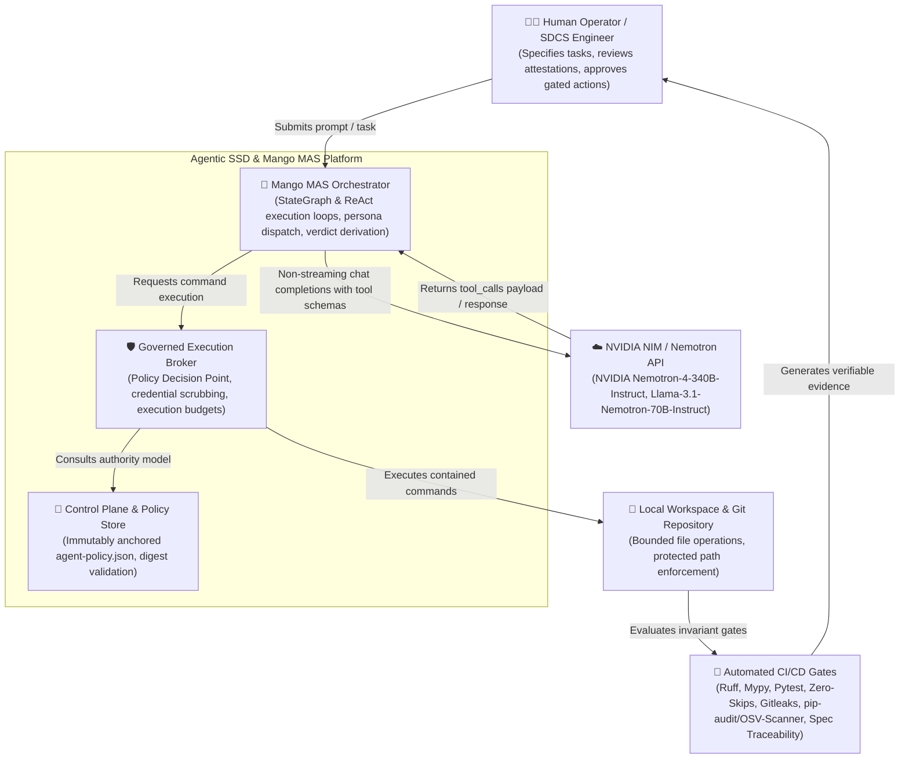
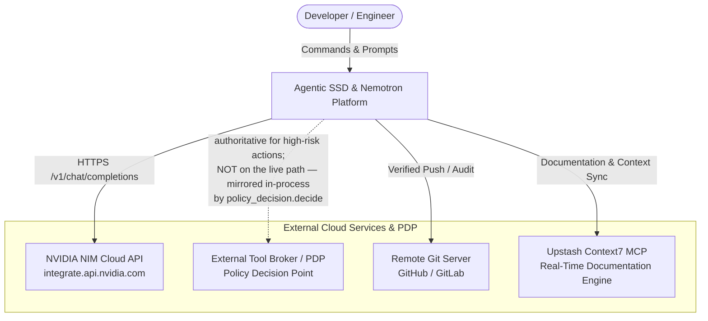
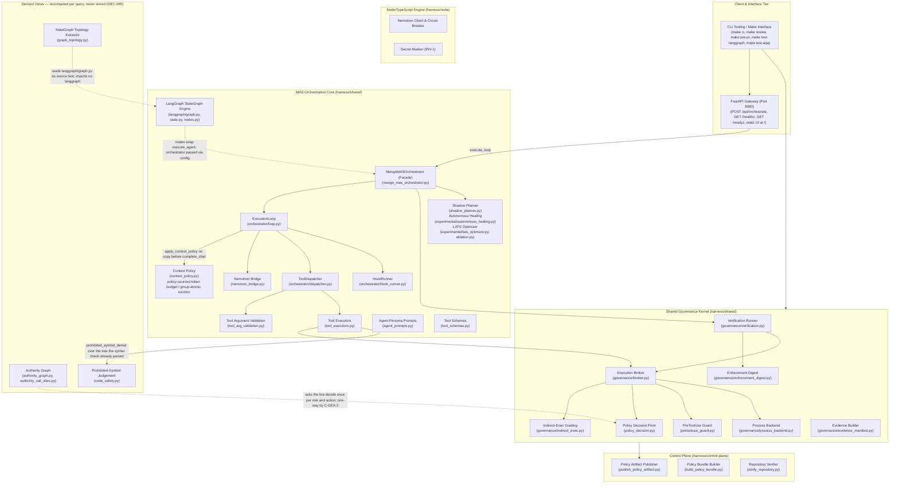
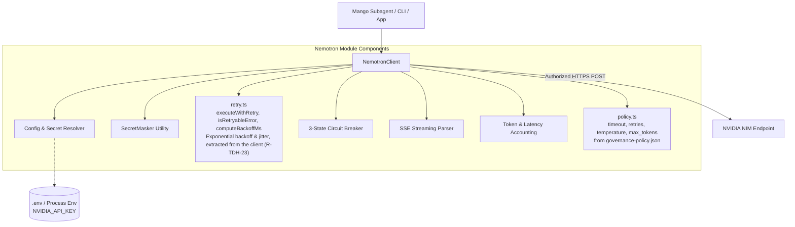
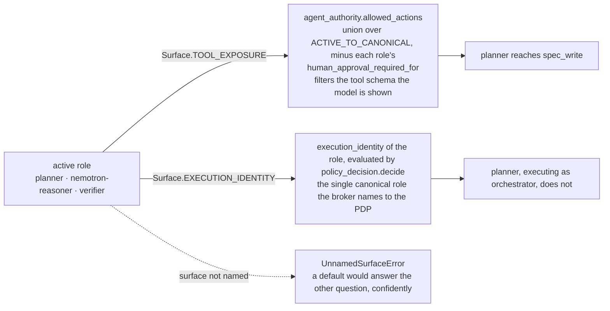

# C4 Architecture: Agentic SSD & Mango MAS Platform

> **Consolidated from** two documents (tech-debt hardening plan R-TDH-24): this
> file, the canonical model at v2.4.0, and `harness/docs/C4_ARCHITECTURE.md`, a
> v2.1.9 snapshot now deleted. Everything the snapshot had that this file lacked
> is folded in: the external-dependency context view (§1.1), the detailed
> `harness/shared` container view (§2.1), the Node-stack Nemotron component
> diagram (§3.2), the CI gate chain with its rationale (§4.8) and the INV-16
> cognitive/execution boundary (§4.9). Where the two disagreed the newer
> statement is kept: the snapshot's `.agents` skill-registry container is
> dropped (`.mango/skills/` is the only skill root), its monolithic
> orchestrator node is now the facade plus the `orchestrator/` package, its
> `1564 tests` label is dropped (the README carries the current count), and the
> version below is this file's, not the snapshot's 2.1.9.

**Version:** 2.5.0 (C4 model updated 2026-09-06 — Origin Sync, Hypothesis Surfacing, Context Budgets)
**Standard:** C4 Model for Visualising Software Architecture (Context, Containers, Components, Code)
**Governing Harness:** Agentic SSD Gate Harness Contract v2.1 (`harness/CONTRACT.md`) (INV-1..INV-17)

> **2.5.0 delta from 2.4.0:**
>
> - Origin Sync (2026-09-06): Re-integrated forward features DEC-057 (memory_store split, append-only hypothesis revision) and DEC-058 (hypothesis surfacing).
> - Context-window budget on ExecutionLoop implemented (H4).
> - Retired NS-17/NS-21 rollback regression tests; recorded via DEC-060 decision log.
> - Preserved RCA-1→RCA-11 Windows portability fixes, renumbering DECs to 059, 061, 062 to avoid origin ID clashes.
> - Fixed test matrix (Smoke, Offline, Coverage, Live e2e, Static Gates) all passing. Test suite: >4000 passed, 0 failures.
> - `pyrightconfig.json` added (root); sets `extraPaths=["."]` for Pylance parity with pytest.
> - `test_windows_portability_regression.py` expanded to enterprise AQA; added AQA-001 (`test_scripts_hook_shims.py`), AQA-002 (`test_scan_findings_windows_waiver.py`), AQA-004 (`test_gaps_memory_integrity.py`), AQA-006 (`test_process_backend_isolation_regression.py`), and AQA-007 (`test_capability_probe_vocabulary_regression.py`).
> - INV-13 step 6 (2026-09-09): `capability_probe.py` is drawn in the `governance/` subgraph and is **not** connected to `ProcessBackend`. Host inventory (`enforced` / `absent` / `undetermined`) is not a `BackendCapabilities` record.
> - INV-13 steps 7–9 (2026-09-09): `landlock_backend.py` is a sibling of `ProcessBackend` under `ExecutionBackend` and is **not** the broker default. `sandbox_policy.py` compiles in memory; no derived artifact.
> - Script hook shims (`scripts/verify-tier-a.sh`, `scripts/guard-forbidden-paths.sh`) wired to `.mango/agents/hooks.json`.
> - Memory cleanup & knowledge gap truncation integrity fortified under DEC-064.
> - Windows console charmap encoding fix (`_safe_str` backslashreplace) and DEC-026 zero-skip attribution wired across live E2E test suites.
>

## 1. Level 1: System Context Diagram

The System Context diagram illustrates the high-level boundaries between human operators, autonomous agent personas, the Mango MAS Orchestrator (and its LangGraph StateGraph engine), external LLM inference providers (NVIDIA Nemotron / NIM), and the local system environment.



### 1.1 External dependencies view (from the v2.1.9 snapshot)

The System Context diagram illustrates the high-level actors, the Autonomous Mango Multi-Agent Ecosystem, and external cloud infrastructure.
The view below keeps the external parties the diagram above folds into `CIGates` and `LocalFS`:
the external tool broker / PDP that is authoritative for high-risk actions but not on the live path
(mirrored in-process by `policy_decision.decide`), the remote Git server, and the Context7 MCP
documentation engine.



---

## 2. Level 2: Container Diagram

The Container diagram zooms into the Agentic SSD system boundaries, displaying its primary runtimes, APIs, LangGraph StateGraph engine overlay, and policy enforcement engines.



The `MAS`/`LangGraph_Engine` edge is drawn in the direction the code calls: the
StateGraph's agent nodes (`langgraph/nodes.py`) wrap
`MangoMASOrchestrator.execute_agent`, receiving the orchestrator through the
graph's `configurable` config. Neither the facade nor `orchestrator/loop.py`
imports LangGraph, and `build_graph` is reached only from the parked
`experimental/autonomous_healing.py` (DEC-027). Before each `complete_chat`,
`ExecutionLoop` shapes a **model-facing** copy of `conversation_history` through
`context_policy.apply_context_policy` using `orchestrator.context_budget_tokens`
/ `context_chars_per_token` from policy (audit H4); the full append-only history
is retained for dumps and API responses. An earlier revision drew
`Loop → LangGraph_Engine`, which reversed that dependency.

`Derived Views` is a container in the C4 sense — three modules with a shared
lifetime rule — rather than a runtime process. Nothing in it holds an artifact:
each query recomputes from the same functions the enforcing code calls, because a
persisted copy of governance state is a cache, and a cache of governance state is
a staleness bug with a security consequence — the stored graph says one thing
while the broker enforces another (§4.10). All three edges above point *into* the
subsystems the views read and none points back out: `C-GEA-2` forbids
`harness/shared/governance/**`, `write_policy.py`, `read_policy.py` and
`agent_authority.py` from importing either `authority_graph` or
`authority_call_sites`, and
`test_authority_graph.py::TestTheGovernanceLayerDoesNotDependOnTheGraph` decides
that by `ast` rather than by grep, so a docstring that merely names the module
does not trip it. `CodeSafety` is the one exception to "a derived view is a
read-only observer": it sits on the live write path, and `execute_generate_code`
refuses the write on its verdict (`tool_executors.execute_generate_code`, §4.5.2).

### 2.1 Detailed container view of `harness/shared` (from the v2.1.9 snapshot)

The Container diagram shows the runtime environments, repositories, tools, and execution processes.
Component-level detail for the shared runtime, the control plane and the AQA engine; the
`orchestrator/` decomposition and the `experimental/` move post-date the snapshot and are
reflected in §2 above.

```mermaid
graph TD
    User([Developer / Engineer]) --> CLI[Terminal CLI / PowerShell / Bash]

    subgraph "Repository Runtime Containers"
        subgraph ".mango Agent Runtime"
            MA[Mango Agent Core]
            SubAgents[Subagents: nemotron-reasoner, planner, verifier]
            Personas[Persona Topology: Web Presenter, Node Bridge]
            Hooks[Lifecycle Hooks: PreToolUse, Stop, SessionStart, PreNemotron]
            Skills[Skills: repo-invariant-review, openspec-peer-review, nemotron-reasoner]
            AgentMetaTools["Continuous Learning: knowledge_gap_log, hypothesis_register (shipped) · MCPs: query_docs (Context7) — Planned"]
            Memory[(Workspace JSON Memory &lt;workspace&gt;/.mango/memory: gaps.json, hypotheses.json — append-only, FIFO-bounded; read back into prompts under policy bounds: open gaps → planner, open hypotheses → reasoner)]
            MA --> SubAgents
            SubAgents --> Personas
            MA --> Hooks
            MA --> Skills
            MA --> AgentMetaTools
            AgentMetaTools --> Memory
        end

        subgraph "Node.js Container - harness/node"
            TSClient[NemotronClient<br/>TypeScript Adapter & Circuit Breaker]
            VitestRunner[Vitest Test Runner<br/>Multi-Tier Matrix]
        end

        subgraph "Python Shared Runtime - harness/shared"
            PyBridge[nemotron_bridge.py<br/>Python Adapter — HTTP, auth, response shape]
            RetryPolicy[retry_policy.py<br/>Pure backoff arithmetic<br/>no I/O, no clock, no network]
            Orchestrator[mango_mas_orchestrator.py facade<br/>+ orchestrator/ loop, dispatcher, hook_runner<br/>+ context_policy.py budget eviction]
            DebugDump[debug_dump.py<br/>Credential redaction + debug dumps]
            MetaTools[meta_tools.py<br/>Meta-Learning Tools + record semantics<br/>+ hypothesis status/revision transitions]
            MemoryStore[memory_store.py<br/>file_lock, malformed recovery, FIFO, append_locked]
            MemoryView[memory_view.py<br/>format_hypotheses_for_review — operator, unbounded<br/>format_hypotheses_for_reasoner — prompt, policy-bounded]
            PyBridge -->|asks for a delay| RetryPolicy
            Orchestrator -->|redacts history through| DebugDump
            MetaTools -->|store mechanics| MemoryStore
            MemoryView -->|reads records via| MetaTools
            Orchestrator -->|open_gaps to planner| MetaTools
            Orchestrator -->|open_hypotheses to reasoner, DEC-058| MemoryView
            subgraph "Cognitive Boundary — INV-16 (one-directional)"
                Signal[cognitive_signal.py<br/>CognitiveSignal envelope + JSONL sink]
                Shadow[shadow_planner.py<br/>Shadow-mode comparison channel<br/>MANGO_SHADOW_PLANNER, off by default]
                Shadow -->|emits, zero tool authority| Signal
            end
            subgraph "Gates — policy-sourced, fail-closed"
                CoverageGate[coverage_gate.py<br/>lines + branches as two floors<br/>from governance-policy.json]
                CoverageScope[coverage_scope.py<br/>which files the floors judge:<br/>per-file floor, optional-extra waivers,<br/>measured-set bound vs on-disk sources]
                CoverageGate -->|delegates membership to| CoverageScope
            end
            subgraph "Derived views — recomputed per query, never stored (DEC-065)"
                AuthorityGraph["authority_graph.py<br/>two grant surfaces that deliberately disagree:<br/>tool exposure vs execution identity;<br/>a query naming neither raises UnnamedSurfaceError"]
                CallSites["authority_call_sites.py<br/>ast scan for a broker context a caller did not build:<br/>114 first-party non-test modules, 5 call sites, 0 witnesses"]
                TopologyExtract["graph_topology.py<br/>StateGraph nodes and edges from source via ast;<br/>imports no langgraph, so no skipif and no INV-2 skip"]
                CodeSafetyView["code_safety.py<br/>the write door's second question of one parse tree:<br/>does this name a synthesis.prohibited_imports symbol"]
                AuthorityGraph -->|re-exports approval_flag_reachability| CallSites
            end
            subgraph "governance/"
                Broker[broker.py<br/>ExecutionBroker<br/>INV-8/9/10 — contains, does not isolate]
                ExecBackend[execution_backend.py<br/>ExecutionBackend protocol + ExecutionResult]
                ProcessBE[process_backend.py<br/>ProcessBackend adapter<br/>broker default — contains, does not isolate]
                LandlockBE[landlock_backend.py<br/>LandlockBackend — tests construct directly<br/>FS PATH_BENEATH + TCP default-deny]
                SandboxPol[sandbox_policy.py<br/>in-memory compile from governance + agent policy<br/>no derived artifact]
                EvidenceRec[evidence_record.py<br/>digest-of-digests + JSONL sink<br/>sandbox digest only when Landlock applied both]
                CapProbe["capability_probe.py<br/>host inventory: enforced / absent / undetermined<br/>stdlib, spawn-free; not a BackendCapabilities record"]
                PDP[policy_decision.py<br/>In-process PDP<br/>mirrors tool_broker_reference.py]
                Actions[command_actions.py<br/>command → declared action; allowlist,<br/>unmodelled ⇒ an action no role holds]
                GovGuards[pretooluse_guard.py<br/>Policy Guards — resolved from the installed<br/>package; unavailability denies]
                Validators["Governance Validators<br/>traceability, zero-skips, remotes"]
                AllowlistGate["check_secret_allowlist.py<br/>every .gitleaks.toml allowlist entry must still<br/>suppress a real finding; keeps are scoped to the<br/>allowlist block itself — INV-1, DEC-035"]
                Attestation["attestation.py<br/>derives the protected-path attestation table<br/>from validate_invariants own matcher and<br/>discovery — imported, never reimplemented; DEC-038"]
                Evidence[evidence_manifest.py<br/>EvidenceBuilder — HMAC attestation]
                Broker --> PDP
                Broker --> Actions
                Broker --> GovGuards
                Broker --> ExecBackend
                ExecBackend --> ProcessBE
                ExecBackend --> LandlockBE
                LandlockBE --> SandboxPol
                LandlockBE --> CapProbe
                Broker --> EvidenceRec
                EvidenceRec --> Evidence
            end
            WritePolicy["write_policy.py<br/>protected_paths at tool-call time<br/>+ any .git segment<br/>+ credential filenames"]
            Authority[agent_authority.py<br/>per-role tool exposure, derived from agent-policy.json]
            RootValidators["Root Validators<br/>policy, adoption, agent-policy"]
            Orchestrator -->|run_command| Broker
            Orchestrator -->|write_file target| WritePolicy
            Orchestrator -->|write_file / apply_patch role check| Broker
            Broker -->|write targets of a command| WritePolicy
            Orchestrator -->|tools_for_role / execution_identity| Authority
            Orchestrator -.->|guarded, observation-only| Shadow
            Orchestrator -->|generate_code: refused before bytes land| CodeSafetyView
            AuthorityGraph -->|allowed_actions and execution_identity, the live functions| Authority
            AuthorityGraph -->|decide per canonical role and action| PDP
        end

        subgraph "Control Plane - harness/control-plane"
            Publisher[publish_policy_artifact.py<br/>Versioned, digest-pinned policy artifact]
            Artifact[(policy-artifact.json<br/>committed, drift-gated)]
            Verifier[verify_repository.py<br/>External root-of-trust verifier]
            Publisher -->|attest, optional| Evidence
            Publisher --> Artifact
        end

        subgraph "Python AQA Engine - harness/{shared,api_server,control-plane}/tests"
            RootConftest["conftest.py (repository root)<br/>session hooks → _session_hooks.py<br/>skip evidence TSV (INV-2 Python half) + langgraph deselection<br/>DEC-030: at the rootdir so all three suites are covered"]
            AQA["Pytest AQA Suite<br/>coverage gate per policy — lines and branches"]
            CPTests["control-plane suite<br/>colocated with its scripts (R-TDH-26)<br/>test_control_plane_layout.py is the meta-test"]
            RunpyExec["runpy.run_path() Executor<br/>In-Process CLI Coverage"]
            RootConftest --> AQA
            RootConftest --> CPTests
            AQA --> RunpyExec
            RunpyExec -->|executes in-process| Validators
            RunpyExec -->|executes in-process| PyBridge
            RunpyExec -->|executes in-process| GovGuards
            AQA -->|drift gate| Artifact
        end
    end

    CLI --> TSClient
    CLI --> PyBridge

    SubAgents --> TSClient
    SubAgents --> PyBridge
    Hooks --> GovGuards

    TSClient -->|HTTPS POST| NIM[NVIDIA Nemotron Ultra API]
    PyBridge -->|HTTPS POST| NIM
```



### 2.2 API surface (`harness/api_server/main.py`)

The FastAPI gateway exposes one orchestration route, two unauthenticated probe
routes, and serves the static UI:

- `/api/orchestrate` — `POST`, guarded by the `X-API-Key` header (`API_SERVER_KEY`,
  compared with `secrets.compare_digest`); runs `MangoMASOrchestrator.execute_loop`
  in a threadpool and returns the redacted history, typed per role
  (`harness/api_server/messages.py`), with the earned verdict.
- `/healthz` — `GET`, liveness: 200 whenever the process answers.
- `/readyz` — `GET`, readiness: 200 only when `API_SERVER_KEY` is set and the
  governance policy loads (every accessor the orchestrator's constructor
  resolves) and the bridge can resolve a model credential; otherwise 503 with
  the body `{"status": "unavailable", "checks": {"api_key": bool, "policy": bool, "model_credential": bool}}`,
  never a path or a value.
- `/` — the static dashboard under `harness/api_server/static/`, mounted with
  `html=True`; the directory is created by the lifespan hook, not at import.

Every backticked path in this section is asserted against `app.routes` by
`TestDocumentedRoutesExist` in `test_documentation_truth.py`. An earlier revision
listed three routes — a health probe, a versioned orchestrator-run path and a
models list — none of which the server has ever registered (2026 standards
audit, M26); that is the drift the assertion exists to catch. The bridge posts
`stream: False` (`nemotron_bridge.py`), so nothing on the Python path streams
reasoning; SSE streaming exists only in the Node client (§3.2).

---

## 3. Level 3: Component Diagram (MAS Orchestration & Execution)

Detailed view of the internal components within `harness/shared/` responsible for governed tool execution, multi-agent loops, and LangGraph StateGraph topology.

```mermaid
classDiagram
    class MangoMASOrchestrator {
        +Path workspace_dir
        +str model
        +int max_iterations
        +execute_sequential_thinking_loop(task) str
        +execute_loop(task) LoopOutcome
        +execute_agent(agent_name, prompt, tools, budget) str
        -_run_hooks(agent_name, phase)
        -_dispatch_tool_calls(tool_calls, agent_name, budget)
    }

    class LangGraphEngine {
        +build_graph(policy, checkpointer) CompiledGraph
        +MangoState state_schema
        +GraphPolicy policy
    }

    class MangoState {
        +str task
        +str plan
        +str shadow_plan
        +float plan_divergence
        +int revision_count
        +dict gate_status
        +str verdict
        +int tool_budget_used
        +list patches (accumulator)
        +list findings (accumulator)
        +list test_results (accumulator)
        +list errors (accumulator)
    }

    class GraphNodes {
        +planner_node(state, config) dict
        +shadow_planner_node(state, config) dict
        +implementer_node(state, config) dict
        +evaluation_node(state, config) dict
        +plan_gate_node(state) dict
        +quality_gate_node(state) dict
        +clarify_node(state) dict
        +escalate_node(state) dict
        +peer_reviewer_node(state) dict
        +security_reviewer_node(state) dict
    }

    class ToolExecutors {
        +execute_write_file(workspace_dir, filepath, content) str
        +execute_read_file(workspace_dir, filepath, start_line, end_line) str
        +execute_apply_patch(workspace_dir, filepath, old_text, new_text) str
        +execute_run_command(broker, active_role, workspace_dir, command, timeout) str
        +execute_generate_code(workspace_dir, filepath, code, language, validate_syntax, overwrite) str
        +authorize_write(broker, active_role, filepath) str|None
        -_validate_code_syntax(filepath, code, language) tuple
    }

    class CodeSafety {
        +load_prohibited_symbols(policy_path) tuple
        +prohibited_symbol_findings(tree, prohibited) list
        +prohibited_symbol_denial(tree, policy_path) str|None
    }

    class ExecutionBroker {
        -_agent_policy_path: Final[Path]
        -_backend: ExecutionBackend
        +execute_command(command, cwd, context, timeout, max_bytes) ExecutionResult
        -_policy_decision(action, context) str
    }

    class ExecutionBackend {
        +name: str
        +version: str
        +available() bool
        +capabilities() BackendCapabilities
        +execute(request: ExecutionRequest) ExecutionResult
    }

    class ProcessBackend {
        +available() bool
        +capabilities() BackendCapabilities
        +execute(request: ExecutionRequest) ExecutionResult
        +run(command, cwd, timeout, max_bytes, env_override) ExecutionResult
        +_cap(text, max_bytes) tuple
    }

    class VerificationRunner {
        +run(cwd, target) HarnessCheck
        +derive_verdict(harness_check) Verdict
    }

    class NemotronBridge {
        +complete_chat(messages, tools, model, api_key, timeout) dict
        +mask_api_key(key) str
    }

    LangGraphEngine --> MangoMASOrchestrator : nodes call execute_agent (orchestrator via config)
    LangGraphEngine --> MangoState : state channels
    LangGraphEngine --> GraphNodes : invokes nodes
    GraphNodes --> MangoMASOrchestrator : wraps execute_agent & _harness_verdict
    MangoMASOrchestrator --> ToolExecutors : invokes operations
    MangoMASOrchestrator --> NemotronBridge : requests chat completions
    MangoMASOrchestrator --> VerificationRunner : derives terminal verdict
    ToolExecutors --> ExecutionBroker : brokers run_command, asks the PDP for write/patch
    ToolExecutors --> CodeSafety : re-uses the parse tree, denies before the write
    ExecutionBroker --> ExecutionBackend : protocol execute(ExecutionRequest)
    ProcessBackend ..|> ExecutionBackend : adapter; containment not isolation
```

### 3.2 NVIDIA Nemotron AI Subsystem (`harness/node/src/ai/nemotron/`)



---

## 4. Level 4: Code, Invariants & Security Boundaries

### 4.1 Immutable Authority Anchoring (`R-AC-11`)

- **Isolation Principle**: Policy rules (`agent-policy.json`) are resolved statically relative to package installation directory:

  ```python
  _AGENT_POLICY_PATH: Final[Path] = Path(__file__).resolve().parent.parent / "agent-policy.json"
  ```

- **Containment**: Untrusted agent workspaces cannot override governance policy by planting modified local policy files.

### 4.2 Re-entrant Verification & Honest Verdicts (`INV-12`, `INV-13`)

- The terminal verdict is earned mechanically via `VerificationRunner` executing `make -f Makefile test-python` through `ExecutionBroker`.
- Provenance is enforced by strong typing: `derive_verdict` accepts only `HarnessCheck` created by the harness itself, rejecting arbitrary agent-supplied `ExecutionResult` structures.
- INV-13 is **four of five** on the default broker evidence path when evidence is enabled: policy digest, source as a digest-of-digests of the loop-start enforcement baseline, backend name+version, and test digest over the resolved verification command plus collected node ids. **Sandbox is recordable on `LandlockBackend`** when filesystem and network isolation were both applied (DEC-069). The broker default remains `ProcessBackend` and does not claim the fifth digest. C-AEI-6 remains if a future runner loses Landlock. Step 6 (AC-12) inventories host primitives and is not a `BackendCapabilities` record. `ExecutionResult` / `HarnessCheck` / `Verdict` do not carry digest fields; those live on the evidence entry. A keyless evidence-enabled broker returns `BLOCKED` naming `AGENT_EVIDENCE_KEY` before spawn.

### 4.3 PreToolUse Command Guard (`INV-8`, `INV-9`, `INV-10`)

- Blocks high-risk shell vectors (`rm -rf /`, credential harvesting, unauthorized network calls, shell pipe escapes).
- Applies `write_policy` check against `protected_paths` on all command write/redirection targets.

### 4.4 Secret Safety & Credential Scrubbing (`INV-1`)

- All environment variables matching credential patterns (`NVIDIA_API_KEY`, `GITHUB_TOKEN`, `AWS_SECRET_ACCESS_KEY`) are stripped before passing to brokered child processes.
- Memory dumps generated for debugging (`write_dump`) redact sensitive tokens with high-entropy regex sanitizers.

### 4.5 Direct File I/O Governance: Read/Patch Parity (`DEC-012`)

- `read_file`, `write_file` and `apply_patch` read and write the filesystem directly from `ToolExecutors`, so they never reach the PreToolUse guard or `ProcessBackend` — those stay `run_command`'s alone. They **do** reach the policy decision point: `tool_executors.authorize_write` calls the public `ExecutionBroker.authorize_action(agent_id, "write")`, asking for the action directly, and returns the denial reason or `None` so one action model grades both doors (`DEC-042`). It is deliberately *not* phrased as a synthesised command: an earlier form asked `classify("tee <path>")` and let the action be derived, which a filepath of `-find` turned into `read` — an action every role holds — so the verifier and planner wrote files through both doors. Before that, `ToolDispatcher` asked nothing while `mcp_server` asked — they were refused by one transport and admitted by the other.
- Path-level governance is two in-process policy modules consulted at tool-call granularity: `write_policy.write_denial_reason` (denies `protected_paths` matches, any `.git` path segment, and credential-bearing filenames) and `read_policy.read_denial_reason` (denies credential-bearing filenames and any `.git` segment). The two questions are distinct and both are asked: the PDP decides *who* may write, the write policy decides *what* may be written.
- The credential-filename alternation has one definition, in `write_policy`, re-exported by `read_policy` and composed by `command_actions` — three anchorings of one pattern (a whole path segment on each file door, a shell word in the classifier), pinned by object identity so they cannot drift. It moved there because the write side had no credential rule at all: `.env` is deliberately untracked, so `protected_paths` matched nothing and `write_denial_reason(".env")` returned `None` (`DEC-042`).
- `apply_patch` consults `read_denial_reason` **first**, then the write policy. This corrects `DEC-012`'s account that it reuses `write_denial_reason` unchanged: a patch reads before it writes, and its `matched 0 times` / `matched 1 times` reply was a substring oracle over every file `read_file` refuses. `agent-policy.json` grants it no new action.
- `command_actions.classify` grades the words the **shell** produces, not the command text: `bash -c` strips quotes, resolves backslashes, expands braces and expands globs before a program sees an argument, so a text-scanning rule was checking a string no filesystem call ever sees. `shell_words.py` owns that analysis; the classifier owns what a command *does*.
- Every verdict is logged at DEBUG from one place — `classify` is a thin wrapper over `_classify` — with the command redacted and truncated, guarded on `isEnabledFor`. Before `DEC-043` this module had no logger at all: `Classification.reason` reached the agent through `ExecutionResult.reason` and stopped there, so an operator saw `action=secret_access` with no way to learn which word triggered it, and an **allowed** grading left no trace whatsoever. The second is the one that matters — a credential read that graded `read` would have been invisible by construction, which is why four rounds of bypass fixes on this module were all found by review and none by a log.

### 4.5.1 Policy resolution: absence is an adopter, incompleteness is a fault (`DEC-043`)

```text
governance-policy.json ──▶ policy_io._Section(data, name, backed) ──▶ policy_defaults accessors
                                    (policy_loader is the facade)
                                    │
        file absent ────────────────┤──▶ built-in default   (supported: the adopter path)
        file present, key gone ─────┴──▶ PolicyError        (fail closed)
```

- Every operational threshold resolves through `policy_loader` (facade over `policy_io` / `policy_defaults`), and `_Section` in `policy_io.py` carries the block's data **and whether a policy file backs it**. One call site expresses both outcomes, so no accessor restates the rule. `coverage.optional_extras` keeps a separate `.optional` accessor, because "this deployment declares no extras" is a statement while a missing threshold is a hole. New top-level `evidence` and `execution` blocks follow DEC-043 (a key inside an adopted block is `PolicyError` for every pre-block adopter).
- `validate_invariants` states no defaults for `protected_paths` or `limits`. The former's old `[".github/**"]` fallback left one pattern matching, so the gate printed `[PASS] Protected Paths` while all three protected groups were unguarded.
- `MAX_FILE_LINES`, `MAX_TEST_FILE_LINES` and `MAX_SHIM_LINES` may only **tighten** a budget; a loosening value is ignored and logged. Returned verbatim, they let anyone who could set an environment variable switch a gate off while it still printed its PASS line.
- `verify_zero_skips` resolves its decision-ID grammar on first use, not at import, so a gate's fail-closed `SystemExit` stays inside the run being gated rather than inside any importer's process.

### 4.5.2 The generate-code write door asks its parse tree a second question (`R-GEA-3`)

- `execute_generate_code` has always parsed generated Python with `ast.parse` to
  answer *does it compile*, then discarded the tree.
  `tool_executors._validate_code_syntax` now returns `(error, tree)`, and
  `execute_generate_code` puts that same tree to
  `code_safety.prohibited_symbol_denial` before any byte reaches disk. A denial there is a refusal, not a repair cycle:
  the file never exists, which is the property `execute_generate_code` already
  had for a syntax error and did not have for a policy violation.
- **The defect this check's shape prevents is a checker that decides two of five
  entries.** `synthesis.prohibited_imports` declares `os.system`, `subprocess`,
  `shutil.rmtree`, `importlib` and `__import__` — three different shapes in one
  key. Two are importable modules; two are attribute targets reachable through a
  bare `import os` / `import shutil`; and `__import__` is a builtin no import
  statement ever names. A walk over `ast.Import` / `ast.ImportFrom`, which is the
  obvious reading of the key's *name*, decides the first two and passes the other
  three in silence while reporting success. So `code_safety.py` resolves import
  bindings first (`import os as o` makes `o.system` the policy entry
  `os.system`), reads the longest name chain rather than each prefix, treats an
  unbound head as itself — which is what catches `__import__` — and expands
  `from os import *` into the prohibited attributes that star binds on the
  module's behalf.
- Single-module decidable by construction (`C-GEA-3`): it reads the one
  `ast.Module` it is handed plus the policy file, and consults no repository-wide
  index, because a write door that depends on a stale index denies valid writes.
- Fail-closed on its own input (`R-GEA-4`): a `synthesis.prohibited_imports` that
  is missing, empty, of the wrong type, or holding a non-string raises
  `ProhibitedSymbolPolicyError` rather than admitting everything. An empty
  prohibition is a check that cannot fail, which is worse than an absent check
  because it converts an open question into a false assurance.
- The analysis lives in the unprotected `code_safety.py` rather than inside
  `tool_executors.py`, which is a protected path: a four-line diff there is a
  cheap review and a sixty-line one is not, and the next write door needing this
  judgement calls a function instead of copying one.
- **No model-supplied argument turns the check off.** Python-ness is derived from
  the *resolved target suffix*, not from the `language` argument, and the
  prohibited-symbol check runs on every Python write regardless of
  `validate_syntax`. Both are model-supplied, so deriving from either would let
  the agent whose output the check constrains decide whether it applies — a `.py`
  target declared `language="markdown"` did exactly that. DEC-065 first recorded
  this as an accepted residual, on the reasoning that closing it would widen a
  protected-path diff; review on PR #120 rejected that and was right, since a diff
  cost is not an argument about a security property. One parse still serves both
  questions, so `R-GEA-3`'s "reuse the AST already parsed" is honoured rather than
  contradicted, and `validate_syntax` keeps its only defensible meaning: whether a
  syntax *error* is reported. Workspace confinement, `write_denial_reason` and
  `authorize_write` run first and are unchanged.
- `write_file`, `apply_patch`, `read_file` and `run_command` are unchanged, so
  `C-CGT-2` in `docs/specs/code-generation-tool.md` still holds. What changed is
  one previously accepted input class: generated Python naming a prohibited
  symbol now returns a denial where it previously wrote the file.

### 4.6 Neuro-Symbolic Sandbox & Critique Normalization (`AC-NS-3`, isolation spec steps 6–9, `INV-9`)

- **Capability Profiles**: The production broker default is `ProcessBackend`, which implements `ExecutionBackend` and only pins `cwd`, `timeout`, and `max_output_bytes` before executing the bash subprocess. INV-13 **steps 7–9** (DEC-069) add `LandlockBackend`, constructed by tests, not by the broker default: filesystem `PATH_BENEATH` to the request workspace and TCP default-deny in the child. `capability_probe.py` reports whether LSM, Landlock, unprivileged userns, and container runtimes *exist* (`enforced` / `absent` / `undetermined`) and is **not** connected to `ProcessBackend`. `execution.routing` is `brokered` or `refuse`; a third value is `PolicyError`.
- **Violation Trapping**: In testing environments, a mock backend simulates isolation by emitting a structured `SandboxViolation` payload when a command violates assumed constraints (e.g., outbound socket I/O).
- **Critique Normalization (`tool_result_format.py`)**: `format_execution_result` intercepts `SandboxViolation` payloads from `stderr` (when generated by the mock backend) and translates them into a standardized Critique schema (`failure_type`, `evidence_id`, `normalized_message`, `location: execution_broker`). This enables deterministic agent repair loops for neuro-symbolic testing.
- **Fail-Closed Sandbox Availability (`INV-9`)**: If the backend is configured as unavailable (`sandbox_available=False`), commands are blocked immediately rather than falling back to host execution.

### 4.7 LangGraph StateGraph Architecture & Invariants (`INV-LG-1` .. `INV-LG-7`)

- **INV-LG-1: 12-Channel Typed State**: The StateGraph operates over a partitioned 12-channel `MangoState` TypedDict: 4 Accumulator channels (`patches`, `findings`, `test_results`, `errors`) reduced via `operator.add`, and 8 Last-Write-Wins (LWW) scalar channels. Gate bookkeeping that is not itself a channel — `quality_gate_reason`, `clarify_count` — lives inside the existing `gate_status` dict, so the channel count is a property of the state schema rather than of how many things the gates track.
- **INV-LG-2: Pure Node Immutability**: Node functions must never mutate state dictionaries in-place; all node outputs return pure partial dictionary updates.
- **INV-LG-3: Contained Error Channel Routing**: Errors occurring within agent tool invocations or model inference are isolated within `try/except` handlers and recorded into the `errors` channel rather than causing unhandled graph crashes. *Containment is not consequence* — this invariant says an error must not crash the graph, and says nothing about the verdict a run with a recorded error may reach. That second half is `INV-LG-6`, and until it existed the channel had no reader on any path through the compiled graph: a denied planner produced `VERIFIED` over an empty plan. Formerly titled "Fail-Open Error Channel Routing", which read as licensing the fail-open outcome rather than describing contained isolation.
- **INV-LG-4: Role Authority & Tool Budget Decorators**: Nodes holding execution authority are annotated with `@with_authority(role=..., may_write=...)` and `@budgeted(budget_key=...)` to enforce role constraints at the node boundary. A denial is recorded to `errors` and is terminal for the run under `INV-LG-6`; before that it was a log line and a list append that nothing read.
- **INV-LG-5: Ablation Isolation**: LATS/MCTS rollouts are tracked in an `AblationChannel` (`langgraph/ablation.py`) whose hypothetical states are deep-copied, so a rollout can never mutate the primary `MangoState`. Declared in `docs/specs/lats-optimization.md` and enforced by `test_ablation.py`; it was live in code and cited by that spec while absent from this section, which is why the heading now runs to `INV-LG-7`.
- **INV-LG-6: Fail-Closed Verdict**: A run MUST NOT terminate `VERIFIED` when the `errors` channel holds a **blocking** record, or when the latest `test_results` entry is inconclusive (`passed + failed == 0`). Terminality is decided once, in `langgraph/errors.py`: control-plane nodes block, the observation plane (`OBSERVATION_NODES`) does not — because `INV-16` requires an observation-mode producer's failure to leave the incumbent path unaffected — and an unrecognised node name blocks, so an unclassified error fails closed. A blocking error routes straight to `escalate` rather than consuming revision budget, since `errors` is an `operator.add` accumulator no node clears and a retry cannot remove the record that failed the gate.
- **INV-LG-7: Injectable Config Contract**: Every node and routing function that reads `config` MUST annotate that parameter in a form LangGraph injects — `RunnableConfig`, `Optional[RunnableConfig]`, or no annotation at all (`KWARGS_CONFIG_KEYS` in `langgraph._internal._runnable`). Any other annotation, `Any` included, is skipped with a `UserWarning` raised at graph-build time and the parameter never arrives, so a policy threaded through `configurable` is silently discarded while unit tests that call the function directly still pass. Under PEP 563 the annotation is compared as the string it spells, so `X | None` is **not** an accepted form. Pinned by `TestConfigInjectionContract`.

**There is deliberately no `INV-LG-8`.** `R-GEA-6` adds no LangGraph invariant
while `DEC-053`'s park carries `status: accepted`, and the reason is that the
park is *decided but unexecuted*: `harness/shared/langgraph/` is still at its
original path, Phase E is blocked behind NS-2 (a credential rotation needing a
human at a provider), and a new fail-closed invariant over parked code would buy
a required check, a `harness/CONTRACT.md` row and a protected-path attestation on
every PR for a subsystem with a named sunset. What the park does *not* justify is
leaving the defect unwatched for that indefinite period, so the pin lands on the
test surface instead (§4.8.2):

- `peer_reviewer` and `security_reviewer` are registered as nodes with **no
  incoming and no outgoing edge**, so `INV-LG-1`'s `findings` accumulator is
  empty on every run. `DEC-052` records that state in prose.
  `test_langgraph_graph.py::test_graph_has_all_expected_nodes_live`
  asserts the node *set*, which both orphans satisfy — a fix that wired them in
  would not fail it and a fix that deleted them would, so the behavioural suite
  pinned the defect rather than catching it.
- `test_graph_topology_parked.py::test_orphan_reviewers_match_the_recorded_decision`
  now asserts both halves at once: the two nodes are edgeless **and** `DEC-052`
  says so. It goes red when either reviewer is wired in without amending
  DEC-052, and when either node is deleted silently.
- The topology it asserts over comes from `graph_topology.extract_topology`,
  which reads `harness/shared/langgraph/graph.py` as
  **source text** and imports nothing from `langgraph` — 10 nodes and 13 edges
  today, with `nodes_without_edges()` returning exactly those two. Reading source
  is what keeps the check off a `skipif` on an optional import, and therefore out
  of `INV-2`'s skip ledger looking for a waiver (`R-GEA-6c`;
  `test_graph_topology.py::test_topology_extraction_is_source_based` pins the
  absence of that import). Every failure to read the source raises
  `TopologyExtractionError` rather than returning an empty topology, because
  "`peer_reviewer` has no incoming edge" is vacuously true of a graph with no
  edges (`R-GEA-4`).
- `test_graph_topology_parked.py::test_topology_gate_is_parked_with_langgraph`
  pins the absence of a topology **target** to DEC-053's status, and does not
  fail merely because a topology *test* exists — the two are different
  enforcement surfaces, and conflating them is what an earlier revision of the
  spec did.

### 4.8 Fail-Closed Invariants & Governance Gates (CI gate chain)

The chain below draws the checks a change passes on the way to merge. Most are
`make` targets that `governance-policy.json` → `ci_required_targets` names; the
last few are pytest-resident, and §4.8.1 says why each of those exists. It is
**not** a complete inventory of this repository's fail-closed checks, and a
check's absence from it is not a weaker status — §4.8.2 records four properties
deliberately landed without a new target, a `ci_required_targets` entry or a
`harness/CONTRACT.md` row, and the rule that decided that.

```mermaid
flowchart TD
    Commit[Pre-PR Git Commit] --> NodeLint["Node Lint Tier<br/>(make lint-node — ESLint + Prettier + Knip;<br/>a ci prerequisite, never ci-python: those legs install no pnpm.<br/>Carries R-TDH-23's policy-sourced ESLint max-lines, DEC-034)"]
    NodeLint --> Lock["Dependency Lock Freshness<br/>(make lock-check — the universal uv lock recompiles unchanged)"]
    Lock --> Secrets[INV-1: Full Working Tree & History Secret Scan]
    Secrets --> AllowlistLive["Allowlist Liveness<br/>(make secrets-allowlist-check — every .gitleaks.toml allowlist entry<br/>must still suppress a real finding; runs in the secret-scan job,<br/>never the unit suite, which has no gitleaks — R-GT-10)"]
    AllowlistLive --> ZeroSkip["INV-2: Zero-Skip Test Verification<br/>(Node: make verify-zero-skips — Vitest JSON;<br/>Python: make verify-zero-skips-python — root conftest TSV, DEC-026/DEC-030)"]
    ZeroSkip --> DeadCode["Dead-Code Gate<br/>(vulture at confidence 80 in make lint-python, R-TDH-17)"]
    DeadCode --> SizeBudget["Per-File Size Budgets<br/>(limits.size_budget_lines for sources, limits.test_size_budget_lines for tests;<br/>make validate, R-TDH-22)"]
    SizeBudget --> Remotes["INV-3: Canonical Remote URL Normalizer & Allowlist<br/>(make remotes)"]
    Remotes --> Hooks[INV-4: Non-Destructive Effective Git Hook Installer]
    Hooks --> GateCov["INV-5: CI Gate Coverage<br/>(every ci_required_target reachable from make ci,<br/>or a declared gap — test_ci_gate_coverage.py)"]
    GateCov --> SpecGate["Spec Gate<br/>(make specs → bash validate_specs.sh)"]
    SpecGate --> SpecTrace["Traceability: Bidirectional Requirements<br/>(check_traceability.py --workspace, resolved against an explicit root<br/>rather than the process CWD; a config declaring scope 'repository' must also<br/>clear traceability.min_discovered_requirement_ids and stay at or below<br/>traceability.max_uncited_contract_requirement_ids — DEC-065)"]
    SpecTrace --> Policy[INV-6: External Root of Trust Digest Verification]
    Policy --> Protected["Protected-Path Gate<br/>(fail-closed unless ALLOW_GITHUB_CHANGES;<br/>patterns proven live by test_protected_path_liveness.py)"]
    Protected --> Attested["Attestation Table Check<br/>(make attestation-check — the PR's per-file table must match the set<br/>the protected-path gate enforces, in both directions.<br/>Runs in build-full BEFORE make ci and independent of the label:<br/>make ci stops at the gate above without it, so a later step<br/>would never run on the PRs this is for — DEC-038)"]
    Attested --> ArtifactDrift["Policy Artifact Drift Gate<br/>(publish_policy_artifact --check, via pytest)"]
    ArtifactDrift --> Delegation[INV-7: Bounded Agent Authority & Trace Logging]
    Delegation --> Boundary["INV-16: Cognitive/Execution Boundary<br/>(no CognitiveSignal field reaches a control path)"]
    Boundary --> Purity["Import Purity<br/>(every shared/control-plane module imports from a foreign CWD<br/>with exit 0, no output, no writes — test_import_purity.py)"]
    Purity --> ConfigLive["Configuration Liveness<br/>(every per-file-ignore and gitleaks allowlist entry still<br/>suppresses something real — test_lint_config_liveness.py)"]
    ConfigLive --> ConstInv["Constant Inventory Completeness<br/>(every module-level numeric constant is policy-linked, decision-linked,<br/>or excluded with a reason — discovered from source by ast,<br/>not read from a hand-kept list; test_constant_triage.py, DEC-039)"]
    ConstInv --> Deferrals["Deferral Register<br/>(every declined rule carries a measured count and a reason;<br/>fails if a deferred rule got enabled — test_deferred_rigor.py)"]
    Deferrals --> Regression["Regression / AQA Tier<br/>(one reproduction per defect that already shipped;<br/>make test-regression)"]
    Regression --> Surface["Agent Surface Liveness<br/>(skills dated and classified, hooks reference real paths,<br/>.mango is the only skill root — test_agent_surface_liveness.py)"]
    Surface --> Pass[PR Approved for Merge]
```



#### 4.8.1 What these later gates add

The first thirteen gates answer "is this change correct". The five added after
INV-16 answer a different question: **"is the machinery that answers the first
question still working?"** Each exists because the corresponding failure had
already happened silently.

- **Import purity** — `validate_adoption.py` ran its entire gate at module
  scope, so importing it executed the gate and could exit the interpreter.
  Two sibling CLIs had been fixed by hand; the third survived because there was
  no rule.
- **Configuration liveness** — three `per-file-ignores` patterns suppressed
  nothing, including one for a directory that does not exist. Ruff has no
  unused-ignore check for config-level ignores, so a prune alone rots.
- **Deferral register** — a rule left unselected with no record is
  indistinguishable from a rule nobody considered. Every decline now carries
  the finding count that justified it, and the register fails if the rule is
  later enabled or its cost falls away.
- **Regression tier** — every module in it was confirmed failing against the
  pre-fix commit. Selected by path rather than marker, so it needs no entry in
  the protected `pyproject.toml`.
- **Agent surface liveness** — hooks named `PLAN.md` and `NOTES.md`, neither of
  which existed, and `.mango/settings.json` invoked mode-644 scripts by bare
  path. A dormant hook that is wrong fails the day someone wakes it.

#### 4.8.2 Which enforcement surface, not gate-or-nothing (DEC-065)

A new check does not automatically become a new gate here, and the reason is this
repository's own evidence rather than a preference. `validate_invariants.py`
already carries four unrelated invariants behind the single `make validate`
entry, and `test_constant_triage.py` enforces a repository-wide property from
inside the ordinary pytest run with no target of its own. So the question a new
check raises is *which enforcement surface*, and the rule is:

> A check that is a pure function over repository state belongs in the test
> suite, where it costs nothing new and inherits `INV-2`'s zero-skip discipline.
> Only a check that must run outside pytest — because it shells out, or because
> an operator needs to run it alone — earns a `make` target.

The AC-12 host inventory (`capability_probe.py`) took that existing `validate`
surface: a `--json` line inside the recipe, so `ci_required_targets` and `ci`'s
prerequisite list stayed unchanged. Stdout is `json.loads`-able; undetermined
fields are named on stderr.

The marginal target is not free: each one costs a `ci_required_targets` entry, a
`harness/CONTRACT.md` row, a `test_ci_gate_coverage.py` update, and
protected-path attestation on `Makefile`, `governance-policy.json` and
`harness/CONTRACT.md`. Paying that for a check the pytest run already fails on
buys a longer contract, not a stronger guarantee — and `INV-5` then has one more
entry to reconcile, on a contract that already records itself as *partially*
enforced with one declared exception (`specs`, in `test_ci_gate_coverage.py`'s
`PARTIAL_COVERAGE`).

On that rule the four checks DEC-065 landed took three different surfaces, and
`ci_required_targets` stayed at ten entries with no row added to
`harness/CONTRACT.md`:

| Check | Surface it took | Where it is decided | Why not a new target |
|---|---|---|---|
| StateGraph topology and the orphan-reviewer pin (§4.7) | ordinary pytest run | `graph_topology.py` · `test_graph_topology.py`, `test_graph_topology_parked.py` | A pure function over `langgraph/graph.py`'s source. A target would also have to be removed when `DEC-053`'s park executes. |
| Authority reachability and the approval-flag scan (§4.10) | ordinary pytest run | `authority_graph.py`, `authority_call_sites.py` · `test_authority_graph.py` | A pure function over `agent-policy.json` and the source tree; nothing to shell out to. |
| Prohibited symbols at the generate-code write door (§4.5.2) | live runtime path | `code_safety.py` · called from `tool_executors.execute_generate_code` | Not a repository property at all — a decision made per write, before bytes land. Its regression proof is in pytest. |
| Requirement traceability, re-scoped (`R-GEA-1`) | the **existing** `traceability` target | `governance/check_traceability.py` · `test_traceability_scope.py` | It re-points a gate that already exists rather than adding one, which is why it is the only one of the four drawn in the chain above. |

The traceability re-scope is worth stating precisely, because it is the case
where the surface was already settled and only the *corpus* was wrong. The gate
resolved `.governance/traceability.json` and every glob against the process CWD
and `make validate` ran it from `harness/node`, so it read **6** requirement IDs
while `docs/specs/` held **412** sharing not one member with them, and printed
`traceability: passed (6 requirements)` with exit 0. Both of its emptiness guards
passed, because the failure mode is not "found nothing" but "found the wrong two
files", which no emptiness check can catch. `--workspace`
(`check_traceability.main`) makes the root explicit and defaults to the CWD, so
the per-stack shims that `runpy` the module during the `DEC-056` shim window
behave exactly as before and `harness/node/.governance/traceability.json` is
untouched — leaving it untouched is what proves the compatibility claim. Only a
config declaring `"scope": "repository"` — today the root
`.governance/traceability.json` alone — is additionally subject to
`traceability.min_discovered_requirement_ids`, an anti-vacuity floor that makes
"the gate is pointed at the wrong corpus" fail instead of pass, and
`traceability.max_uncited_contract_requirement_ids`, a ratchet over the
contract-spec IDs still missing an implementation citation, a test citation, or
both (`check_traceability._enforce_repository_scope`).

Two properties decide whether that ratchet is a control or a waiver. It may only
be **lowered** — every citation that lands makes the recorded number wrong in the
one direction the policy refuses — so an allowance cannot outlive the backlog it
covers (`C-GEA-4`). And a run *below* the ratchet prints the headroom and names
the lower value the policy should be set to, so an allowance that has stopped
being needed is visible on every green run rather than only on a red one.
Requirement IDs are classified per document by a line carrying
`traceability.spec_class_marker`: a document declaring nothing is graded as
`traceability.default_spec_class` — the strict branch — and a document declaring
an unrecognised class raises rather than falling into the permissive one, because
a class inferred from a filename is a class an author can acquire by accident.

### 4.9 Cognitive/Execution Boundary (INV-16)

The shadow planner channel is one-directional and off by default. It is
included at Level 4, not Level 2/3, because its defining property is a
constraint on data flow rather than a runtime container: no field of a
`CognitiveSignal` may reach a control path, select a tool, or alter tool
exposure, and observation-mode code never receives the live orchestrator.

```mermaid
flowchart LR
    subgraph "Incumbent path (always runs)"
        Planner[planner role] --> Plan[incumbent plan]
        Plan --> Reasoner[nemotron-reasoner]
        Reasoner --> Verifier[verifier]
    end

    subgraph "Shadow channel (MANGO_SHADOW_PLANNER=1 only)"
        Plan -.->|value object, zero tool authority| ShadowCall[shadow_planner.run_shadow_comparison]
        ShadowCall -->|tools=[], bounded timeout| ShadowModel[shadow model call]
        ShadowModel --> Signals[(cognitive-signals.jsonl<br/>.mango/memory/signals, gitignored)]
        ShadowCall -.->|never raises; caller swallows and logs| Verifier
    end

    Signals -.->|read-only, offline| Analysis["shadow-channel-analysis skill<br/>(UC-4 kill-criteria reporting)"]
```

Enforced by `pytest -m governance` (byte-identity when disabled,
zero-authority, envelope invariance, containment) and the static boundary
scan in `test_shadow_planner.py`. See `docs/specs/mangomas-integration-core.md`
and `.mango/skills/boundary-invariant-review/SKILL.md`.

### 4.10 Derived Authorization View: two surfaces, one direction (`R-GEA-2`, DEC-065)

The authorization chain — `ACTIVE_TO_CANONICAL` → `agent-policy.json` →
`allowed_actions` → `TOOL_REQUIRED_ACTION` — has always been a graph. Until
DEC-065 it was checked only at its endpoints, by unit tests asking "does this
role hold this action", never along its paths. `authority_graph.py` and
`authority_call_sites.py` make the path questions answerable. Both are Level 4
material rather than Level 2/3 runtime containers for the same reason §4.9 gives
about the shadow channel: their defining property is a constraint, not a process.

**Derived, and deliberately never stored.** The graph is small — 3 active roles,
7 canonical roles, 7 tools, 11 declared actions — and it is a *pure function* of
`agent-policy.json` and three mappings in `agent_authority.py`. A persisted copy
would be a cache of governance state, and a stale cache of governance state is a
security bug with a specific shape: the stored graph says one thing while the
broker enforces another. So every query recomputes, calling the same functions
the broker calls — `agent_authority.allowed_actions` for tool exposure and
`policy_decision.decide` for the execution identity — rather than restating their
logic. A restatement would agree with the enforced answer only until one of them
changed, which is the drift `test_a_naive_union_reimplementation_turns_the_live_half_red`
exists to demonstrate.

**Two grant surfaces that deliberately disagree, and no default between them.**



`planner` holds `spec_write` while executing as `orchestrator`, which lacks it;
`verifier` holds `review_write` and `security_scan` while executing as
`test-eval`, which lacks both. A single-surface reachability check therefore
returns a confident wrong answer for exactly the pairs a reader is most likely to
ask about, so `Surface` has no default and `build_authority_graph(None)` raises
`UnnamedSurfaceError` (`authority_graph._require_surface`). Today the derivation yields 28
nodes on either surface, with 32 edges on tool exposure against 28 on execution
identity — re-derive with `build_authority_graph(surface).node_count` /
`.edge_count` rather than trusting these figures.

**Witness paths, not booleans.** `paths_to("nemotron-reasoner", "write_file",
Surface.TOOL_EXPOSURE)` returns `[["nemotron-reasoner", "implementer", "write",
"write_file"]]` and the same query for `planner` returns `[]`. "The reasoner can
write" is a claim a reader cannot check; the witness names the edge to delete if
the grant is wrong. A tool no mapping declares **raises** rather than returning
`[]`, because an empty list for a misspelled tool name reads as "safely
unreachable" for a tool that does not exist.

**What the high-risk reachability property is, and what it is not.** Of the five
`high_risk_actions`, only `external_write` and `production_change` are declared by
a canonical role at all (`release-auditor`, both approval-gated). The other three
— `destructive`, `permission_change`, `secret_access` — are
`command_actions.classify` *output* rather than grants, so `decide()` denies them
by absence, which is `default_deny` operationalised. `high_risk_actions` mixes a
grant vocabulary and a classification vocabulary in one namespace, which is what
made this easy to miss: an assertion that the verifier reaches none of the five
would pass on three of them for a reason unrelated to reachability, there being
no edge to traverse. `test_high_risk_reachability_names_its_live_half` says so in
its own assertion messages, and the neighbouring property is *not* a gap —
`validate_agent_policy.py` already fails closed on any role granting a high-risk
action without approval-gating it. The plan's first revision claimed a gap that
was mostly closed; the correction is recorded rather than quietly applied.

**The approval-flag property, with its scope stated.** `policy_decision.decide`
takes `human_approved`, the one argument that turns a high-risk DENY into an
ALLOW. `broker.py:133` sources it from the caller's `context` with an identity
check (`is True`, deliberately not truthiness, because `bool("false")` is
`True`), and `tool_executors.execute_run_command` builds that context as a literal
`{"agent_id": execution_identity(active_role)}` — no such key, so the agent path
cannot reach the flag. The guarantee was real, rested on one dict literal, and
nothing asserted it: `broker.execute_command(command, **kwargs)` makes forwarding
a caller-supplied mapping a one-line edit that no test would have failed.
`approval_flag_reachability` (`authority_call_sites`) now scans every
caller of `ExecutionBroker.execute_command` and reports any site whose context is
not provably a literal mapping — **114** first-party non-test modules, **5**
broker call sites (`tool_executors.py`, three in `governance/verification.py`,
one in `experimental/autonomous_healing.py`), **0** witnesses.

Two limits are stated here rather than left for a later reader to over-trust:

- The scan is deliberately **not** applied to `broker.py`'s own plumbing.
  `_policy_decision` receives the context as a *parameter* by design, and
  reporting it would fire on correct code every run — and a check that fires on
  correct code gets switched off. So the property is "no *caller* can supply
  `human_approved`", not "the flag is unreachable by any path". If the external
  broker contract ever accepts a context from an untrusted transport, that is a
  different hole and this check does not cover it.
- Resolution is narrow on purpose, and over-reporting is the safe direction: a
  name is readable only when bound exactly once, in the same function, to a dict
  display whose keys are all string literals, optionally extended by
  literal-key subscript assignment. A rebinding, an `update`/`setdefault`, a
  computed key or a `**` spread it did not build all taint the name. The one
  shape that must not over-report is the live call site — `execute_run_command`
  forwards `**kwargs` built two lines above and mutated by
  `kwargs["timeout"] = timeout` — and `test_the_real_forwarding_shape_is_not_reported`
  pins that a scan flagging every `**`, which is the obvious implementation,
  would have failed on correct code.

**Fails closed on its own inputs, in both modules** (`R-GEA-4`). An empty active
role map, an authority model declaring no canonical role or no action, no tool
declaring a required action, no role granted anything, a scan handed no files, or
a scanned corpus containing no broker call at all — each raises
`EmptyDerivationError` rather than reporting a satisfied property, because every
assertion over an empty set is true for the reason that nothing was inspected.
This repository has been bitten by that shape three times: DEC-024's
carried-forward claim, DEC-052's assertion over a channel's whole domain, and the
traceability gate of §4.8.2.

**The dependency runs one way, and is checked** (`C-GEA-2`). Nothing under
`harness/shared/governance/`, nor `write_policy.py`, `read_policy.py` or
`agent_authority.py`, may import `authority_graph` or `authority_call_sites`: the
graph reads the governance layer, and a governance module importing it would put
a derived view underneath the thing it derives from.
`test_governance_layer_does_not_import_the_graph` decides that by `ast`, so a
docstring mentioning the module does not trip it, and a companion test introduces
such an import into a fixture to prove the scan can fail.
