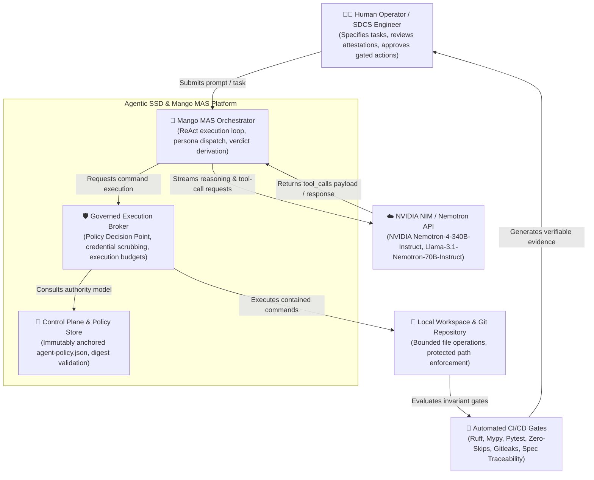
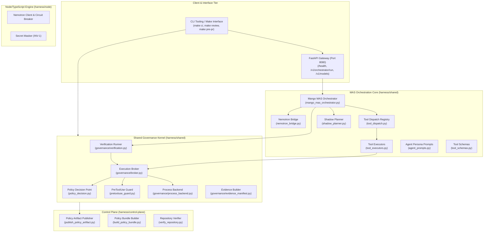
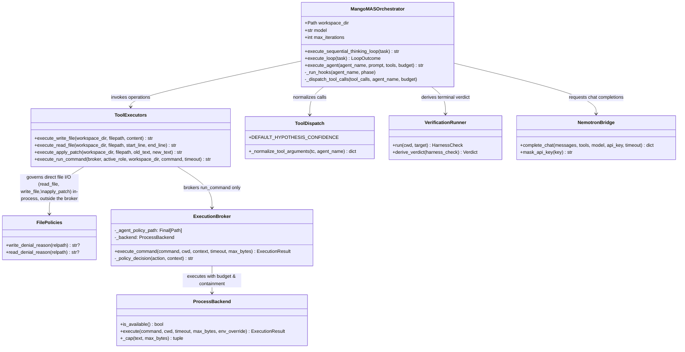

# C4 Architecture: Agentic SSD & Mango MAS Platform

**Version:** 2.3.0 (2026 Standards)  
**Standard:** C4 Model for Visualising Software Architecture (Context, Containers, Components, Code)  
**Governing Harness:** Agentic SSD Gate Harness Contract v2.1 (`harness/CONTRACT.md`)

---

## 1. Level 1: System Context Diagram

The System Context diagram illustrates the high-level boundaries between human operators, autonomous agent personas, the Mango MAS Orchestrator, external LLM inference providers (NVIDIA Nemotron / NIM), and the local system environment.



---

## 2. Level 2: Container Diagram

The Container diagram zooms into the Agentic SSD system boundaries, displaying its primary runtimes, APIs, and policy enforcement engines.



---

## 3. Level 3: Component Diagram (MAS Orchestration & Execution)

Detailed view of the internal components within `harness/shared/` responsible for governed tool execution and multi-agent loops.



---

## 4. Level 4: Code, Invariants & Security Boundaries

### 4.1 Immutable Authority Anchoring (`R-AC-11`)

- **Isolation Principle**: Policy rules (`agent-policy.json`) are resolved statically relative to package installation directory:

  ```python
  _AGENT_POLICY_PATH: Final[Path] = Path(__file__).resolve().parent.parent / "agent-policy.json"
  ```

- **Containment**: Untrusted agent workspaces cannot override governance policy by planting modified local policy files.

### 4.2 Re-entrant Verification & Honest Verdicts (`INV-12`, `INV-13`)

- The terminal verdict is earned mechanically via `VerificationRunner` executing `make -f Makefile test-python` through `ExecutionBroker`.
- Provenance is enforced by strong typing: `derive_verdict` accepts only `HarnessCheck` created by the harness itself, rejecting arbitrary agent-supplied `ExecutionResult` structures.

### 4.3 PreToolUse Command Guard (`INV-8`, `INV-9`, `INV-10`)

- Blocks high-risk shell vectors (`rm -rf /`, credential harvesting, unauthorized network calls, shell pipe escapes).
- Applies `write_policy` check against `protected_paths` on all command write/redirection targets.

### 4.4 Secret Safety & Credential Scrubbing (`INV-1`)

- All environment variables matching credential patterns (`NVIDIA_API_KEY`, `GITHUB_TOKEN`, `AWS_SECRET_ACCESS_KEY`) are stripped before passing to brokered child processes.
- Memory dumps generated for debugging (`write_dump`) redact sensitive tokens with high-entropy regex sanitizers.

### 4.5 Direct File I/O Governance: Read/Patch Parity (`DEC-012`)

- `read_file` and `apply_patch` read and write the filesystem directly from `ToolExecutors` — they do **not** pass through `ExecutionBroker`, the PDP, or the PreToolUse guard, because they are not shell commands. That path is `run_command`'s alone.
- Direct file I/O is governed instead by two symmetric, in-process policy modules consulted at tool-call granularity: `write_policy.write_denial_reason` (denies `protected_paths` matches and any `.git` path segment) and its read-side counterpart `read_policy.read_denial_reason` (denies credential-bearing filenames and any `.git` segment).
- Both modules compose the same credential-filename alternation (`read_policy.CREDENTIAL_FILENAME_ALTERNATION`) that `command_actions.classify` uses to grade `cat <credential-file>` as `secret_access` — a single source, so the shell-command door and the direct-read door cannot independently drift apart.
- `apply_patch` reuses `write_denial_reason` unchanged, so it reaches no path `write_file` cannot reach; `agent-policy.json` grants it no new action.

### 4.6 Neuro-Symbolic Sandbox & Critique Normalization (`AC-NS-3`, `AC-CE-1`, `INV-9`)

- **Capability Profiles**: The production `ProcessBackend` only pins `cwd`, `timeout`, and `max_output_bytes` before executing the bash subprocess. Full filesystem and network isolation via fine-grained capability profiles (e.g., `network-isolated`, `read-only-fs`) are explicitly out of scope for production as defined in the code-execution spec.
- **Violation Trapping**: In testing environments, a mock backend simulates isolation by emitting a structured `SandboxViolation` payload when a command violates assumed constraints (e.g., outbound socket I/O).
- **Critique Normalization (`tool_result_format.py`)**: `format_execution_result` intercepts `SandboxViolation` payloads from `stderr` (when generated by the mock backend) and translates them into a standardized Critique schema (`failure_type`, `evidence_id`, `normalized_message`, `location: execution_broker`). This enables deterministic agent repair loops for neuro-symbolic testing.
- **Fail-Closed Sandbox Availability (`INV-9`)**: If the backend is configured as unavailable (`sandbox_available=False`), commands are blocked immediately rather than falling back to host execution.
