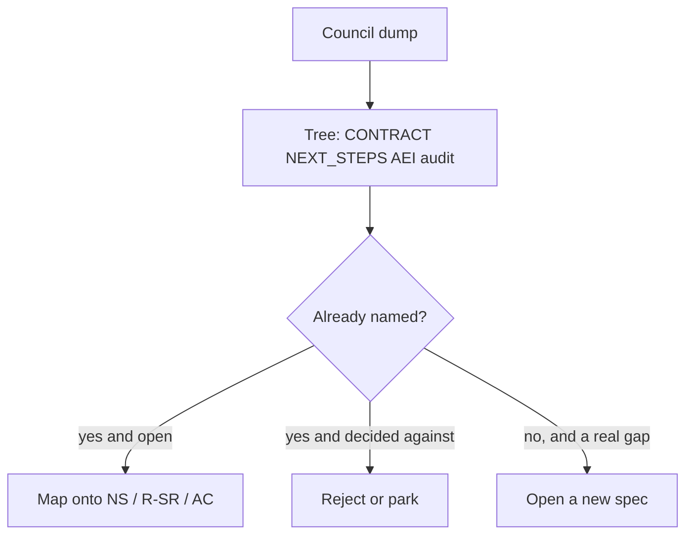
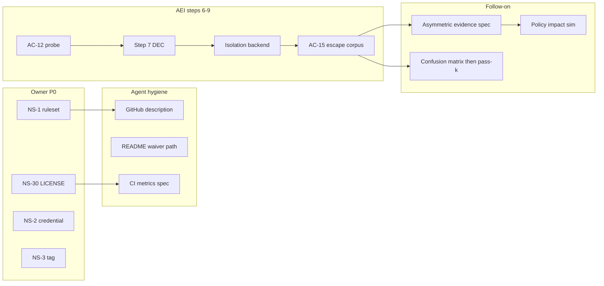

# Deep peer review: three-model strategy council vs this harness

**Reviewed head:** `origin/main` @ `e57be11` (PR #124, 2026-09-08)
**Subject under review:** the three-model synthesis "Where Models Agree / Disagree /
Unique Discoveries / Comprehensive Analysis" (Claude Opus 5 Thinking /
Gemini 3.8 Flash Thinking / GPT-5.6 Sol Thinking)
**Companion artefacts already in the tree:**
[`docs/specs/attested-execution-isolation.md`](../specs/attested-execution-isolation.md),
[`NEXT_STEPS.md`](../../NEXT_STEPS.md) NS-1 / NS-2 / NS-3 / NS-30,
[`docs/specs/2026-standards-remediation-plan.md`](../specs/2026-standards-remediation-plan.md)
R-SR-3 / R-SR-24 / R-SR-25, [`docs/reports/2026-STANDARDS-AUDIT.md`](2026-STANDARDS-AUDIT.md)
B2 / B4 / H6 / H9 / H10,
[`docs/specs/graph-engineering-adoption.md`](../specs/graph-engineering-adoption.md)
**Method:** every repository fact below is a command, a GitHub API result, or a
`file:line` read on this checkout. Council claims that rest on academic papers
or market priors are tagged `[Prior]` and are not re-derived. Four
`openspec-peer-review` personas (Architecture, SDLC/CI Lead, QA Director,
Product) are applied in §9.

> **Scope note.** This is a review of a strategy dump, not a new programme plan.
> It does not open a competing spec, does not choose a licence, and does not
> implement an isolation backend. `make ci` was **not** run for this
> markdown-only change; per DEC-024 nothing here is a passing-gate claim.
> GitHub settings that the tree cannot prove about itself were re-queried on
> 2026-09-08: `licenseInfo: null`, description `"A custom built version of
> Claude Code"`.

---

## 1. Summary verdict

The council is **substantially correct in diagnosis, substantially wrong in
novelty, and one merge stale in sequencing.** Its central thesis — that this
repository is exceptionally strong on *provable process governance* and
structurally weak on *isolation, independently verifiable evidence, measured
capability, and distribution* — survives contact with the code. Its "do this
first" ordering does not, because the files it could not fetch
(`NEXT_STEPS.md`, `harness/CONTRACT.md`) already name the same gaps, rank the
owner-blocked ones above the engineering ones, and have a live isolation
programme that has closed four of five INV-13 digests.

The single highest-leverage correction is this: **do not start a new isolation
programme.** Finish [`attested-execution-isolation.md`](../specs/attested-execution-isolation.md)
steps 6–9. The protocol (`ExecutionBackend`), the four-of-five evidence
record (`evidence_record.py`), the routing block (`execution.routing`), and
the capability three-state fields are on `main` as of PR #124. What remains
is the capability probe, the vendor decision, the isolation backend, and the
escape corpus. Council language that "there is no evidence record on the
execution path" and that "HMAC is the only integrity story" describes the
tree *before* #124 for the first claim and is still true for the second —
asymmetric signing is explicitly out of scope of that spec's open questions.

| # | Council position | Verdict | Basis |
|---|---|---|---|
| 1 | INV-13 isolation gap is the #1 *engineering* blocker; `ProcessBackend` contains but does not isolate | **Accepted, already specified** | CONTRACT.md INV-13, DEC-010, SECURITY.md, agent-policy.json, AEI spec. Remaining: AC-12…AC-16, AC-19 |
| 2 | Move evidence signing from HMAC to asymmetric / KMS / Sigstore | **Accepted as a follow-on spec** | HMAC is live and now *on* the broker path; AEI open questions already refuse the enterprise-audit claim until this lands |
| 3 | Drop Nemotron coupling; become provider-neutral | **Accepted as positioning, not as a rewrite** | Wire protocol is already OpenAI `/chat/completions`; the *name* is coupled; adapters are Phase F / NS-19 |
| 4 | Stop positioning as "custom Claude Code"; sit *under* other agents | **Accepted, two-line fix** | GitHub `description` is that phrase; README already says "Agentic SSD Gate Harness" |
| 5 | Publish real capability benchmarks | **Accepted, deferred until isolation attests** | Audit H10; no `make bench`; SWE-bench before a sandbox digest is a score on an uncontained process |
| 6 | Ship GitHub App + Action + MCP server as the distribution surface | **MCP half exists; App/Checks/SARIF do not** | `mcp_server.py` is a governed *outbound* tool transport, not an inbound plugin gateway |
| 7 | Enterprise IAM, durable audit store, OTel are missing | **Accepted, already named** | Audit H6; openspec Milestone 6; JSONL sinks today |
| 8 | Treat MCP servers as untrusted plugins | **Accepted for *consumed* servers; mis-aimed at *this* MCP server** | This repo *is* an MCP server of brokered tools. Context7 is a dummy key, not a live retrieval path |

**If only one engineering effort can be funded after the owner P0 items:**
finish AEI steps 6–9 (isolation backend + escape corpus) and then open the
asymmetric-evidence spec the isolation spec already deferred. That pair is
what converts repository-local governance into an externally auditable
control. Everything else in the council dump is either already on the
roadmap, already decided against, or a product feature that needs its own
spec after those two.

---

## 2. What the council could not fetch, and why that matters

The council's sourcing caveat is: "`NEXT_STEPS.md` and `harness/CONTRACT.md`
could not be fetched, so if your own roadmap already covers isolation and
benchmarking, treat this as prioritization rather than discovery."

Those two files are the contract and the roadmap. Reading the tree without
them produces a report that *rediscovers* B2, B4, INV-13, DEC-010, NS-30,
HMAC-is-symmetric, JVM-is-a-template, LATS-is-off, and the don't-build list,
then presents them as council findings. The graph-engineering three-model
review (`docs/reports/2026-DEEP-PEER-REVIEW-GRAPH-ENGINEERING.md`) already
established the working rule for this class of input: **re-derive against
the checkout; reject sequencing that collides with an accepted DEC.**

This review applies the same rule.

---

## 3. Unanimous findings, re-derived

### 3.1 Isolation — accepted, already half-landed

**Council:** `ProcessBackend` contains but does not isolate; replace with
rootless containers / gVisor / Firecracker + default-deny egress; INV-13 is
unsatisfiable until an external verifier rejects evidence produced without
an approved sandbox profile.

**Tree, 2026-09-08:**

- `harness/CONTRACT.md` INV-13: four of five digests are recordable; sandbox
  remains unattestable until isolation lands or C-AEI-6.
- `DEC-010`: containment, explicitly not isolation; filesystem and network
  are unconfined.
- `SECURITY.md` "What the runtime governance does and does not guarantee":
  the indirect door is open and known; `python3 forge.py` can read `.env`,
  write protected files, and open sockets; `VerificationRunner` detects
  enforcement tampering after the fact.
- `docs/specs/attested-execution-isolation.md` problem statement §1
  reproduced the same escape (workspace script reads/writes outside the
  workspace and opens a socket; the broker returns `SUCCESS` classified
  `test_execute`).
- Protocol and default backend are live: `harness/shared/governance/execution_backend.py`
  (`ExecutionBackend`, `BackendCapabilities` with three-state
  `filesystem_isolation` / `network_isolation` / `process_isolation`),
  `ProcessBackend.capabilities()` reports `unenforced` when isolation was
  requested and the host could not apply it.
- Evidence is live on the broker path: `evidence_record.build_execution_entry`
  writes policy, source (digest-of-digests of the loop-start enforcement
  baseline), backend name+version, and test digest. Keyless evidence-enabled
  brokers `BLOCKED` before spawn.

**AEI acceptance criteria on this head:**

| AC | Status | What it is |
|---|---|---|
| AC-1 … AC-11, AC-17, AC-18 | `[x]` | Classifier-by-form, denial-rate, population floors, four-of-five evidence, protocol, routing block, no-direct-spawn, LATS stays off |
| AC-12 | `[ ]` | `capability_probe.py` — **file does not exist** |
| AC-13, AC-14, AC-16, AC-19 | `[ ]` | Isolation backend, in-memory sandbox policy, no-fallback, unattestable-sandbox refusal |
| AC-15 | `[ ]` | Escape corpus: each route open on `ProcessBackend`, closed or `BLOCKED` on the isolation backend |

**Where the council is wrong on the *fix shape*.** "Rootless containers /
gVisor / Firecracker as the production default" is the right *family* and
the wrong *first primitive for this CI*. AEI already measured: the agent
container reports `ENOSYS` for `landlock_create_ruleset`; GitHub
`ubuntu-latest` restricts unprivileged user namespaces
(`kernel.apparmor_restrict_unprivileged_userns`); Anthropic's sandbox
runtime steers egress through `HTTP_PROXY` / `ALL_PROXY`, which R-AEI-15
refuses to attest as `network_isolation=enforced`; NVIDIA OpenShell has
not been shown inside Actions. The spec's step 6 is a probe, step 7 a
decision record, and C-AEI-6 is a completed programme if nothing qualifies.
Jumping to Firecracker without that measurement would fail closed on the
runners that have to prove it.

**GPT-5.6 Sol Thinking's acceptance criterion is already AEI AC-15 + AC-19.**
Adversarial tests cannot read outside the workspace, cannot reach an
unapproved endpoint, and the verifier rejects evidence without an approved
sandbox profile. Do not rewrite that criterion in a new spec.

### 3.2 HMAC is symmetric — accepted, already deferred

**Council:** a verifier who shares the HMAC key can forge; move to
Ed25519 / KMS / Sigstore with DSSE / in-toto.

**Tree:**

- `EvidenceBuilder` is HMAC-SHA256 over canonical JSON
  (`harness/shared/governance/evidence_manifest.py`).
- Constructor injection now takes precedence on the broker path
  (`CONTRACT.md` Evidence signing); `AGENT_EVIDENCE_KEY` remains the
  control-plane path.
- AEI open questions, verbatim: *"Whether evidence signing moves from
  symmetric HMAC to an asymmetric attestation is out of scope. Any party
  who can verify a manifest today can forge one, which matters for an
  external auditor and not for this change, so the enterprise-audit claim
  is not made here."*

The council's cryptographic claim is correct. The sequencing claim ("do
this in the same breath as isolation") is not. Isolation produces a
sandbox digest worth signing; signing a four-of-five record with Ed25519
does not close INV-13's fifth digest. Open a follow-on spec *after* step 7
records which backend exists, so the signed envelope can bind the sandbox
image digest the council wants.

Do not claim "third-party verifiable evidence" in README or SECURITY.md
until that spec lands. HMAC-on-the-broker-path is integrity against
accidental mutation, not against the key holder.

### 3.3 Nemotron coupling — accepted as branding, overstated as architecture

**Council:** single-provider coupling is disqualifying; ship
Bedrock / Azure / Vertex / vLLM / Ollama adapters over the existing
OpenAI wire protocol.

**Tree:**

- `harness/node/docs/specs/nemotron.md` R1: the client MUST conform to
  OpenAI `/chat/completions`. That is already the adapter seam.
- Default model is `nvidia/llama-3.3-nemotron-super-49b-v1`
  (`.env.example`, pinned against the README by
  `test_documentation_truth.TestTheConfiguredModelIsTheDocumentedOne`).
- "Nemotron Ultra" is a product label used in README, personas, the
  TypeScript client banner, and the Python bridge description. It is not
  the model identifier. GPT-5.6 Sol Thinking treats this as an assurance
  inconsistency; it is a naming inconsistency. Buyers who grep for
  `nvidia/nemotron-ultra` will not find a matching ID. That is a real
  trust cost, not a secret second model.
- NS-19 (NIM multi-model routing) is parked: `complete_chat` has no
  provider boundary (`stream: False` hard-coded, `usage` discarded);
  Phase F first.
- Active reasoner role is still named `nemotron-reasoner`. DEC-011
  forbids adding active roles to `agent-policy.json`. Renaming the role
  is a protected-path change with an attestation, not a search-replace.

**Prescription:** keep the OpenAI wire protocol as the only network
contract. Add a `provider` key in a *new* policy block (DEC-043: do not
stuff it into `nemotron.*` or every adopter policy becomes a
`PolicyError`). Do not rename the active role until a spec says how
`EXECUTION_IDENTITY` and the hook names move with it. Do not build four
cloud adapters before NS-19's provider boundary exists.

### 3.4 Positioning — accepted, and cheaper than the council thinks

**Council:** Copilot cloud agent already owns plan → branch → test → PR;
sit underneath as a governance/control plane.

**Tree:**

- GitHub repository `description`: `"A custom built version of Claude Code"`
  (`gh repo view … --json description`, 2026-09-08). That string does
  **not** appear in README.md. The README's first heading is "Agentic SSD
  & NVIDIA Nemotron AI Platform" and §5 calls it an "Agentic Software
  Security & Development (SSD) Harness".
- `SECURITY.md` already describes a "governance/agent-harness kernel, not
  an end-user application".
- The wrap-competitors-as-channels strategy has academic cover the
  council cites (DEI) and a local analogue the council missed: MCP
  transport and the in-process orchestrator already share one dispatcher
  (audit M8 / `mcp_server._build_tool_handlers`). That *is* the
  control-plane-under-other-agents shape, for one transport.

Two-line owner action, no spec: change the GitHub description; optionally
add `AGENTS.md` as a pointer to `CLAUDE.md` / `.mango/agents/` (Claude
Opus 5 Thinking). Do not rewrite the harness as a Copilot extension in
the same change.

### 3.5 Capability benchmarks — accepted, and dangerous if run now

**Council:** SWE-bench Verified (Gemini), `pass^k` (Claude), two-axis
capability + gate confusion matrix (GPT). Publish via `make bench`.

**Tree:** audit H10 is this finding: no workflow references
`NVIDIA_API_KEY`; Node live tests waived until 2027-01-01; eval spec is
DRAFT; the only prompt tests are substring pins. NEXT_STEPS parks "Eval
harness / nightly live smoke" on a scoped key plus fixtures after the
openspec fold.

**Weighting.** GPT-5.6 Sol Thinking's two-axis framing is the one that
matches this product: a governance harness that cannot publish its
false-allow rate is selling a gate whose confusion matrix is unknown.
Claude's `pass^k` claim ("same task, eight runs, identical gate
outcomes") is the determinism thesis and is cheaper to measure *on this
repo's own fixtures* than on SWE-bench. Gemini's resolve-rate is the
recognizable currency and is the one most contaminated (SWE-bench+
leakage, "solved issues" not matching developer intent — council sources
[2][12]).

**Do not run SWE-bench against `ProcessBackend` and call it a safety
score.** AEI §1 already shows a workspace script that leaves the
workspace and opens a socket while the broker returns `SUCCESS`. A
resolve-rate on that backend measures the model, not the harness. The
gate confusion matrix can start on the committed command corpus
(`denial_rate.py`, landed with DEC-067) without a frontier model.

### 3.6 Distribution surface — MCP exists; App / Action / Checks do not

**Council:** GitHub App + reusable Action + Checks API + SARIF + OIDC +
MCP gateway.

**Tree:**

- MCP STDIO server: `harness/shared/mcp_server.py`, spec
  `docs/specs/mcp-server-nemotron.md`, AC-1…AC-3 ticked. It exposes
  brokered MAS tools, filtered by role, through the same dispatcher the
  in-process loop uses. Default role: `nemotron-reasoner`.
- No GitHub App manifest, no Checks API publisher, no SARIF upload, no
  OIDC federation. Four workflows: `python-package.yml`,
  `scheduled-drift.yml`, plus two never-executed per-stack templates.
- NS-1: branch ruleset export exists at `.github/rulesets/main.json` and
  is **not applied** (`GET …/rules/branches/main` → `[]` as of
  2026-09-05; not re-queried here as a required-check claim). Shipping a
  Checks integration while required checks are advisory is the NS-40
  shape: a status that is never required reads as passing.

**Prescription:** do not build the App until NS-1 lands. The MCP server
is the distribution surface that already exists; document it as "bring
your own agent, we are the tool broker" rather than wrapping it in a
second protocol.

### 3.7 IAM / audit store / OTel — accepted, already named, not P0

Audit H6: unstructured logs; `JSONFormatter` drops `extra=`; no per-call
record of tool name / latency / tokens / outcome. Openspec
`add-neurosym-governed-synthesis` tasks.md already lists OpenTelemetry
GenAI-compatible spans. JSONL evidence sink is now outside the workspace
(AEI R-AEI-5, landed). Durable audit store and OIDC/SSO/RBAC are
enterprise packaging; they do not close INV-13.

GPT-5.6 Sol Thinking's warning not to conflate agent roles
(`planner` / `verifier`) with human enterprise RBAC is already how
DEC-011 is written: active roles are not in `agent-policy.json` because
that would give the agent's own governing policy an execution grant.
Keep those layers distinct when IAM lands.

### 3.8 MCP as untrusted plugins — right threat, wrong object

Council sources [4][5] describe prompt injection and tool-poisoning via
*consumed* MCP servers. This repository *serves* MCP tools that are
already PDP-gated. The live analog of the threat is Context7: `.env.example`
ships `CONTEXT7_API_KEY=ctx7sk-dummy-key`; `debug_dump.py` redacts it;
`harness/docs/PRE_PR_VERIFICATION_REFERENCE.md` marks Context7 MCP as
`[Planned]`. There is no retrieval path that hashes a docs fragment into
the attestation.

GPT-5.6 Sol Thinking's lockfile-pinned Context7 design is therefore a
*net-new* spec (see §7), not a hardening of `mcp_server.py`. Treating
*this* MCP server as an untrusted plugin would mean distrusting the
harness's own brokered tools — which the PDP already decides.

---

## 4. Disagreements, resolved against accepted decisions

### 4.1 First action of all

| Model | First action | Verdict here |
|---|---|---|
| Claude Opus 5 Thinking | Add a LICENSE | **Highest leverage-to-effort, already NS-30 / R-SR-3 / audit B2.** Owner-blocked. Plan recommends Apache-2.0. Claude's AGPL+commercial dual-license is a *different product decision* and is not implied by anything in the tree. |
| Gemini 3.8 Flash Thinking | Sandbox isolation | Correct on engineering merit; wrong as "first". Isolation is AEI steps 6–9, which the spec itself ordered *after* evidence and the protocol so a sandbox digest has a record to sit in. |
| GPT-5.6 Sol Thinking | README metric consistency + CI-generated figures | Correct as DEC-024 hygiene. AEI open questions already cut this from the isolation spec ("needs its own spec"). Complementary to LICENSE, not a substitute. |

**Resolved order, given this repo's own P0 list:**

1. Owner sitting (cannot be done by an agent): NS-30 licence, NS-1 ruleset,
   NS-2 credential rotation, NS-3 tag. The council's "two weeks of Phase 0"
   that an agent can actually perform is: GitHub description, README
   skip-waiver path (see §6), CI-generated metrics spec, threat-model
   *document* (C4 §4.6 already states the isolation residual).
2. Agent-executable engineering: AEI steps 6–9.
3. Follow-on spec: asymmetric evidence.
4. Distribution (App / Checks) after NS-1.
5. Benchmarks after AC-15 is green, or a confusion-matrix slice on the
   command corpus sooner.

Claude's "no LICENSE → legally unusable" is confirmed:
`ls LICENSE*` → none; `pyproject.toml` `[project].license` is `None`;
`harness/node/package.json` has no `"license"` field; GitHub
`licenseInfo: null`. AC-3 in the remediation plan is written and
unchecked. `CODEOWNERS` already exists (`.github/CODEOWNERS`); Claude's
"add CODEOWNERS" is stale. DCO is absent; CONTRIBUTING.md does not
mention it.

### 4.2 Headline metric

Do not pick one. Publish three numbers when they exist, in this order of
defensibility for *this* product:

1. **Gate confusion matrix** on the committed command corpus and on the
   AEI escape corpus (false-allow = highest severity). No model required.
2. **`pass^k` on a frozen local fixture set** once isolation attests —
   "eight runs, identical denials" is the determinism claim.
3. **SWE-bench Verified resolve-rate + cost** for recognition, with the
   contamination caveats the council already collected, and never as a
   safety score.

Gemini's "safety score on SWE-bench" is the metric that will be gamed.
Claude's `pass^k` without a contained backend is a reliability score of
an uncontained process.

### 4.3 Repo structure

| Model | Proposal | Collision |
|---|---|---|
| Claude | Split kernel vs distribution (2 repos) | Not forbidden; not motivated. Adopter templates already live at `harness/node/` and `harness/jvm/`. |
| Gemini | Keep monorepo, add adapters | Matches DEC-020 / DEC-029. NEXT_STEPS §5: **"Regrouping `harness/shared/` — DEC-020 / DEC-029 stand."** |
| GPT | Nine independently published packages | Contradicts DEC-020 / DEC-029; maintainer overhead on a solo-owned repo is the reason those DECs exist. |

**Keep the monorepo.** Publish wheels/npm later as *distribution*, not as
a source split. `pip install` is R-SR packaging / Phase F, not a nine-package
extract.

### 4.4 Multi-agent architecture

Claude's Agentless skepticism is the one that matches this tree:

- Live runtime is the sequential `ExecutionLoop`, not the LangGraph
  StateGraph. DEC-053 parks LangGraph (`status: accepted`).
- `langgraph/ablation.py` is MCTS hypothetical-state isolation
  (INV-LG-5), not a SWE-bench ablation grid. Council "run the ablation"
  is right; pointing at `ablation.py` as if it already were that grid is
  wrong.
- `peer_reviewer` and `security_reviewer` are registered nodes with no
  edges (DEC-052, pinned by `test_graph_topology_parked.py`). The
  multi-agent graph does not currently review.
- Shadow planner is observation-only, off unless `MANGO_SHADOW_PLANNER=1`.
- DEI (council [10]) supports the *meta-layer* framing, which is the
  positioning in §3.4, not persona proliferation.

GPT's pre-registered ablation grid (no broker / broker without isolation /
isolation without role policy / no reviewer / unsigned evidence / single
vs multi-agent) is the right experiment design. It is also INV-15's
missing gate, parked with LATS. Do not run it as a reason to add
personas. Run it, if at all, as the argument that would justify *keeping*
the three active roles.

Gemini's CPG + shadow planning investment collides with
`docs/specs/graph-engineering-adoption.md`: CPG is gated on a recorded
tokens-and-tool-calls baseline (R-GEA-5 / AC-GEA-8). PR #124 landed
`docs/reports/subagent-turn-token-baseline.json`. Building a Tree-sitter
CPG *before* comparing that baseline to a policy threshold is the
DEC-024 shape the spec exists to prevent. `code_safety.py` already
judges prohibited symbols on the AST `generate_code` parsed; a
repository-wide CPG is a different tool for a different question
(cross-file reachability), and D-3 of that spec says measure first.

### 4.5 Test suite

Claude's prune instinct is directionally right as *contributor UX* and
wrong as a gate change. Coverage floors live in `governance-policy.json`;
lowering them is a policy edit with attestation, not a courtesy to
contributors. The number the council quotes (98.91% lines / 97.07%
branches, 4 377 passed on `296b085`) is a *transcribed* README figure
(DEC-024). NS-35 already asks for a mutation score instead of mutation
prose; that is Claude's actual prescription, and it is blocked on
nothing mechanical now that NS-6's 3.10 floor has landed.

Gemini's "expand into an academic regression corpus" is how you get to
5 000 tests without a mutation score. Freeze growth of *unrelated*
tests; add tests that kill a named defect (gate-mutation-proof skill).
Do not prune passing AQA reproductions in `harness/shared/tests/regression/`
— those are the only tests confirmed failing against a pre-fix commit.

GPT's "generate counts in CI" is the CI-generated-metrics spec AEI
already deferred. Do that; stop hand-updating README.

### 4.6 Hugging Face

No HF artefact exists in the tree. Claude's "leaderboard row" is cheap
and empty until §3.5 has a number. Gemini's "distill Nemotron traces
into a 3B–7B security critic" is R&D on a byproduct that is not yet an
export path (INV-14: no dataset export; openspec Milestone 6). GPT's
`mango-agent-security-bench` Space is the AEI escape corpus with a UI.
All three are downstream of AC-15.

### 4.7 Context7

Gemini reads Context7 as hierarchical context engineering (L1/L2/L3 +
CPG). GPT reads it as documentation provenance in the attestation.
**GPT is the reading this repo can implement without a new runtime.**
Context7 is not a live retrieval path. The context-window budget
(`context_policy.py`, PR #110) already does group-atomic eviction; that
is L1/L2 by another name. Do not add "context tiers" as a second
mechanism.

### 4.8 Compliance mapping

Claude: map invariants → NIST AI RMF / ISO 42001 / EU AI Act now via
COMPL-AI. Gemini: Phase 4. GPT: threat model first, certification later.

**GPT, then Claude's mapping as a table, never as a certification claim.**
C4 §4.6 and SECURITY.md *are* the threat model for the execution path;
they are not STRIDE/ATLAS/SSDF/SLSA. A one-page mapping of INV-1…INV-17
onto those frameworks is documentation and is cheap. A certification
claim before AEI AC-15 is the thing NEXT_STEPS §5 already refuses
("claimed readiness without the hard gate").

---

## 5. Unique discoveries: net-new vs already named

| Source | Finding | Status against the tree |
|---|---|---|
| Claude | No LICENSE | **Already NS-30 / R-SR-3 / B2.** Confirmed still true. |
| Claude | Support `AGENTS.md` | **Net-new, cheap, vendor-neutral.** Pointer file; do not duplicate CLAUDE.md. |
| Claude | Cybench against the broker; "N attack trajectories, 0 escapes" | **AEI AC-15 with a published score.** Cybench-the-benchmark is `[Prior]`; the escape corpus is the local equivalent. |
| Claude | Media/broadcast wedge (NBC) | **No evidence in the tree.** Do not add a vertical to the roadmap from a prior. |
| Claude | DEI meta-module supports wrap-as-channels | **Positioning, not a work item.** Aligns with §3.4. |
| Gemini | Upgrade `code_safety.py` to Tree-sitter/SCIP CPG | **Already reviewed and re-scoped.** Graph-engineering spec: reuse the write-door AST; CPG gated on AC-GEA-8 baseline (now recorded). |
| Gemini | Distill traces into an SLM critic on HF | **Blocked on INV-14 / Milestone 6.** |
| Gemini | Bi-directional sync of memory stores to Jira/Confluence/Notion | **Do not build.** Agent memory is workspace-scoped JSON with FIFO retention (DEC-057/058). Syncing it into enterprise wiki tools is a new trust boundary. |
| GPT | Policy impact simulation on historical runs | **Genuinely net-new product feature.** Digest-pinned policy artefacts + evidence corpus (now on the broker path) are the two inputs. No competitor in OPA/Cedar has the paired execution history. Spec after HMAC→asymmetric, so a simulation cannot forge a historical allow. |
| GPT | Resolve Context7 docs from `uv.lock` / `pnpm-lock.yaml` / `requirements-lock.txt` | **Genuinely net-new**, and testable ("does version-matched docs reduce obsolete-API defects?"). Blocked on Context7 becoming a real retrieval path. |
| GPT | README metric inconsistencies | **Confirmed, with a correction:** "zero unapproved skips" and "133 expected Windows skips" are *not* a contradiction in the README — §3 and §4.4 already distinguish them. The real inconsistencies are ~3,970 (2026-09-05) vs 4,377 passed on `296b085` vs 4,238 on PR #120's failing head; skip-waiver *path* (README cites `.governance/skip-waivers.json`, which does not exist; the Python gate reads `harness/shared/tests/skip-waivers.json`); NEXT_STEPS header still says PR #124 is "not yet on `main"` after it merged. |
| GPT | Do not conflate agent roles with human RBAC | **Already DEC-011.** Record as a constraint on any future IAM spec. |
| GPT | Don't-build list: more personas, LATS, IDE, visual builder, autonomous policy modification | **Already NEXT_STEPS §5 + INV-15 + DEC-027 + DEC-053.** Autonomous policy modification is additionally refused by `self_modify_policy: false` and `write_policy` on `agent-policy.json`. |

---

## 6. What all three models missed

These are defects or states the council did not name and the tree
demonstrates.

1. **The isolation programme is mid-flight, not unstarted.** Steps 1–5 of
   AEI are landed (DEC-067, population floors, evidence record, protocol,
   routing). `capability_probe.py` is the next file, not `ProcessBackend`
   itself.
2. **Four owner P0 items outrank every engineering recommendation.**
   NS-1 (ruleset), NS-2 (leaked-key branch still on the remote), NS-3
   (zero git tags; "2.5.0" names no commit), NS-30 (licence). PR #120's
   bot-head incident is measured evidence that advisory gates cost a
   red suite with no merge hold. An isolation backend behind advisory
   checks is a green job a merge can ignore.
3. **AEI already forbids attesting proxy-env "isolation".** Council
   "default-deny egress" implemented as `HTTP_PROXY` would be a
   `network_isolation=enforced` lie (R-AEI-15).
4. **EvidenceBuilder *was* unwired; as of #124 it is not.** Council text
   that "HMAC is elegant but unused on the execution path" is stale.
   The remaining hole is the *key type*, not the caller.
5. **README cites a skip-waiver path that does not exist.**
   `.governance/skip-waivers.json` — glob finds three files, none at
   that path: `harness/shared/tests/skip-waivers.json`,
   `harness/node/.governance/skip-waivers.json`,
   `harness/jvm/.governance/skip-waivers.json`. CONTRACT.md names the
   Python path correctly. This is a documentation-truth defect in the
   same class GPT flagged, and it is cheaper than a metrics badge.
6. **The 7-tier pyramid in README is a Pong leftover.**
   `docs/reports/TEST-REPORT.md` is marked superseded; it still describes
   Pong tiers. README §3 still draws the pyramid ("Match Progression &
   Multi-Turn Chats", "Vector Math, Physics"). The Pong demo was
   removed. Council counted ~3,970 tests against that diagram and did
   not notice the diagram names a game engine.
7. **JVM is an adopter template, not an unwired "pack" to move to
   `contrib/`.** CONTRACT.md already says INV-2/INV-3 are partially
   enforced because nothing under the root Makefile invokes
   `harness/jvm/`. Moving it does not close the invariant; wiring it
   would. DEC-054 relocates JVM in Phase E, which is blocked on NS-2.
8. **`experimental/autonomous_healing.py` and `lats_optimizer.py` are
   parked on purpose (DEC-027), still coverage-measured, still tested.**
   Council "unwired code reads as the invariants don't cover everything"
   is the reason they were moved. Moving them again to `contrib/` is
   churn. INV-15 pins `lats_enabled: false` with tests.
9. **NEXT_STEPS last-reviewed line is already stale on the head it
   describes.** It says PR #124 is "not yet on `main"`; this checkout
   *is* #124 (`e57be11`). Same class as transcribed test counts.
10. **C4 and SECURITY.md already disclose the indirect door in language
    a security architect can use.** Council "publish a threat model" as
    Phase 0 is partly "put a STRIDE heading on prose that exists". A
    short STRIDE table that *cites* those sections is useful; a parallel
    threat-model doc that restates them will drift.

---

## 7. What is actually worth a new spec

Only items that are not already an open NS / R-SR / AEI step, and that
would change behaviour.

| Proposed spec | Why it is not a NEXT_STEPS bullet | Blocked on |
|---|---|---|
| CI-generated assurance figures (README test counts, coverage %, skip counts, traceability ratchet) | AEI open questions already named this and cut it from isolation | Nothing. Smallest DEC-024 fix that is not NS-30. |
| Asymmetric / DSSE evidence | AEI explicitly out-of-scope | Isolation step 7 (so the envelope can bind a real sandbox digest) or, if C-AEI-6 fires, bind "unattestable" as a typed field rather than a missing key |
| Policy-impact simulation | No artefact in the tree | Evidence corpus + stable policy digests (both now exist); stronger after asymmetric signing |
| Context7 version provenance | Context7 is not a retrieval path | A real Context7 (or other docs) provider behind the orchestrator, treated as untrusted data |
| `AGENTS.md` | File-level, but agent-control-surface adjacent | Decide whether it is a stub that points at CLAUDE.md (unprotected?) or a second control surface (protected, attestation) |
| GitHub App + Checks + SARIF | Distribution, not kernel | NS-1 (required checks that actually hold a merge) |

Do **not** spec: Firecracker-as-default, nine packages, CPG ingestion,
Jira sync, HF SLM distillation, media vertical, more personas, LATS
enablement, IDE, visual builder, autonomous policy modification,
compliance certification.

---

## 8. Sequencing that survives contact with the roadmap

**Phase 0 (owner + cheap agent work, no new kernel).**

- Owner: NS-30 (Apache-2.0 unless a dual-license DEC says otherwise —
  the remediation plan already recommends Apache-2.0 for the patent
  grant; do not silently pick AGPL), NS-1, NS-2, NS-3.
- Agent, once NS-30 is decided *or in parallel for the non-licence
  items*: GitHub description rewrite; README skip-waiver path;
  `make spec NAME=ci-generated-metrics` as AEI already requested;
  `AGENTS.md` stub if Product wants vendor-neutral entry.

**Phase 1 (the only kernel work that closes a published MUST).**

- AEI steps 6–9. Probe on every matrix leg. Decision record for the
  primitive, or C-AEI-6. Isolation backend with in-memory policy.
  Escape corpus with positive network controls. INV-13 becomes
  claimable, or is honestly unclaimable.

**Phase 2 (makes the record third-party verifiable).**

- Asymmetric evidence spec: Ed25519 or KMS or Sigstore keyless; DSSE
  envelope; bind commit SHA, policy digest, sandbox profile, model
  revision. External verifier that does *not* hold the signing key.
  This is what the council's "compliance artefact" sentence actually
  requires.

**Phase 3 (distribution, after the merge button means something).**

- GitHub App / Checks / SARIF / OIDC. MCP gateway docs. Fifteen-minute
  adopter path with a deliberate violation. Not before NS-1.

**Phase 4 (benchmarks and mapping).**

- Confusion matrix on corpus + escape suite. `pass^k` on fixtures.
  SWE-bench Verified only with isolation attested. INV → NIST/ISO/EU
  mapping table, no certification claim.

If funding allows only one engineering slice after owner P0: **Phase 1.**
HMAC-without-isolation is a signed statement that a process was not
contained. Isolation-without-asymmetric-signing is still internally
auditable, which is this repo's current buyers.

---

## 9. `openspec-peer-review` — four personas on this review's prescription

### Architect

Sign-off on "finish AEI, do not start a parallel isolation design". The
`ExecutionBackend` protocol is the seam the council asked for
(`pluggable ExecutionEnvironment behind ExecutionBroker` with tiers).
`ProcessBackend` is already the dev-only tier in all but name
(`capabilities()` reports unenforced). Adding Firecracker as a second
backend that does not speak `ExecutionRequest` would be the defect
AEI R-AEI-8 exists to prevent.

Refuse nine-package extract and kernel/distribution repo split while
DEC-020 / DEC-029 stand. Refuse a CPG build before the AC-GEA-8
comparison against a policy threshold.

Risk: C-AEI-6 fires (no primitive works on both the agent container and
Actions). The programme must then record sandbox digest as unattestable
and **stop claiming INV-13**, which is a product event, not a failed
sprint. The council has no branch for that outcome; the spec does.

### SDLC / CI Lead

Sign-off on "no SWE-bench job until AC-15 is green". A nightly that
needs `NVIDIA_API_KEY` is H10 and is owner-gated. CI-generated metrics
must not write into `protected_paths`; README.md is not protected, but
the workflow that produces the badge is `.github/workflows/**` and
needs attestation. Prefer a committed artefact under `docs/reports/`
that `test_documentation_truth.py` diffs against the README, over a
badge service.

NS-1 before Checks API: otherwise the new check is as advisory as the
nine that already exist.

### QA Director

Sign-off on the escape corpus as the headline security artefact, not
coverage %. AC-15's "open on ProcessBackend, closed on isolation
backend, no skips, loopback positive control" is more falsifiable than
Cybench-against-the-broker as a press line. Mutation score (NS-35) over
coverage percentage: agree with Claude, already specified.

Refuse pruning `harness/shared/tests/regression/`. Those tests are the
AQA contract.

Determinism: `pass^k` on fixtures is the right reliability claim; it
needs a frozen tool surface (NS-18 landed on #124: tool paragraph
generated from `tools_for_role`) so the action set cannot drift between
the eight runs.

### Product Manager

Sign-off on positioning ("fail-closed policy and attestation layer —
bring your own agent, bring your own model") and on **not** competing
with Copilot on scaffold. Sign-off on Apache-2.0 as the default licence
recommendation already in the remediation plan; escalate AGPL dual-
license to the owner rather than encoding it in an agent PR.

Refuse media/broadcast as a wedge without a customer. Refuse HF
distillation and Jira sync as roadmap items. Policy-impact simulation
is the one unique feature that would make a design-partner demo
("here are the last 200 runs; this policy would have denied 11 of
them, including the one that forged the Makefile"). Schedule it after
the evidence is independently verifiable, or the demo is a shared-secret
HMAC theatre.

The "custom Claude Code" GitHub description is actively hostile to that
positioning and is a settings edit, not a PR.

---

## 10. `repo-invariant-review` of *this* document

This change is a report under `docs/reports/` plus the harness README
index `test_documentation_claims.TestEveryReportIsIndexed` requires.

| Check | Collision? | Notes |
|---|---|---|
| `protected_paths` | No | `docs/reports/**` and `harness/README.md` are not in `governance-policy.json` `protected_paths`. `NEXT_STEPS.md` and `harness/CONTRACT.md` are untouched on purpose. |
| `size_budget` | No | Not Python. |
| `no_hardcoded_secrets` | No | No credentials. GitHub description quoted from a public API. |
| Coverage / tests | No | No production code. |
| Specs gate | No | Not a spec; `Spec class: program-plan` is not claimed. A competing isolation spec would have failed INV-17 against AEI. |
| Traceability ratchet | No | No new `R-*` / `C-*` IDs. |

Predicted CI: documentation-truth and specs validators should remain
green. If a later change *implements* any §7 spec, that PR is
infra-reviewed where it touches `harness/shared/governance/**`.

---

## 11. Method, sourcing, and what this review is not

- Repository facts: read on `e57be11`, plus `gh repo view
  ianshank/Mango_Code_Agent-Harness --json description,licenseInfo`
  (description `"A custom built version of Claude Code"`,
  `licenseInfo: null`). NS-1's empty ruleset is cited from NEXT_STEPS's
  2026-09-05 re-query, not re-issued here as a fresh measurement.
- Council academic sources [1]–[29], [31]–[79] were not re-fetched;
  claims that depend on them stay `[Prior]`. Benchmark contamination,
  MCP exploit surface, Agentless, DEI, Cybench, COMPL-AI are in that
  bucket.
- Market-positioning (Copilot feature set in 2026, procurement
  disqualification, NBC wedge) is `[Prior]`.
- This review does **not** implement LICENSE, isolation, or HMAC
  replacement, and does **not** add NEXT_STEPS rows that would duplicate
  NS-30 or AEI steps 6–9. The remaining INV-13 work after #124 is
  already "not a new NEXT_STEPS row" (NEXT_STEPS header).

**A verification claim is not evidence.** The check runs on the pushed
head of this PR prove only that a markdown file does not break the
gates. They do not prove isolation, licence, or third-party-verifiable
evidence.
