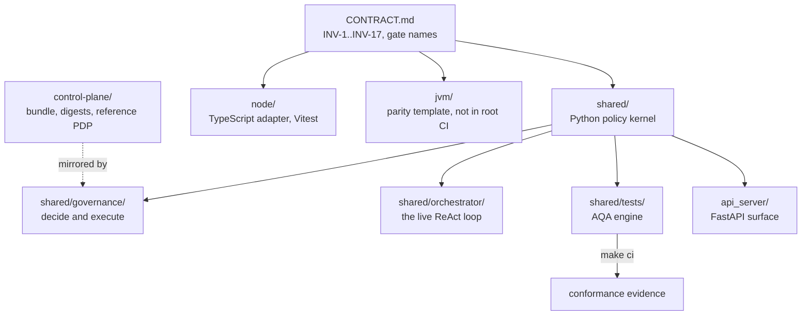

# AGENTS.md — Harness root

**Scope:** `CONTRACT.md`, `shared/`, `node/`, `control-plane/`, `api_server/`, `jvm/`
**Owner:** planner → spec-analyst
**Protected path:** no
**Reviewed:** 2026-09-19

## What this does

This is where one governance contract meets four runtimes. `CONTRACT.md` declares
INV-1..INV-17, the five-layer authority model and the gate names every stack must
expose; each stack directory implements them for its own toolchain. `shared/` exists
so the security-critical half is written once and shared byte-for-byte rather than
reimplemented per stack. A change belongs here when it alters what a gate *means* —
changing how one stack runs it belongs in that stack's directory.

## Map

## Key files

| File | Role |
| --- | --- |
| `CONTRACT.md` | The contract itself: INV-1..INV-17, the authority model, the target-name list. Protected. |
| `README.md` | Package layout and the trust-boundary statement; its file lists are machine-checked. |
| `shared/` | The Python policy kernel and every gate script. Security-critical logic is written only here. |
| `node/` | TypeScript adapter, the Nemotron client, `SecretMasker` (INV-1) and the Vitest matrix. |
| `jvm/` | Kotlin/Gradle parity **template**. No root target runs it, so INV-2/INV-3 are partial there. |
| `control-plane/` | Policy bundle, digests and `tool_broker_reference.py`, the PDP an external broker mirrors. |
| `api_server/` | FastAPI orchestration endpoints and the dashboard. |
| `docs/` | Harness-scoped governance docs and reports. |

## Invariants

- **The repository is not its own root of trust (INV-6).** CI produces evidence; it
  does not grant authority. Nothing here may be described as preventing an
  off-policy action that already happened.
- **Gate names are a cross-stack contract.** Stack-specific implementation is
  permitted only where the runtime requires it; parsing and policy logic is shared.
  `check_dedup.py` fails a per-stack script that is a copy rather than a shim
  (`make check-dedup`, `test_check_dedup.py`).
- **"Partially enforced" is load-bearing.** INV-2, INV-3, INV-5 and INV-7 carry that
  qualifier, and INV-11/12/14 are "not yet enforced". Do not delete a qualifier to
  make prose read better; `test_policy_consistency.DECLARED_NOT_YET_ENFORCED` pins it.
- **A new gate is not just a target.** It needs a `ci_required_targets` entry, a
  `CONTRACT.md` row and a `test_ci_gate_coverage.py` mapping, or the meta-gate fails.
- **Every directory with three or more first-party sources owes an `AGENTS.md` and a
  one-line `CLAUDE.md`** — derived, never transcribed (`test_agents_doc.py`).

## Commands

| Task | Command |
| --- | --- |
| Full deterministic gate | `make ci` |
| Mechanical invariants only | `make validate` |
| Pre-PR gate plus review checklist | `make pre-pr` |
| Cold typecheck, as CI runs it | `make lint-cold` |
| Print this branch's attestation table | `make attestation` |
| Check a written table in a PR body | `make attestation-check` |

## Agents and skills

| Stage | Agent | Skills |
| --- | --- | --- |
| plan | `.mango/agents/planner.md` | `spec-authoring`, `openspec-peer-review` |
| build | `.mango/agents/nemotron-reasoner.md` | `harness-engineering`, `protected-path-attestation` |
| verify | `.mango/agents/verifier.md` | `validation-runner`, `repo-invariant-review`, `standards-audit` |

## Gotchas

- **`CONTRACT.md` is itself a protected path.** Editing it needs a decision record,
  the `infra-reviewed` label, `ALLOW_GITHUB_CHANGES=1` for that change only, and an
  attestation row. `validate_invariants.py` fails closed in `make validate`.
- **The attestation table is machine-derived, not hand-written.** A transcribed table
  once overstated its own coverage (DEC-038). Generate it with `make attestation`;
  `make attestation-check FILE=<pr-body.md>` fails on a mismatch in either direction.
- **`README.md`'s file lists are checked against the tree.** Adding a report under
  `docs/reports/` without listing it, or listing one that moved, fails
  `test_documentation_claims.py`. Same for every mermaid block — a bare bracket in a
  node label fails `test_documentation_truth.py`.
- **`jvm/` looks wired and is not.** The root `Makefile` declares no `JVM_DIR`, so a
  green `make ci` says nothing about the JVM half of INV-2 or INV-3. Claiming
  otherwise in a PR body is the exact defect DEC-024 records.
- **`.governance/` at root is live, holding one tracked file.** It is no longer a
  declared-dormant pattern; `test_protected_path_liveness.py` fails a dormancy
  declaration for a pattern that now matches something.
- **A verification claim in prose is not evidence.** Paste the `make ci` and
  `make lint-cold` tails into the PR's Validation section; a reviewer who cannot see
  output treats the claim as absent.
