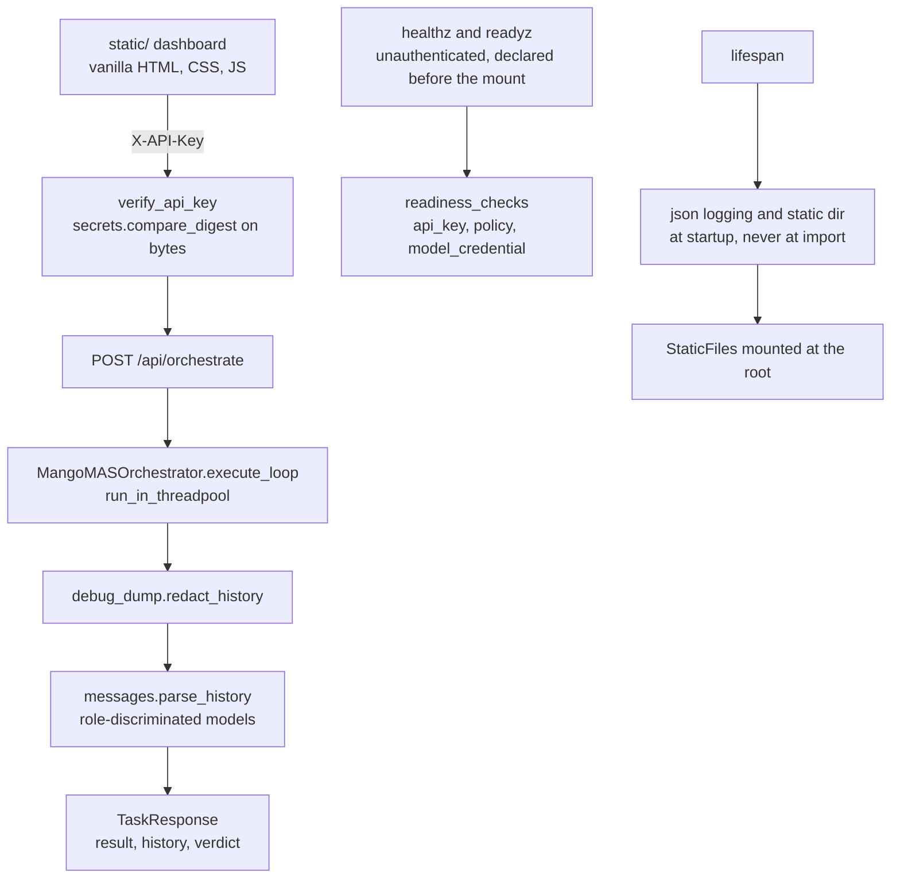

# AGENTS.md — API server

**Scope:** `main.py`, `messages.py`, `static/`, `tests/`
**Owner:** nemotron-reasoner → implementer — the **Web Presenter** persona for the `.mango` / `harness` architecture: the FastAPI backend, the vanilla HTML/CSS/JS frontend, and the styling that dresses it
**Protected path:** no
**Reviewed:** 2026-09-19

## What this does

This is the only way into the planner → reasoner → verifier loop that is not a
shell. It authenticates a task brief, runs the loop off the event loop, and hands
back the conversation the run actually produced together with the verdict the
harness earned for it. It is layer 5 of `test_import_direction.LAYERS` — the top —
so it may name anything under `harness/shared`, and nothing may name it.

## Map

## Key files

| File | Role |
| --- | --- |
| `main.py` | The app: `lifespan`, `verify_api_key`, `/api/orchestrate`, `/healthz`, `/readyz`, the static mount, and the dev runner under `__main__`. |
| `messages.py` | Role-discriminated Pydantic wire models for the returned history. Audit finding B3 — see Gotchas. |
| `static/` | The dashboard served at `/`. Vanilla HTML/CSS/JS, no framework and no build step. |
| `tests/` | The colocated pytest suite, collected by `pyproject.toml` `testpaths`. |

## Invariants

- **No JS frameworks.** The frontend stays vanilla HTML/CSS/JS unless a decision
  record authorises otherwise. Nothing here has a bundler or an npm manifest.
- **Glassmorphism.** The UI keeps its premium, modern treatment — translucent cards,
  blur, CSS custom properties declared once on `:root` in `static/styles.css`.
- **FastAPI endpoints are typed and async.** Requests and responses are Pydantic
  models; the one deliberate `def` is `readyz`, so its policy read runs in the
  threadpool instead of blocking the event loop.
- **Full pytest coverage for every new endpoint.** `tests/` is in the coverage
  `source` set, per-file floors come from `governance-policy.json`, and a route
  added without tests fails `make coverage-python`.
- **No hard-coded thresholds.** `TaskRequest.task` is deliberately unbounded because
  no policy key describes a task brief; borrowing `orchestrator.max_command_bytes`
  would enforce a limit the policy does not state.
- **Credentials never leave.** The key is compared with `secrets.compare_digest` over
  `surrogateescape`-encoded bytes, and the history is redacted before it is serialised.

## Commands

| Task | Command |
| --- | --- |
| Gate this directory's tests | `make test-python` |
| Coverage floors from policy | `make coverage-python` |
| Governance-marked gates only | `make test-governance` |
| Regression tier for this server | `make test-regression` |
| Full deterministic gate | `make ci` |

## Agents and skills

| Stage | Agent | Skills |
| --- | --- | --- |
| plan | `.mango/agents/planner.md` | `spec-authoring`, `openspec-peer-review` |
| build | `.mango/agents/nemotron-reasoner.md` | `harness-engineering`, `boundary-invariant-review` |
| verify | `.mango/agents/verifier.md` | `validation-runner`, `coverage-gate`, `regression-pin-author` |

## Gotchas

- **Setup belongs in `lifespan`, not at import.** `STATIC_DIR.mkdir()` and the
  root-logger reconfiguration once ran at module scope, so every pytest collection
  mutated the working tree and replaced the importing process's log handlers.
  `test_json_logging_is_installed_by_lifespan_not_by_import` and
  `harness/shared/tests/regression/test_api_server_regression.py` hold that line.
- **The history is not `dict[str, str]`.** A tool-using turn carries `content: None`
  plus `tool_calls`, and the dispatcher appends a `tool` turn with `tool_call_id`.
  Typing it loosely made every real run a 500 with its verdict discarded (audit B3).
  `messages.py` allows unknown keys but not unknown roles; a stricter wire model
  than the loop recreates the defect.
- **Route order is load-bearing.** Starlette matches in registration order and the
  mount at `/` shadows everything after it, so `/healthz` and `/readyz` must stay
  declared above it.
- **Adding a route means editing the C4 doc.** `TestDocumentedRoutesExist` in
  `harness/shared/tests/test_documentation_truth.py` checks every path listed under
  the "API surface" heading of `docs/architecture/c4_architecture.md` against
  `app.routes`.
- **`status` is not the outcome.** It is `"success"` whenever the request did not
  raise; `verdict`, `termination_reason` and `verdict_detail` carry what was checked,
  and `verdict_detail` names the command and exit code because one gate is not the
  full matrix.
- **`tests/conftest.py` is a protected path** (`**/conftest.py`) even though this
  directory is not. Editing it needs `ALLOW_GITHUB_CHANGES=1`, the `infra-reviewed`
  label and an attestation row.
