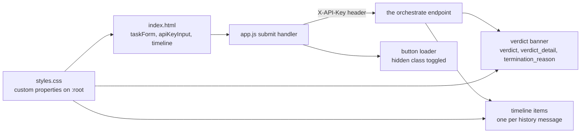

# AGENTS.md — Dashboard assets

**Scope:** `index.html`, `styles.css`, `app.js`, `fetch`
**Owner:** nemotron-reasoner → implementer — the **Web Presenter** persona's front half
**Protected path:** no
**Reviewed:** 2026-09-19

## What this does

Three files are the entire client for `/api/orchestrate`: a form that takes a task
and a key, a submit handler that posts them, and a stylesheet. There is no
framework, no bundler and no dependency manifest, so what is checked in is exactly
what the browser runs — which is the point, and also why nothing in CI lints this
directory. It is served by the `StaticFiles` mount in `../main.py`.

## Map

## Key files

| File | Role |
| --- | --- |
| `index.html` | The whole document: the task form, the API-key field, and the timeline container. |
| `app.js` | One submit listener. Posts the task, renders the verdict banner, then one node per history message. |
| `styles.css` | The palette as custom properties on `:root`, the glass cards, the loader and the timeline. |

## Invariants

- **No JS frameworks.** Vanilla HTML/CSS/JS only. No React, no bundler, no npm
  manifest; the only external resource is the Google Fonts stylesheet in
  `index.html`.
- **Glassmorphism.** Translucent card backgrounds, a gradient page background and
  blur. The palette is declared once in the `:root` block of `styles.css`; a new
  colour joins that block rather than appearing inline in a rule.
- **Never render response data through `innerHTML`.** Every node is built with
  `createElement` and filled with `textContent`. The single `innerHTML` write in
  `app.js` assigns a constant empty string to reset the timeline.
- **The key is typed, never stored.** `apiKeyInput` is a `password` field read at
  submit time; nothing writes it to `localStorage`, a cookie or the URL.
- **Field names are a contract with `../main.py`.** `app.js` reads `verdict`,
  `verdict_detail`, `termination_reason`, `history` and `result` — the `TaskResponse`
  fields.

## Commands

| Task | Command |
| --- | --- |
| Prove the dashboard is served | `make test-python` |
| Coverage floors from policy | `make coverage-python` |
| Full deterministic gate | `make ci` |

## Agents and skills

| Stage | Agent | Skills |
| --- | --- | --- |
| plan | `.mango/agents/planner.md` | `spec-authoring` |
| build | `.mango/agents/nemotron-reasoner.md` | `harness-engineering` |
| verify | `.mango/agents/verifier.md` | `validation-runner`, `shadow-channel-analysis` |

## Gotchas

- **No gate lints this JavaScript.** `make lint-node` runs ESLint, Prettier and Knip
  from `harness/node`, and `make lint-python` is Python-only, so nothing here is
  linted, type-checked or dead-code scanned. Review is the only check.
- **Only one test touches this directory.** `test_static_files` in
  `../tests/test_main.py` asserts that `/` returns 200 and contains the document
  title. Renaming a `TaskResponse` field blanks the verdict banner with every gate
  still green — the API side is pinned by
  `test_the_response_carries_the_verdict_and_what_earned_it`, the render side is not.
- **`index.html` still carries one inline `style` attribute**, on `#apiKeyInput`.
  It is the one place the custom-property rule is broken; move it into `styles.css`
  rather than adding a second.
- **This directory is created at startup, not at import.** `main.py` mounts it with
  `check_dir=False` and `lifespan` does the `mkdir`, so an empty checkout still
  serves `/healthz`. Do not reintroduce an import-time `mkdir`.
- **The mount is registered last on purpose.** A mount at `/` shadows any route added
  after it, so a new endpoint goes above it in `main.py`, not here.
- **`data.result` is only shown when the history is empty**, in the placeholder
  branch. A change that always populates history makes that branch unreachable.
