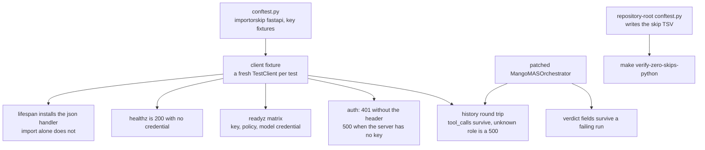

# AGENTS.md — API server suite

**Scope:** `test_main.py`, `conftest.py`, `__init__.py`, `pytest`
**Owner:** verifier → test-eval
**Protected path:** no
**Reviewed:** 2026-09-19

## What this does

This suite asks one question: does the HTTP surface in `../main.py` behave when the
orchestrator underneath it is stubbed? Auth, the readiness matrix, the wire shape of
the returned history and the dev runner's defaults are all exercised here against a
`TestClient`, with no network and no real credential. Reproductions of defects that
already shipped live one tier up, in `harness/shared/tests/regression/`, so
`make test-regression` asks its own question in one place.

## Map

## Key files

| File | Role |
| --- | --- |
| `test_main.py` | Every behavioural test: auth, orchestrate, verdict fields, history shapes, probes, lifespan, dev runner. |
| `conftest.py` | `pytest.importorskip("fastapi")` and the generated `api_server_key` / `no_server_key` fixtures. **Protected path.** |
| `__init__.py` | Makes the directory a package so `pyproject.toml` `testpaths` can collect it beside the other two suites. |

## Invariants

- **No committed credential.** `API_SERVER_KEY` is generated per test with
  `secrets.token_urlsafe(32)`. A test that reads an ambient key passes locally and
  lies in CI.
- **The FastAPI guard is declared once.** `importorskip` belongs in `conftest.py`;
  a duplicate in a test module skips nothing the conftest has not already decided.
- **Fixtures, not module-level state.** The `TestClient` is built per test, because
  under `pytest-randomly` and `-n auto` an import-time client leaks between workers.
- **Sockets stay disabled.** `addopts` carries `--disable-socket --allow-unix-socket`;
  the `enable_socket` mark is applied only on `win32`, where anyio's portal falls
  back to a loopback pair (DEC-062).
- **Every test asserts something.** `harness/shared/tests/test_test_quality.py` scans
  this directory by AST and fails a test with no assertion.
- **Skips are failures (INV-2).** Waivers live in
  `harness/shared/tests/skip-waivers.json` and must carry a `DEC-` id in the reason.

## Commands

| Task | Command |
| --- | --- |
| Run this suite with the rest | `make test-python` |
| Coverage floors from policy | `make coverage-python` |
| Governance-marked gates only | `make test-governance` |
| Zero-skip verification | `make verify-zero-skips-python` |
| Full deterministic gate | `make ci` |

## Agents and skills

| Stage | Agent | Skills |
| --- | --- | --- |
| plan | `.mango/agents/planner.md` | `spec-authoring`, `openspec-peer-review` |
| build | `.mango/agents/nemotron-reasoner.md` | `harness-engineering`, `regression-pin-author` |
| verify | `.mango/agents/verifier.md` | `validation-runner`, `coverage-gate`, `gate-mutation-proof` |

## Gotchas

- **A wholesale patch of `MangoMASOrchestrator` returns a `MagicMock`.** Pydantic
  rejects it for a `str` field and the endpoint's blanket `except` turns that into a
  500, so the test fails for a reason that has nothing to do with what it asks.
  Return a real `LoopOutcome` — that is what `_passing_outcome()` exists for.
- **This directory is in coverage `omit`, `../` is in `source`.** Tests here never
  inflate the number; the modules they exercise are what is measured.
- **`conftest.py` is a protected path** (`**/conftest.py`) even though the directory
  is not. Editing it needs `ALLOW_GITHUB_CHANGES=1`, the `infra-reviewed` label and
  an attestation row, or `make validate` fails closed.
- **Session hooks are not re-registered here.** Skip evidence and deselection come
  from the repository-root `conftest.py`; DEC-030 moved them up precisely because a
  suite-local hook covered only one of the three suites.
- **Reproductions belong in the regression tier.** A new defect in `../main.py` gets
  a test here for the behaviour and a pinned reproduction in
  `harness/shared/tests/regression/test_api_server_regression.py`.
- **The file has a size budget.** `test_main.py` is measured against
  `limits.test_size_budget_lines`; split along a seam rather than appending.
