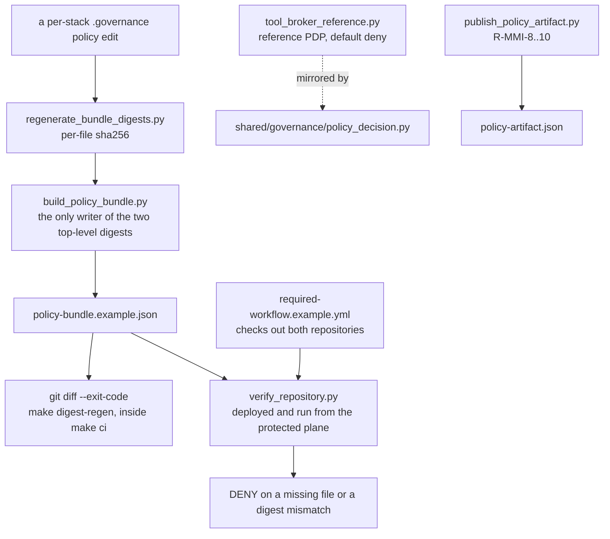

# AGENTS.md — Control-plane reference

**Scope:** `verify_repository.py`, `tool_broker_reference.py`, `policy-bundle.example.json`, `required-workflow.example.yml`
**Owner:** nemotron-reasoner → security-reviewer
**Protected path:** no — but four files here are; see Gotchas
**Reviewed:** 2026-09-19

## What this does

These are reference deployment artifacts for a control plane that is supposed to be
somewhere else. A repository cannot prove that its own mutable governance files are
immutable (INV-6), so the verifier, the approved bundle and the required workflow
belong in an independently administered repository, pinned by commit and required
through an organization ruleset. The copy checked in here exists to be read,
adapted and deployed outward — it is **not** the root of trust when it is read from
inside the governed project.

## Map

## Key files

| File | Role |
| --- | --- |
| `verify_repository.py` | Compares the governed repo's policy and agent-policy digests to the protected bundle **before** project-local conformance code runs. |
| `tool_broker_reference.py` | Reference PDP: unknown identity, ungranted action and unapproved high-risk action all DENY. Protected. |
| `build_policy_bundle.py` | Builds the candidate bundle; the only writer of `governance_policy_sha256` and `agent_policy_sha256`. |
| `regenerate_bundle_digests.py` | Refreshes `profiles[*].protected_files` digests, never the two top-level ones. Protected. |
| `publish_policy_artifact.py` | Versioned, digest-pinned policy artifact plus HMAC attestation. Protected. |
| `policy-bundle.example.json` | The committed bundle the digest gate diffs against. |
| `required-workflow.example.yml` | The org-owned required workflow that runs the verifier against a governed checkout. |

## Invariants

- **Not the root of trust.** Any prose describing this directory says so. A verifier
  a compromised repository can rewrite verifies nothing.
- **Digests are regenerated, never typed.** `make digest-regen` runs both
  regenerators and then `git diff --exit-code`, and it is a prerequisite of `make ci`.
- **Fail closed everywhere.** A missing protected file, a digest of the wrong length
  or a malformed input is a `DENY`/`SystemExit`, never a warning.
- **Import is side-effect free.** `argparse` stays under `main()` behind a `__main__`
  guard: the directory name is hyphenated, so tests load these modules by path with
  `importlib` and `runpy`, and an import-time parse breaks that.
- **Every script has a colocated test.** `tests/test_control_plane_layout.py` maps
  script → test and test → script in both directions, so a new script cannot land
  untested with CI green.
- **The reference PDP is a floor, not a product.** A production broker additionally
  authenticates identity, binds approval to exact resource and destination, enforces
  expiry and nonces, and writes evidence outside the governed repository.

## Commands

| Task | Command |
| --- | --- |
| Regenerate and diff the bundle | `make digest-regen` |
| Run the colocated tests | `make test-python` |
| Coverage floors from policy | `make coverage-python` |
| Governance validators | `make validate` |
| Full deterministic gate | `make ci` |

## Agents and skills

| Stage | Agent | Skills |
| --- | --- | --- |
| plan | `.mango/agents/planner.md` | `spec-authoring`, `openspec-peer-review` |
| build | `.mango/agents/nemotron-reasoner.md` | `evidence-signing`, `protected-path-attestation` |
| verify | `.mango/agents/verifier.md` | `validation-runner`, `shadow-channel-analysis`, `gate-mutation-proof` |

## Gotchas

- **Four files here are protected paths** — `publish_policy_artifact.py`,
  `policy-artifact.json`, `regenerate_bundle_digests.py` and
  `tool_broker_reference.py` — even though the directory is not. Editing one needs
  the `infra-reviewed` label, `ALLOW_GITHUB_CHANGES=1` and an attestation row.
- **The directory is not an importable package.** The hyphen means no `import
  harness.control_plane`; everything loads by path. Keep the module top stdlib-only
  and put `harness.shared` imports inside functions.
- **A dropped digest entry is silent in the log and loud in CI.**
  `regenerate_bundle_digests.py` removes entries whose file has vanished, logs each
  at WARNING and summarises on stderr; `git diff --exit-code` is what turns it red.
  Run with `LOG_LEVEL=DEBUG` to see every file digested.
- **The two top-level digests have exactly one writer.** `build_policy_bundle.py`
  computes them from `harness/node/.governance/`; the other regenerator must never
  touch them, or the bundle disagrees with itself.
- **`PIN_FULL_COMMIT_SHA` is deliberate here and nowhere else.**
  `required-workflow.example.yml` is the one tracked YAML that still carries it, and
  `test_documentation_claims.py` fails if a real workflow gains one or this example
  loses it.
- **`tool_broker_reference.py` and `shared/governance/policy_decision.py` are two
  copies of one decision.** Changing one without the other splits the PDP the
  external broker is meant to mirror.
