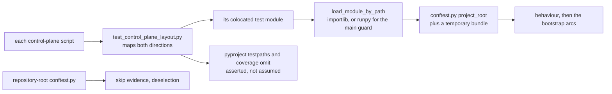

# AGENTS.md — Control-plane suite

**Scope:** `test_control_plane_layout.py`, `test_verify_repository.py`, `conftest.py`, `pytest`
**Owner:** verifier → test-eval
**Protected path:** no
**Reviewed:** 2026-09-19

## What this does

These tests sit beside the scripts they judge rather than in
`harness/shared/tests`, so a reader of `harness/control-plane/` can see that a
script has tests at all. One of them, `test_control_plane_layout.py`, is a
meta-test: it makes the colocation itself a rule, in both directions, so a new
script cannot land untested with every gate green. The rest drive their script
against a temporary fixture tree, never against the repository's real bundle.

## Map

## Key files

| File | Role |
| --- | --- |
| `test_control_plane_layout.py` | The meta-test: script → module, module → script, and that `pyproject.toml` collects and omits this directory. |
| `test_verify_repository.py` | The verifier CLI: side-effect-free import and an unchanged `__main__` allow/deny matrix. |
| `test_tool_broker_reference.py` | The reference PDP CLI, same contract: flags, output and exit codes survive the `main()` wrap. |
| `test_build_policy_bundle.py` | The bundle builder, now the only regenerator of the two top-level policy digests. |
| `test_regenerate_bundle_digests.py` | Behavioural tests for the digest regenerator, driven against a temporary bundle. |
| `test_regenerate_bundle_digests_arcs.py` | The bootstrap and process-boundary arcs `regenerate()` and `main()` cannot reach. |
| `test_publish_policy_artifact.py` | R-MMI-8..10 and C-MMI-6: pinned digests, fail-closed check mode, attestation. |

## Invariants

- **Colocation is a rule, not a convention.** Every `*.py` beside this directory has
  a `test_<script>.py` here that *names* its script; every module here maps back to
  one, or is the layout meta-test itself. An allowed sibling is
  `test_<script>_<topic>.py`.
- **Never assert against the real bundle.** Digest and drift behaviour is exercised
  on a fixture tree, so a run cannot pass because the repository happened to agree.
- **Scripts load by path.** The hyphen in `control-plane` makes it unimportable, so
  everything goes through `harness.shared.tests._helpers.load_module_by_path`, or
  `runpy` for the `__main__` arc.
- **Session hooks stay at the root.** Skip evidence and LangGraph deselection come
  from the repository-root `conftest.py` and are deliberately not re-registered here.
- **Every test asserts something** (`test_test_quality.py` scans this directory), and
  **skips are failures** under INV-2.
- **A vacuous glob is a failure.** The meta-test asserts its own population before
  looping over it — an empty `glob` would otherwise report success for free.

## Commands

| Task | Command |
| --- | --- |
| Run this suite with the rest | `make test-python` |
| Coverage floors from policy | `make coverage-python` |
| Governance-marked gates only | `make test-governance` |
| Exercise the digest pipeline | `make digest-regen` |
| Full deterministic gate | `make ci` |

## Agents and skills

| Stage | Agent | Skills |
| --- | --- | --- |
| plan | `.mango/agents/planner.md` | `spec-authoring`, `openspec-peer-review` |
| build | `.mango/agents/nemotron-reasoner.md` | `harness-engineering`, `regression-pin-author` |
| verify | `.mango/agents/verifier.md` | `validation-runner`, `coverage-gate`, `gate-mutation-proof` |

## Gotchas

- **Adding a script next door fails this suite immediately.** That is the meta-test
  working: write `test_<script>.py` here, and make it reference the script by
  filename, or `test_each_script_has_a_colocated_test_module_that_names_it` stays red.
- **`conftest.py` is a protected path** (`**/conftest.py`). Editing it needs
  `ALLOW_GITHUB_CHANGES=1`, the `infra-reviewed` label and an attestation row.
- **There is no `__init__.py`.** The directory is collected by `testpaths`, not
  imported as a package; adding one changes how pytest resolves module names.
- **`pyproject.toml` is asserted from inside this suite.** Removing this directory
  from `testpaths` or from the coverage `omit` list fails
  `test_pyproject_collects_and_omits_this_directory`, which is the point — an
  uncollected suite is indistinguishable from a passing one.
- **CLI tests run in a real subprocess from the repo root**, so the `sys.path`
  bootstrap is exercised as shipped rather than masked by pytest's `pythonpath`.
- **Module size is budgeted.** `limits.test_size_budget_lines` applies here too;
  `_arcs` is a sibling module rather than an appendix for exactly that reason.
