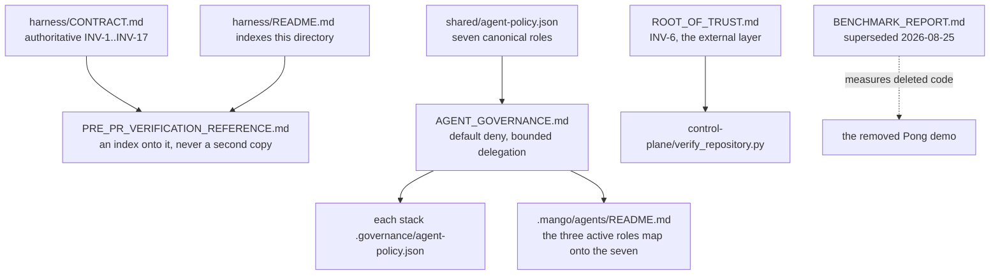

# AGENTS.md — Harness governance docs

**Scope:** `AGENT_GOVERNANCE.md`, `ROOT_OF_TRUST.md`, `PRE_PR_VERIFICATION_REFERENCE.md`, `BENCHMARK_REPORT.md`
**Owner:** planner → spec-analyst
**Protected path:** no
**Reviewed:** 2026-09-19

## What this does

Four harness-scoped reference documents, and none of them is a source of truth.
Two restate contracts that are authoritative elsewhere — `harness/CONTRACT.md` for
the invariants, `shared/agent-policy.json` for the roles — one states the trust
boundary the whole repository rests on, and one is a superseded benchmark kept for
the record. The value of the directory is entirely in its accuracy, so the only
thing to get right here is not saying something the tree does not back.

## Map

## Key files

| File | Role |
| --- | --- |
| `AGENT_GOVERNANCE.md` | The seven canonical roles and the rules over them: default deny, bounded delegation, approval categories, evidence obligations. |
| `ROOT_OF_TRUST.md` | INV-6 in five clauses: what the external, independently administered layer must own and verify. |
| `PRE_PR_VERIFICATION_REFERENCE.md` | A verification index onto `harness/CONTRACT.md`. Where the two disagree, the contract wins. |
| `BENCHMARK_REPORT.md` | **Superseded 2026-08-25.** Kept only for the record; see Invariants before citing anything in it. |

## Invariants

- **`harness/CONTRACT.md` wins.** `PRE_PR_VERIFICATION_REFERENCE.md` is an index, not
  a second source of truth; its INV numbering was wrong for INV-5 and INV-7 once
  already, which is the failure mode a restating table creates.
- **`BENCHMARK_REPORT.md` stays marked superseded.** Its paths, coverage rows and
  artifact links all refer to the Pong demo that `docs/specs/remove-pong-demo.md`
  deleted, its links point at one contributor's local filesystem, and its headline
  speed multiple is measured against an unsourced baseline. Do not quote it, and do
  not quietly remove the banner.
- **Reports do not live here.** Repository reports go under `docs/reports/` and are
  indexed in `harness/README.md`; `test_documentation_claims.TestEveryReportIsIndexed`
  compares that index to the directory in both directions.
- **The file list is indexed.** `harness/README.md` names exactly these four under
  its `docs/` bullet. Adding, renaming or removing one means editing that bullet in
  the same change.
- **Seven canonical roles, three active ones.** `AGENT_GOVERNANCE.md` describes the
  canonical taxonomy; the executed loop is planner → nemotron-reasoner → verifier.
  The mapping lives in `.mango/agents/README.md` and is pinned by
  `test_agent_authority.py` — do not reconcile the two by editing this directory.
- **Nothing here grants authority.** Describing the control plane as if the
  in-repository copy enforced it contradicts INV-6 and `ROOT_OF_TRUST.md` itself.

## Commands

| Task | Command |
| --- | --- |
| Documentation-claim tests | `make test-python` |
| Governance-marked gates only | `make test-governance` |
| Governance validators | `make validate` |
| Scaffold a spec instead of a doc | `make spec` |
| Full deterministic gate | `make ci` |

## Agents and skills

| Stage | Agent | Skills |
| --- | --- | --- |
| plan | `.mango/agents/planner.md` | `spec-authoring`, `openspec-peer-review` |
| build | `.mango/agents/nemotron-reasoner.md` | `harness-engineering`, `tech-debt-audit` |
| verify | `.mango/agents/verifier.md` | `validation-runner`, `standards-audit`, `repo-invariant-review` |

## Gotchas

- **This directory holds no source files.** It owes an `AGENTS.md` through
  `agents_doc.additional_directories` in `governance-policy.json`, not through the
  three-source floor — so the document exists because a human decided the boundary
  is document-worthy, and it stays only as long as that entry does.
- **Diagrams here are outside the mermaid gate.**
  `test_documentation_truth.TestEveryMermaidDiagramCanRender` scans `docs/`,
  `README.md` and `CLAUDE.md` at the repository root, not `harness/docs/`. A broken
  diagram added to one of these four renders as an error box with CI green. The one
  diagram above is covered, because `agents_doc` checks every `AGENTS.md`.
- **`make validate` does not validate this directory.** Its
  `validate_governance_docs.py` leg runs from `harness/node` and checks that stack's
  `docs/`. Nothing mechanically reads these four files except the README index test.
- **A superseded document is not a deletable one.** The banner is the finding; the
  file is the evidence that the finding was recorded.
- **`AGENT_GOVERNANCE.md` names `control-plane/tool_broker_reference.py` as reference
  PDP logic only.** Any edit that upgrades that sentence into a claim of enforcement
  contradicts both `ROOT_OF_TRUST.md` and the script's own docstring.
