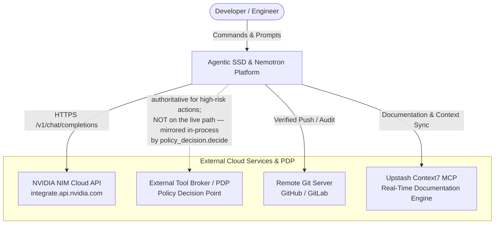
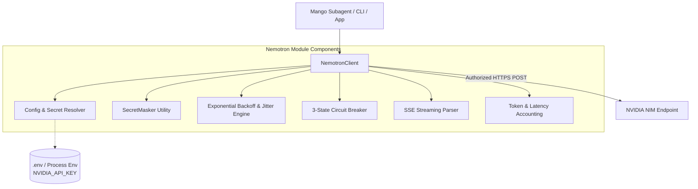

# C4 Architecture Model: Agentic SSD & NVIDIA Nemotron AI Platform

**System:** Agentic SSD & NVIDIA Nemotron AI Platform (Mango Ecosystem)  
**Version:** 2.1.9 (2026 Standards)  
**Governance:** `harness/CONTRACT.md` / Agentic SSD Governance Harness v2.1 (INV-1..INV-16)

---

## 1. System Context Diagram (Level 1)

The System Context diagram illustrates the high-level actors, the Autonomous Mango Multi-Agent Ecosystem, and external cloud infrastructure.



---

## 2. Container Diagram (Level 2)

The Container diagram shows the runtime environments, repositories, tools, and execution processes.

```mermaid
graph TD
    User([Developer / Engineer]) --> CLI[Terminal CLI / PowerShell / Bash]

    subgraph "Repository Runtime Containers"
        subgraph ".agents Skill Registry"
            AgentSkills[Skills: nemotron-reasoner<br/>Native Antigravity Skill Definition]
        end

        subgraph ".mango Agent Runtime"
            MA[Mango Agent Core]
            SubAgents[Subagents: nemotron-reasoner, planner, verifier]
            Personas[Persona Topology: Web Presenter, Node Bridge]
            Hooks[Lifecycle Hooks: PreToolUse, Stop, SessionStart, PreNemotron]
            Skills[Skills: repo-invariant-review, openspec-peer-review, nemotron-reasoner]
            AgentMetaTools[Continuous Learning & MCPs: knowledge_gap_log, query_docs (Context7) [Planned]]
            Memory[(Local JSON Memory: gaps.json, hypotheses.json)]
            MA --> SubAgents
            SubAgents --> Personas
            MA --> Hooks
            MA --> Skills
            MA --> AgentMetaTools
            AgentMetaTools --> Memory
        end

        subgraph "Node.js Container - harness/node"
            TSClient[NemotronClient<br/>TypeScript Adapter & Circuit Breaker]
            VitestRunner[Vitest Test Runner<br/>Multi-Tier Matrix]
        end

        subgraph "Python Shared Runtime - harness/shared"
            PyBridge[nemotron_bridge.py<br/>Python Adapter — HTTP, auth, response shape]
            RetryPolicy[retry_policy.py<br/>Pure backoff arithmetic<br/>no I/O, no clock, no network]
            Orchestrator[mango_mas_orchestrator.py<br/>MAS Orchestrator + tool dispatch registry]
            DebugDump[debug_dump.py<br/>Credential redaction + debug dumps]
            MetaTools[meta_tools.py<br/>Meta-Learning Tools + file_lock]
            PyBridge -->|asks for a delay| RetryPolicy
            Orchestrator -->|redacts history through| DebugDump
            subgraph "Cognitive Boundary — INV-16 (one-directional)"
                Signal[cognitive_signal.py<br/>CognitiveSignal envelope + JSONL sink]
                Shadow[shadow_planner.py<br/>Shadow-mode comparison channel<br/>MANGO_SHADOW_PLANNER, off by default]
                Shadow -->|emits, zero tool authority| Signal
            end
            subgraph "Gates — policy-sourced, fail-closed"
                CoverageGate[coverage_gate.py<br/>lines + branches as two floors<br/>from governance-policy.json]
            end
            subgraph "governance/"
                Broker[broker.py<br/>ExecutionBroker + ProcessBackend<br/>INV-8/9/10 — contains, does not isolate]
                PDP[policy_decision.py<br/>In-process PDP<br/>mirrors tool_broker_reference.py]
                Actions[command_actions.py<br/>command → declared action; allowlist,<br/>unmodelled ⇒ an action no role holds]
                GovGuards[pretooluse_guard.py<br/>Policy Guards — resolved from the installed<br/>package; unavailability denies]
                Validators["Governance Validators<br/>traceability, zero-skips, remotes"]
                Evidence[evidence_manifest.py<br/>EvidenceBuilder — HMAC attestation]
                Broker --> PDP
                Broker --> Actions
                Broker --> GovGuards
            end
            WritePolicy[write_policy.py<br/>protected_paths at tool-call time<br/>+ any .git segment]
            Authority[agent_authority.py<br/>per-role tool exposure, derived from agent-policy.json]
            RootValidators["Root Validators<br/>policy, adoption, agent-policy"]
            Orchestrator -->|run_command| Broker
            Orchestrator -->|write_file target| WritePolicy
            Broker -->|write targets of a command| WritePolicy
            Orchestrator -->|tools_for_role / execution_identity| Authority
            Orchestrator -.->|guarded, observation-only| Shadow
        end

        subgraph "Control Plane - harness/control-plane"
            Publisher[publish_policy_artifact.py<br/>Versioned, digest-pinned policy artifact]
            Artifact[(policy-artifact.json<br/>committed, drift-gated)]
            Verifier[verify_repository.py<br/>External root-of-trust verifier]
            Publisher -->|attest, optional| Evidence
            Publisher --> Artifact
        end

        subgraph "Python AQA Engine - harness/shared/tests"
            AQA["Pytest AQA Suite<br/>1564 tests / coverage gate per policy"]
            RunpyExec["runpy.run_path() Executor<br/>In-Process CLI Coverage"]
            AQA --> RunpyExec
            RunpyExec -->|executes in-process| Validators
            RunpyExec -->|executes in-process| PyBridge
            RunpyExec -->|executes in-process| GovGuards
            AQA -->|drift gate| Artifact
        end
    end

    CLI --> TSClient
    CLI --> PyBridge

    SubAgents --> TSClient
    SubAgents --> PyBridge
    Hooks --> GovGuards

    TSClient -->|HTTPS POST| NIM[NVIDIA Nemotron Ultra API]
    PyBridge -->|HTTPS POST| NIM
```

---

## 3. Component Diagram (Level 3)

### 3.1 NVIDIA Nemotron AI Subsystem (`harness/node/src/ai/nemotron/`)



---

## 4. Code & Governance Diagram (Level 4)

### 4.1 Fail-Closed Invariants & Governance Gates

```mermaid
flowchart TD
    Commit[Pre-PR Git Commit] --> Secrets[INV-1: Full Working Tree & History Secret Scan]
    Secrets --> ZeroSkip[INV-2: Zero-Skip Test Verification]
    ZeroSkip --> Remotes["INV-3: Canonical Remote URL Normalizer & Allowlist<br/>(make remotes)"]
    Remotes --> Hooks[INV-4: Non-Destructive Effective Git Hook Installer]
    Hooks --> GateCov["INV-5: CI Gate Coverage<br/>(every ci_required_target reachable from make ci,<br/>or a declared gap — test_ci_gate_coverage.py)"]
    GateCov --> SpecGate["Spec Gate<br/>(make specs → bash validate_specs.sh)"]
    SpecGate --> SpecTrace[Traceability: Bidirectional Requirements]
    SpecTrace --> Policy[INV-6: External Root of Trust Digest Verification]
    Policy --> Protected["Protected-Path Gate<br/>(fail-closed unless ALLOW_GITHUB_CHANGES;<br/>patterns proven live by test_protected_path_liveness.py)"]
    Protected --> ArtifactDrift["Policy Artifact Drift Gate<br/>(publish_policy_artifact --check, via pytest)"]
    ArtifactDrift --> Delegation[INV-7: Bounded Agent Authority & Trace Logging]
    Delegation --> Boundary["INV-16: Cognitive/Execution Boundary<br/>(no CognitiveSignal field reaches a control path)"]
    Boundary --> Purity["Import Purity<br/>(every shared/control-plane module imports from a foreign CWD<br/>with exit 0, no output, no writes — test_import_purity.py)"]
    Purity --> ConfigLive["Configuration Liveness<br/>(every per-file-ignore and gitleaks allowlist entry still<br/>suppresses something real — test_lint_config_liveness.py)"]
    ConfigLive --> Deferrals["Deferral Register<br/>(every declined rule carries a measured count and a reason;<br/>fails if a deferred rule got enabled — test_deferred_rigor.py)"]
    Deferrals --> Regression["Regression / AQA Tier<br/>(one reproduction per defect that already shipped;<br/>make test-regression)"]
    Regression --> Surface["Agent Surface Liveness<br/>(skills dated and classified, hooks reference real paths,<br/>.mango is the only skill root — test_agent_surface_liveness.py)"]
    Surface --> Pass[PR Approved for Merge]
```



### 4.1.1 What these later gates add

The first nine gates answer "is this change correct". The five added after
INV-16 answer a different question: **"is the machinery that answers the first
question still working?"** Each exists because the corresponding failure had
already happened silently.

- **Import purity** — `validate_adoption.py` ran its entire gate at module
  scope, so importing it executed the gate and could exit the interpreter.
  Two sibling CLIs had been fixed by hand; the third survived because there was
  no rule.
- **Configuration liveness** — three `per-file-ignores` patterns suppressed
  nothing, including one for a directory that does not exist. Ruff has no
  unused-ignore check for config-level ignores, so a prune alone rots.
- **Deferral register** — a rule left unselected with no record is
  indistinguishable from a rule nobody considered. Every decline now carries
  the finding count that justified it, and the register fails if the rule is
  later enabled or its cost falls away.
- **Regression tier** — every module in it was confirmed failing against the
  pre-fix commit. Selected by path rather than marker, so it needs no entry in
  the protected `pyproject.toml`.
- **Agent surface liveness** — hooks named `PLAN.md` and `NOTES.md`, neither of
  which existed, and `.mango/settings.json` invoked mode-644 scripts by bare
  path. A dormant hook that is wrong fails the day someone wakes it.

### 4.2 Cognitive/Execution Boundary (INV-16)

The shadow planner channel is one-directional and off by default. It is
included at Level 4, not Level 2/3, because its defining property is a
constraint on data flow rather than a runtime container: no field of a
`CognitiveSignal` may reach a control path, select a tool, or alter tool
exposure, and observation-mode code never receives the live orchestrator.

```mermaid
flowchart LR
    subgraph "Incumbent path (always runs)"
        Planner[planner role] --> Plan[incumbent plan]
        Plan --> Reasoner[nemotron-reasoner]
        Reasoner --> Verifier[verifier]
    end

    subgraph "Shadow channel (MANGO_SHADOW_PLANNER=1 only)"
        Plan -.->|value object, zero tool authority| ShadowCall[shadow_planner.run_shadow_comparison]
        ShadowCall -->|tools=[], bounded timeout| ShadowModel[shadow model call]
        ShadowModel --> Signals[(cognitive-signals.jsonl<br/>.mango/memory/signals, gitignored)]
        ShadowCall -.->|never raises; caller swallows and logs| Verifier
    end

    Signals -.->|read-only, offline| Analysis["shadow-channel-analysis skill<br/>(UC-4 kill-criteria reporting)"]
```

Enforced by `pytest -m governance` (byte-identity when disabled,
zero-authority, envelope invariance, containment) and the static boundary
scan in `test_shadow_planner.py`. See `docs/specs/mangomas-integration-core.md`
and `.mango/skills/boundary-invariant-review/SKILL.md`.
