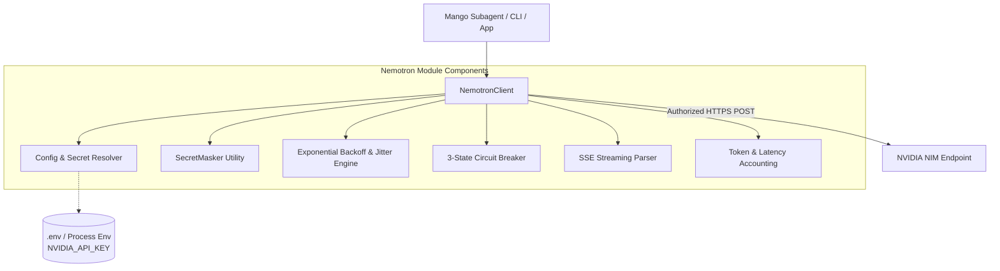
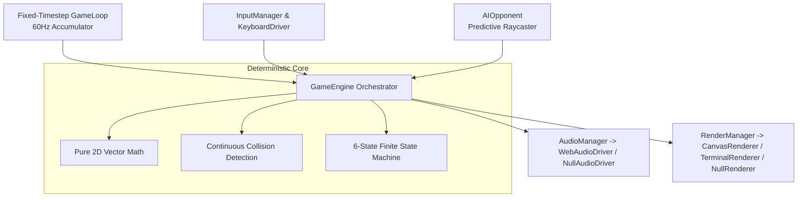
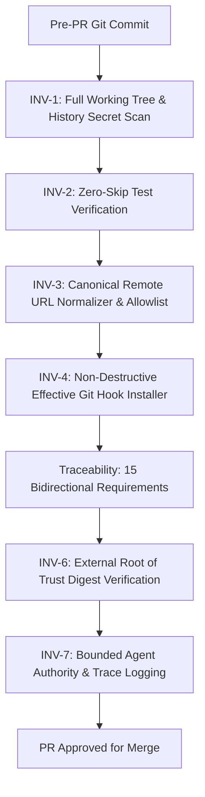

# C4 Architecture Model: Agentic SSD & NVIDIA Nemotron AI Platform

**System:** Agentic SSD & NVIDIA Nemotron AI Platform (Mango Ecosystem)  
**Version:** 2.1.6 (2026 Standards)  
**Governance:** `harness/CONTRACT.md` / Agentic SSD Governance Harness v2.0

---

## 1. System Context Diagram (Level 1)

The System Context diagram illustrates the high-level actors, the Autonomous Mango Multi-Agent Ecosystem, and external cloud infrastructure.

---

## 2. Container Diagram (Level 2)

The Container diagram shows the runtime environments, repositories, tools, and execution processes.

```mermaid
graph TD
    User([Developer / Engineer]) --> CLI[Terminal CLI / PowerShell / Bash]
    User --> Browser[Web Browser<br/>HTML5 Canvas 2D UI]

    subgraph "Repository Runtime Containers"
        subgraph ".agents Skill Registry"
            AgentSkills[Skills: nemotron-reasoner<br/>Native Antigravity Skill Definition]
        end

        subgraph ".mango Agent Runtime"
            MA[Mango Agent Core]
            SubAgents[Subagents: nemotron-reasoner, planner, verifier]
            Personas[Persona Topology: Web Presenter, Node Bridge]
            Hooks[Lifecycle Hooks: PreToolUse, Stop, SessionStart, PreNemotron]
            Skills[Skills: repo-invariant-review, openspec-peer-review, nemotron-reasoner]
            MetaTools[Continuous Learning: knowledge_gap_log, hypothesis_register]
            Memory[(Local JSON Memory: gaps.json, hypotheses.json)]
            MA --> SubAgents
            SubAgents --> Personas
            MA --> Hooks
            MA --> Skills
            MA --> MetaTools
            MetaTools --> Memory
        end

        subgraph "Node.js Container - harness/node"
            TSClient[NemotronClient<br/>TypeScript Adapter & Circuit Breaker]
            PongEngine[Pong Game Engine<br/>Physics, FSM, Renderers]
            VitestRunner[Vitest Test Runner<br/>95 Tests / 7 Tiers]
            PongCli[Pong CLI Runner<br/>Autoplay & Tournament]
        end

        subgraph "Python Shared Runtime - harness/shared"
            PyBridge[nemotron_bridge.py<br/>Python Adapter]
            Orchestrator[mango_mas_orchestrator.py<br/>MAS Orchestrator]
            MetaTools[meta_tools.py<br/>Meta-Learning Tools]
            subgraph "governance/"
                GovGuards[pretooluse_guard.py<br/>Policy Guards]
                Validators["Governance Validators<br/>traceability, zero-skips, remotes"]
            end
            RootValidators["Root Validators<br/>policy, adoption, agent-policy"]
        end

        subgraph "Python AQA Engine - harness/shared/tests"
            AQA["Pytest AQA Suite<br/>138 Tests / 85.37% Coverage"]
            RunpyExec["runpy.run_path() Executor<br/>In-Process CLI Coverage"]
            AQA --> RunpyExec
            RunpyExec -->|executes in-process| Validators
            RunpyExec -->|executes in-process| PyBridge
            RunpyExec -->|executes in-process| GovGuards
        end
    end

    CLI --> PongCli
    CLI --> TSClient
    CLI --> PyBridge
    Browser --> PongEngine

    SubAgents --> TSClient
    SubAgents --> PyBridge
    Hooks --> GovGuards

    TSClient -->|HTTPS POST| NIM[NVIDIA Nemotron Ultra API]
    PyBridge -->|HTTPS POST| NIM
```

---

## 3. Component Diagram (Level 3)

### 3.1 NVIDIA Nemotron AI Subsystem (`harness/node/src/ai/nemotron/`)

### 3.2 Deterministic Pong Engine Subsystem (`harness/node/src/pong/`)

---

## 4. Code & Governance Diagram (Level 4)

### 4.1 Fail-Closed Invariants & Governance Gates

