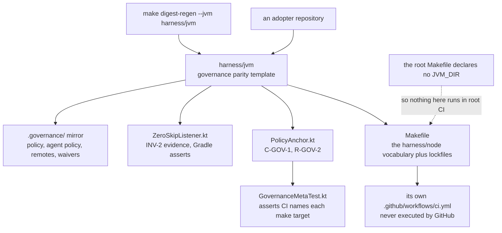

# AGENTS.md — JVM parity template

**Scope:** `build.gradle.kts`, `src/main/kotlin/governance/PolicyAnchor.kt`, `.governance/`, `Kotlin`, `Gradle`
**Owner:** nemotron-reasoner → implementer
**Protected path:** no — but `Makefile`, `agents/`, `.governance/` and `docs/PROJECT-CHARTER.md` here are
**Reviewed:** 2026-09-19

## What this does

This is a reference adoption template, not a live stack. It exists to show that the
harness contract is toolchain-neutral: the same gate vocabulary, the same
`.governance/` root of trust and the same zero-skip evidence, expressed in
Kotlin and Gradle. The code is deliberately minimal — a requirement anchor, a
meta-test and a JUnit listener — because what is being demonstrated is the
governance surface, not a feature set.

## Map

## Key files

| File | Role |
| --- | --- |
| `Makefile` | The stack-neutral gate vocabulary — `lint`, `types`, `cov`, `secrets`, `governance`, `pre-pr` — mirroring `harness/node`. **Protected.** |
| `build.gradle.kts` | Kotlin JVM build, detekt, coverage and the locked-dependency posture an adopter inherits. |
| `settings.gradle.kts` | Project coordinates; the second half of what `make digest-regen` digests for this profile. |
| `src/main/kotlin/governance/PolicyAnchor.kt` | The requirement anchor: `C-GOV-1` and `R-GOV-2` as data, so a test can assert them. |
| `src/test/kotlin/governance/GovernanceMetaTest.kt` | Asserts the workflow invokes every named target and that pre-push delegates to the shared normalizer. |
| `src/test/kotlin/governance/ZeroSkipListener.kt` | JUnit listener recording skip evidence; Gradle performs the failing assertion (INV-2). |
| `config/detekt.yml` | The static-analysis configuration behind `make lint`. |
| `gradle.lockfile.template` | A template, not a lockfile. An adopter generates and reviews the real one. |

## Invariants

- **Nothing here runs in this repository's CI.** The root `Makefile` declares no
  `JVM_DIR`, and GitHub only discovers workflows under the repository-root
  `.github/workflows/`, so `harness/jvm/.github/workflows/ci.yml` is never executed.
  `harness/CONTRACT.md` states this, and it is the concrete shape of INV-2's and
  INV-3's "partially enforced".
- **Target names are the contract.** Parity with `harness/node` means the same gate
  vocabulary, not the same features; renaming a target here breaks the claim the
  directory exists to make, and `GovernanceMetaTest` asserts the workflow names them.
- **`scripts/*.py` are delegating shims** over `harness/shared`, never copies —
  `make check-dedup`. That is also why `harness/jvm/scripts` is waived from owing
  its own `AGENTS.md`: its contract is stated once, here.
- **Minimal by design.** Adding Kotlin beyond the governance anchor changes what the
  template claims to be, and needs a decision record.
- **Templates stay templates.** `gradle.lockfile.template`,
  `gradle/verification-metadata.xml.template.xml` and
  `.governance/root-of-trust.json.template` are renamed by the adopter, not here.

## Commands

| Task | Command |
| --- | --- |
| Regenerate the digests covering this stack | `make digest-regen` (root) |
| Shim-versus-copy drift | `make check-dedup` (root) |
| Full deterministic gate | `make ci` (root) |
| Stack-local gate vocabulary | `make pre-pr` (in `harness/jvm`, adopter only) |
| Static analysis tier | `make lint` (in `harness/jvm`) |

## Agents and skills

| Stage | Agent | Skills |
| --- | --- | --- |
| plan | `.mango/agents/planner.md` | `spec-authoring`, `openspec-peer-review` |
| build | `.mango/agents/nemotron-reasoner.md` | `harness-engineering`, `protected-path-attestation` |
| verify | `.mango/agents/verifier.md` | `validation-runner`, `repo-invariant-review`, `standards-audit` |

## Gotchas

- **Green targets here prove nothing about this repository.** Treat them as an
  adopter starting point. Claiming JVM coverage in a PR body because `make ci` passed
  is the exact defect DEC-024 records.
- **`make install` here fails closed on a fresh checkout.** The Gradle wrapper,
  `gradle.lockfile` and `gradle/verification-metadata.xml` are not committed — only
  their templates are — so every Gradle target stops at the guard. That is the
  adopter bootstrap (`make lockfiles` in a reviewed change), not a broken build.
- **The digest bundle does cover this directory.** `make digest-regen` invokes the
  builder with `--jvm harness/jvm` and digests the Makefile, both Gradle scripts,
  `gradle.properties`, the two Kotlin test sources, the JUnit services file and every
  `scripts/` entry. Change one without regenerating and `make ci` fails on the diff.
- **Four protected patterns match inside this unprotected directory**:
  `harness/*/Makefile`, `harness/*/agents/**`, `**/.governance/**` and
  `harness/*/docs/PROJECT-CHARTER.md`. Any of them needs the `infra-reviewed` label,
  `ALLOW_GITHUB_CHANGES=1` and an attestation row.
- **`GovernanceMetaTest` reads files by relative path**, so it only passes when
  Gradle runs with `harness/jvm` as the working directory.
