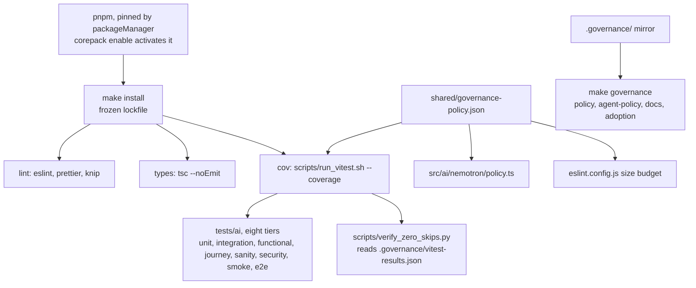

# AGENTS.md — Node stack

**Scope:** the `typescript` NVIDIA Nemotron client adapter under `src/ai/nemotron/` (HTTP client, circuit breaker, retry, secret masker, CLI), the governance mirror under `.governance/` and `src/governance/`, the `vitest` test matrix, and the `eslint`, `prettier` and `knip` lint tier.
**Owner:** nemotron-reasoner → implementer — the **Node Bridge** for the `.mango` / `harness` architecture
**Protected path:** no — but `Makefile`, `agents/` and `.governance/` here are; see Gotchas
**Reviewed:** 2026-09-19

## What this does

This is the TypeScript half of the harness: the Nemotron client the loop talks to,
and a governance mirror that proves one contract can be enforced by a second
toolchain. There is no frontend, bundler or WebSocket layer — `package.json`
declares no such dependency and `src/` imports none. The scope line above is the
contract: `test_documentation_claims.py` checks every backticked name on it against
`package.json` or a `src/` import, so a scope claim cannot outlive its code.

## Map

## Key files

| File                    | Role                                                                                                                       |
| ----------------------- | -------------------------------------------------------------------------------------------------------------------------- |
| `package.json`          | The manifest the scope line is checked against: `packageManager` pin, the Node engine floor, and the dev toolchain.        |
| `Makefile`              | The 19-target stack-neutral vocabulary (`lint`, `types`, `cov`, `governance`, …) shared with `harness/jvm`. **Protected.** |
| `vitest.config.ts`      | Reads the `coverage` block from the shared policy and fails closed rather than defaulting.                                 |
| `eslint.config.js`      | Reads `limits.size_budget_lines` from the same policy; a literal here would be exactly the drift the rule forbids.         |
| `knip.json`             | Dead-code and unused-dependency scan over `src/` and `tests/`.                                                             |
| `scripts/run_vitest.sh` | Always writes the results JSON, then runs the zero-skip verifier. Shell, so it is byte-identical to the shared copy.       |
| `.governance/`          | The per-stack root of trust: policy, agent policy, allowed remotes, traceability, skip waivers. **Protected.**             |

## Invariants

- **Strict TypeScript.** Every `.ts` file passes `pnpm exec tsc --noEmit`.
- **Full Vitest coverage for the client and governance modules**, with thresholds
  taken from `governance-policy.json` — never from a literal in this stack.
- **pnpm only.** `corepack enable` picks up the `packageManager` pin; no global
  installs, and `install` refuses to run without a lockfile.
- **Zero skips (INV-2).** `run_vitest.sh` writes `.governance/vitest-results.json`
  on every run and verifies it; the root gate is `make verify-zero-skips`.
- **`scripts/*.py` are shims, never copies.** Logic lives in `harness/shared`;
  `make check-dedup` fails a copy. Shell helpers have no import mechanism, so they
  stay byte-identical and `test_harness.py` holds them that way.
- **The scope line is falsifiable.** Widening it to a technology the manifest does
  not declare is the React/Vite/WebSocket defect that gate was written for.

## Commands

| Task                        | Command                           |
| --------------------------- | --------------------------------- |
| Install pinned dependencies | `make node-deps` (root)           |
| Lint tier                   | `make lint-node` (root)           |
| Vitest with coverage        | `make test-node` (root)           |
| Zero-skip verification      | `make verify-zero-skips` (root)   |
| Whole-project types         | `make types` (in `harness/node`)  |
| Stack-local gate vocabulary | `make pre-pr` (in `harness/node`) |

## Agents and skills

| Stage  | Agent                                | Skills                                                            |
| ------ | ------------------------------------ | ----------------------------------------------------------------- |
| plan   | `.mango/agents/planner.md`           | `spec-authoring`, `openspec-peer-review`                          |
| build  | `.mango/agents/nemotron-reasoner.md` | `harness-engineering`, `nemotron-reasoner`, `god-file-decomposer` |
| verify | `.mango/agents/verifier.md`          | `validation-runner`, `coverage-gate`, `repo-invariant-review`     |

## Gotchas

- **Two Makefiles, two vocabularies.** The root exposes `lint-node`, `test-node`,
  `node-deps`; the stack-local names (`lint`, `types`, `cov`, `governance`, `specs`)
  only work from inside `harness/node`. Running `make test` at the root runs the
  whole repository.
- **Three protected patterns live under this directory.** `harness/*/Makefile`,
  `harness/*/agents/**` and `**/.governance/**` all match here, so editing the
  Makefile, a role contract or the mirror needs the `infra-reviewed` label,
  `ALLOW_GITHUB_CHANGES=1` and an attestation row — even though the directory itself
  is unprotected.
- **`.governance/vitest-results.json` is written into a protected directory** by
  every test run. It is generated state: `make clean` removes it, and it must not be
  committed as if it were policy.
- **Knip fails on an unused export.** Adding a symbol to `src/ai/nemotron/index.ts`
  that nothing imports turns `make lint-node` red; delete it or consume it.
- **The digest bundle covers this stack.** `make digest-regen` digests
  `package.json`, `tsconfig.json`, `vitest.config.ts`, the Makefile and every
  `scripts/` entry, then diffs; changing one without regenerating fails `make ci`.
- **Coverage thresholds are per file.** A new module with no test drags its own file
  below the floor even when the total looks healthy.
