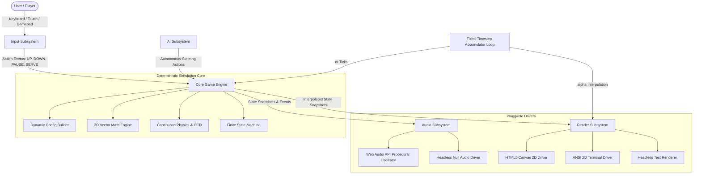
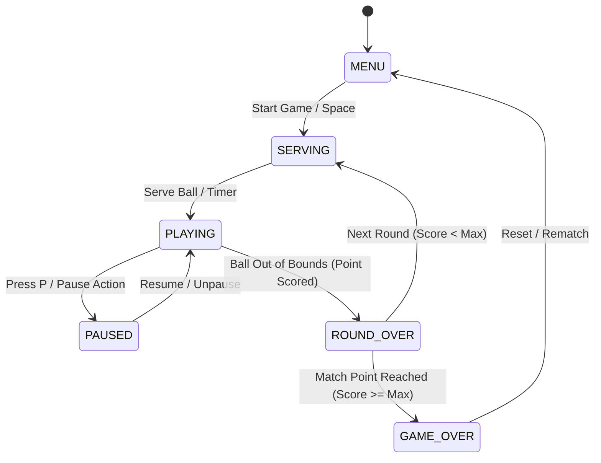

# Pong System Architecture & Technical Reference

**System:** Agentic SSD Pong Engine  
**Version:** 1.0.0 (2026 Standards)  
**Governance:** `harness/node` / Agentic SSD Governance Harness v2.0

---

## 1. Architectural Overview

The Pong Engine is structured as a decoupled, deterministic, event-driven game simulation system with pluggable input, rendering, and audio drivers.

---

## 2. Core Subsystems

### 2.1 Core Mathematical & Physics Models (`src/pong/core/`)

- **Coordinate Space:** Normalized floating-point space bounded by configurable `width` and `height` dimensions.
- **Continuous Collision Detection (CCD):** Prevents ball tunneling at high velocities by sweeping ball position over the sub-step vector.
- **Segmented Paddle Reflection:** The paddle is divided into continuous gradient segments: hitting near the center reflects horizontally with minimal deflection; hitting near the edges produces aggressive steep angular reflections.
- **Spin Dynamics:** Ball angle receives tangential velocity adjustments based on paddle vertical movement at the moment of contact.
- **Velocity Acceleration:** Speed multiplies by a configurable factor (e.g. 1.05x) after each paddle rally to ensure decisive scoring.

### 2.2 Finite State Machine (`src/pong/core/state-machine.ts`)

### 2.3 Multi-Tier AI Subsystem (`src/pong/ai/`)

- **Reactive Tracker (Easy):** Moves paddle toward ball Y position with reaction latency delay buffer and random human error jitter.
- **Trajectory Estimator (Medium):** Raycasts ball vector across top/bottom boundaries to determine exact intercept Y coordinate at paddle X plane.
- **Adaptive Interceptor (Hard/Expert):** Calculates intercept point, anticipates ball spin, and positions the paddle specifically to hit with the upper/lower segment to shoot away from the opponent's paddle.

### 2.4 Audio Subsystem (`src/pong/audio/`)

- Pure procedural audio generation utilizing Web Audio API oscillators:
  - Paddle Bounce: 220Hz Square Wave with 50ms exponential decay.
  - Wall Bounce: 440Hz Sine Wave with 40ms decay.
  - Score Point: 880Hz Sawtooth Wave with 150ms decay.
  - Victory Jingle: Multi-tone arpeggio sequence (440Hz -> 554Hz -> 659Hz -> 880Hz).
- Null Audio Driver for CLI/Headless testing with zero browser audio dependencies.

### 2.5 Multi-Target Rendering (`src/pong/render/`)

- **HTML5 Canvas 2D:** High-DPI support (`window.devicePixelRatio`), glowing CRT retro aesthetic, particle explosion effects on scoring, speed-scaled ball trails.
- **ANSI Terminal 2D:** Renders directly to terminal stdout using ANSI escape codes and Unicode block characters.
- **Headless Null Renderer:** Records frame counts, draw calls, and rendered state snapshots for test assertions without visual overhead.

### 2.6 Accumulator Game Loop (`src/pong/loop/`)

- Implements the canonical "Fix Your Timestep" accumulator pattern:
  $$\text{accumulator} \leftarrow \text{accumulator} + \Delta t$$
  $$\text{while } \text{accumulator} \ge \text{tickRate} \text{ do: } \text{tick()}; \text{accumulator} \leftarrow \text{accumulator} - \text{tickRate}$$
  $$\text{render}(\alpha = \text{accumulator} / \text{tickRate})$$
- Frame-rate independent: game physics remains identical whether running on a 60Hz laptop, 144Hz gaming monitor, or 1000Hz headless testing runner.
