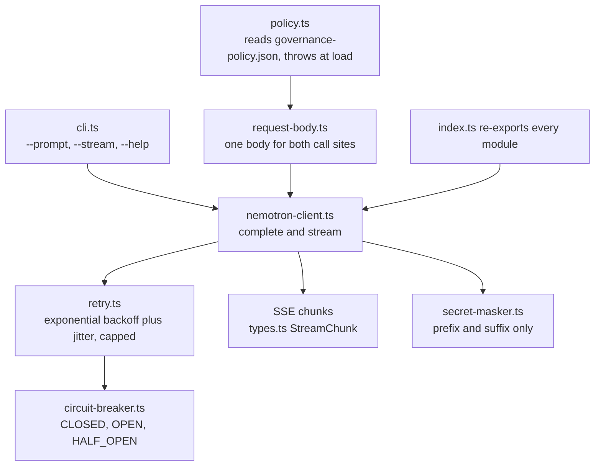

# AGENTS.md — Nemotron client

**Scope:** `nemotron-client.ts`, `circuit-breaker.ts`, `secret-masker.ts`, `policy.ts`, `typescript`
**Owner:** nemotron-reasoner → implementer
**Protected path:** no
**Reviewed:** 2026-09-19

## What this does

This is the TypeScript adapter for the NVIDIA Nemotron NIM endpoint: an
OpenAI-compatible chat client with streaming, a retry budget, a circuit breaker and
a redactor that keeps the credential out of anything the process prints. The
modules are split along the seams the tests need — the retry decision, the request
body and the policy read are each testable without a transport in the loop.

## Map

## Key files

| File | Role |
| --- | --- |
| `nemotron-client.ts` | The client: request construction, SSE stream parsing, token telemetry, and the seam the other modules plug into. |
| `policy.ts` | Timeout, retry budget and sampling defaults read from the shared policy. A missing or non-numeric key throws at module load. |
| `request-body.ts` | Builds the chat-completions body once, so `complete()` and `stream()` cannot disagree about sampling. |
| `retry.ts` | The retry decision on its own: transient fault, 429 or 5xx, up to `maxRetries`, backoff with jitter. |
| `circuit-breaker.ts` | Failure threshold, reset cooldown and half-open success count; `CLOSED`, `OPEN`, `HALF_OPEN`. |
| `secret-masker.ts` | INV-1 / C-AI-SEC-1 redactor. Ten characters of prefix, four of suffix, `<UNSET>` when absent. |
| `types.ts` | The wire contracts: config, chat options, responses and stream chunks. |
| `cli.ts` | `runNemotronCli`: argument parsing and the operator-facing output path. |

## Invariants

- **No literal thresholds.** `timeout_ms`, `max_retries`, `temperature`, `top_p` and
  `max_tokens` come from `harness/shared/governance-policy.json` through `policy.ts`
  (R-NPW-1), and the read fails closed (R-NPW-2). A retry budget of three once
  shipped while the policy said zero, and nothing noticed.
- **One request body, two call sites.** Streaming and non-streaming must not drift
  apart; that is why `request-body.ts` is a pure function taking the policy as an
  argument.
- **The credential never reaches stdout or a log.** Anything key-shaped goes through
  `SecretMasker.mask` first (C-AI-SEC-1, INV-1).
- **Every module stays under `limits.size_budget_lines`.** `retry.ts` was extracted
  from the client for exactly that reason (R-TDH-23), and `eslint.config.js` reads
  the same budget from the policy.
- **Coverage is per file.** `vitest.config.ts` sets `perFile` from the policy, so a
  new module here ships with its own tests or the gate fails on that file alone.
- **ESM, with extensions.** Relative imports carry `.js`; the package is
  `"type": "module"`.

## Commands

| Task | Command |
| --- | --- |
| Vitest with coverage | `make test-node` (root) |
| Lint tier | `make lint-node` (root) |
| Whole-project types | `make types` (in `harness/node`) |
| Coverage plus zero skips | `make cov` (in `harness/node`) |
| Stack-local gate vocabulary | `make pre-pr` (in `harness/node`) |
| Full deterministic gate | `make ci` |

## Agents and skills

| Stage | Agent | Skills |
| --- | --- | --- |
| plan | `.mango/agents/planner.md` | `spec-authoring`, `openspec-peer-review` |
| build | `.mango/agents/nemotron-reasoner.md` | `nemotron-reasoner`, `harness-engineering`, `god-file-decomposer` |
| verify | `.mango/agents/verifier.md` | `validation-runner`, `coverage-gate`, `shadow-channel-analysis` |

## Gotchas

- **The breaker is per client instance, not per process.** Constructing a fresh
  `NemotronClient` per call discards the outage state the breaker exists to carry.
- **Retry classification is narrow on purpose.** Transient network faults, 429 and
  5xx only; a 4xx that is not 429 is the caller's bug and must surface immediately.
- **Adding an export to `index.ts` that nothing imports fails `knip`**, which runs
  inside `make lint-node`. The re-export barrel is not a dumping ground.
- **`cli.ts` prints.** It is the one module whose output an operator reads, so every
  new line it emits is a place a credential can escape — route it through
  `SecretMasker`.
- **Tests for this module live in `harness/node/tests/ai/`, not beside the source.**
  Eight tiers share one Vitest matrix; the `smoke` and `e2e` tiers include live
  suites that load `.env` from the repository root and need a real credential.
- **Editing sampling defaults is a policy change, not a code change.** The numbers
  live in `governance-policy.json`, which is a protected path.
