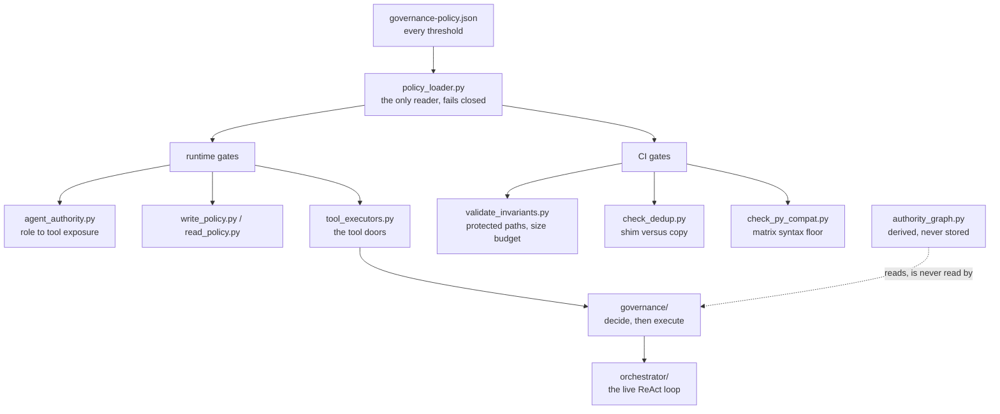

# AGENTS.md — Shared policy kernel

**Scope:** `governance-policy.json`, `policy_loader.py`, `governance/`, `orchestrator/`, `tests/`, `stdlib-only`
**Owner:** nemotron-reasoner → implementer
**Protected path:** no
**Reviewed:** 2026-09-19

## What this does

Everything security-critical is written once, here, and every stack delegates to it
rather than reimplementing it — that is the whole point of the directory and the rule
`check_dedup.py` enforces. It holds the policy the repository is governed by, the
single reader that resolves it, the runtime gates on the agent's tool calls, and the
CI-time gates that judge a diff. Subdirectories carry their own `AGENTS.md`; this
document covers the modules that sit directly here.

## Map

## Key files

| File | Role |
| --- | --- |
| `governance-policy.json` | The policy. Every threshold in the repository is declared here, nowhere else. |
| `policy_loader.py` | The only reader. A present policy missing a declared key raises `PolicyError` rather than substituting a default (DEC-043). |
| `agent_authority.py` | Derives each active role's tool exposure from `agent-policy.json`; holds `ACTIVE_TO_CANONICAL` and `EXECUTION_IDENTITY`. |
| `write_policy.py` | Runtime write gate at tool-call granularity: `protected_paths`, any `.git` segment, any credential filename. |
| `tool_executors.py` | The tool doors themselves, plus the shared write authorization. Protected. |
| `validate_invariants.py` | The CI-time gate: protected paths over staged, modified and untracked files, plus `limits.size_budget_lines`. |
| `meta_tools.py` | `knowledge_gap_log` / `hypothesis_register` — what a reasoner writes instead of guessing. |
| `check_dedup.py` | Drift gate: a per-stack governance script must be a thin shim, never a copy. |

## Invariants

- **No hard-coded thresholds.** Every number comes from `governance-policy.json`
  through `policy_loader`, and the read fails closed. A gate that lowers itself when
  it cannot read its own policy is the defect `coverage_gate.py` replaced.
- **Import direction is enforced by AST, not by grep.** Nothing under `governance/`,
  nor `write_policy.py`, `read_policy.py` or `agent_authority.py`, may import the
  derived views `authority_graph.py`, `authority_call_sites.py` or
  `graph_topology.py`. The whole first-party graph is also asserted acyclic, with
  `governance/verdict.py` at layer 0 (`test_import_direction.py`).
- **Derived views are recomputed, never persisted.** A stored copy of governance
  state is a cache whose staleness has a security consequence (DEC-065).
- **The syntax floor is resolved from the CI matrix, not written down.** Moving the
  matrix moves the gate; it is 3.10 today (`check_py_compat.py`, `make check-compat`).
- **Modules stay under `limits.size_budget_lines`.** A module approaching it is split
  along a real seam, not appended to (`validate_invariants.py`).

## Commands

| Task | Command |
| --- | --- |
| Full deterministic gate | `make ci` |
| Mechanical invariants and validators | `make validate` |
| Shim-versus-copy drift | `make check-dedup` |
| Syntax floor against the matrix | `make check-compat` |
| Governance-marked gates only | `make test-governance` |
| Read the agent memory stores | `make memory-show` |

## Agents and skills

| Stage | Agent | Skills |
| --- | --- | --- |
| plan | `.mango/agents/planner.md` | `spec-authoring`, `openspec-peer-review` |
| build | `.mango/agents/nemotron-reasoner.md` | `harness-engineering`, `god-file-decomposer`, `agent-memory-manager` |
| verify | `.mango/agents/verifier.md` | `validation-runner`, `repo-invariant-review`, `gate-mutation-proof` |

## Gotchas

- **The directory is unprotected; many of its files are not.** `write_policy.py`,
  `read_policy.py`, `tool_executors.py`, `tool_dispatch.py`, `tool_schemas.py`,
  `agent_prompts.py`, `nemotron_bridge.py`, `policy_loader.py`, `agent_authority.py`,
  `validate_invariants.py` and every validator are individually listed in
  `protected_paths`. Touching one needs the `infra-reviewed` label,
  `ALLOW_GITHUB_CHANGES=1` and an attestation row, or `make validate` fails closed.
- **Adding a key to a policy block breaks every adopter policy that predates it.**
  `policy_loader` treats an absent key inside a *declared* block as a `PolicyError`
  (DEC-043). A genuinely new concern gets its own top-level block, which is why
  `agents_doc` is one rather than keys inside `gates`.
- **`harness/shared/langgraph/` shadows the real `langgraph` distribution** when this
  directory lands at the head of `sys.path` — which is what `python harness/shared/x.py`
  does. `coverage_scope._importable` strips its own directory before probing; any new
  probe must do the same or it will report an uninstalled extra as present.
- **A prefix without its trailing slash silently widens a waiver.**
  `harness/shared/langgraph` matched `langgraph_helpers.py` too, and the policy check
  that the prefix names a real directory still passed. Match whole segments.
- **`check_dedup.py` fails a per-stack copy, not a divergence.** Porting logic into
  `harness/node/scripts/` "just for now" fails `make check-dedup` immediately; the
  shim is the contract.
- **Prose here is gated.** A module or report named in `README.md` that does not
  exist fails `test_documentation_claims.py`, and a mermaid label with a bare bracket
  fails `test_documentation_truth.py`.
