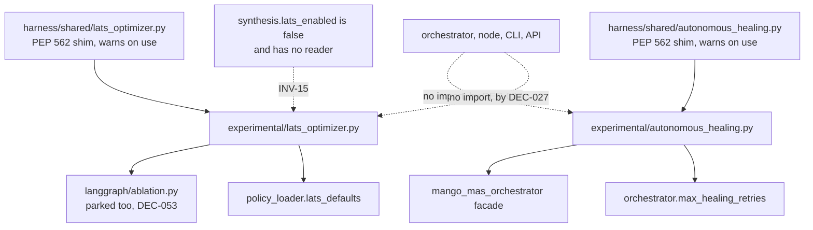

# AGENTS.md — Parked capabilities

**Scope:** `autonomous_healing.py`, `lats_optimizer.py`, `__init__.py`
**Owner:** nemotron-reasoner → implementer
**Protected path:** no
**Reviewed:** 2026-09-19

## What this does

Both modules shipped in v2.3.0 as headline features and have never been reachable
from a runtime path. Leaving them beside the live kernel made the public surface
larger than the tested behaviour, so DEC-027 drew a package boundary instead of
deleting them: nothing here is weakened, and importing from here is visibly opting
into an experiment. The boundary is the whole product of this directory — the code
behind it is unchanged.

## Map

## Key files

| File | Role |
| --- | --- |
| `__init__.py` | The boundary statement: what parked means here, and what it does not mean. |
| `autonomous_healing.py` | `TestHealer` — parses test failures and drives remediation loops through the orchestrator facade. |
| `lats_optimizer.py` | `LATSOptimizer` — UCB1 selection over an MCTS ablation tree, budget from `lats.*`. |

## Invariants

- **INV-15: LATS stays disabled** until its cost-adjusted evaluation threshold is met.
  `synthesis.lats_enabled` is `false` *and has no reader*, so the flag records the
  posture rather than controlling it.
- **No runtime path may import this package.** No orchestrator, node, CLI or API
  module does today; the only first-party importers are the two shims and the tests.
- **Parked is not exempt.** Both modules stay fully tested, coverage-measured against
  the per-file floor, and policy-sourced — `orchestrator.max_healing_retries`,
  `lats.max_budget`, `lats.exploration_weight`. No hard-coded values here either.
- **The old import paths warn on *use*, not on import.** `__getattr__` resolves the
  moved name and warns once per access, so importing the shim stays side-effect free
  (`test_import_purity.py`, `test_deprecation_shims.py`).
- **Wiring either capability onto a runtime path is its own spec**, gated on
  `synthesis.lats_enabled` for LATS. It is not a refactor.

## Commands

| Task | Command |
| --- | --- |
| LATS optimizer and ablation forking | `make test-lats` |
| Healer, shims and the rest | `make test-python` |
| Negative-reward LATS reproduction | `make test-regression` |
| Per-file coverage floors from policy | `make coverage-python` |
| Full deterministic gate | `make ci` |

## Agents and skills

| Stage | Agent | Skills |
| --- | --- | --- |
| plan | `.mango/agents/planner.md` | `spec-authoring`, `openspec-peer-review` |
| build | `.mango/agents/nemotron-reasoner.md` | `harness-engineering`, `tech-debt-audit` |
| verify | `.mango/agents/verifier.md` | `validation-runner`, `regression-pin-author`, `coverage-gate` |

## Gotchas

- **Flipping `synthesis.lats_enabled` to `true` changes nothing.** The key has no
  reader; INV-15 is held by the absence of a caller, not by the flag. A change that
  makes the flag meaningful is a change that wires LATS in, and needs its own spec.
- **This package is parked on top of another parked subsystem.** Both modules import
  `harness.shared.langgraph`, which DEC-053 also parks and plans to move under this
  directory. A revival has to name both parks, not one.
- **The shim is silent on a plain `import`.** `import harness.shared.lats_optimizer`
  emits nothing; `from harness.shared.lats_optimizer import LATSOptimizer` warns.
  That is deliberate — a warning at import time would fire during collection — but it
  means "no warning" is not evidence that nothing uses the old path.
- **`TestHealer` sets `__test__ = False`.** Without it pytest collects the class by
  name and reports phantom failures. Keep it on any future `Test*`-named class here.
- **Deleting a module here is not cleanup.** DEC-027 records the park as the decision
  actually taken; removing either module supersedes that record and drops tests,
  coverage and the shim window with it.
- **Coverage carve-outs do not apply to this directory.** Only
  `harness/shared/langgraph/` is waived under `coverage.optional_extras`, so code
  added here has to carry its own tests to clear the per-file floor.
