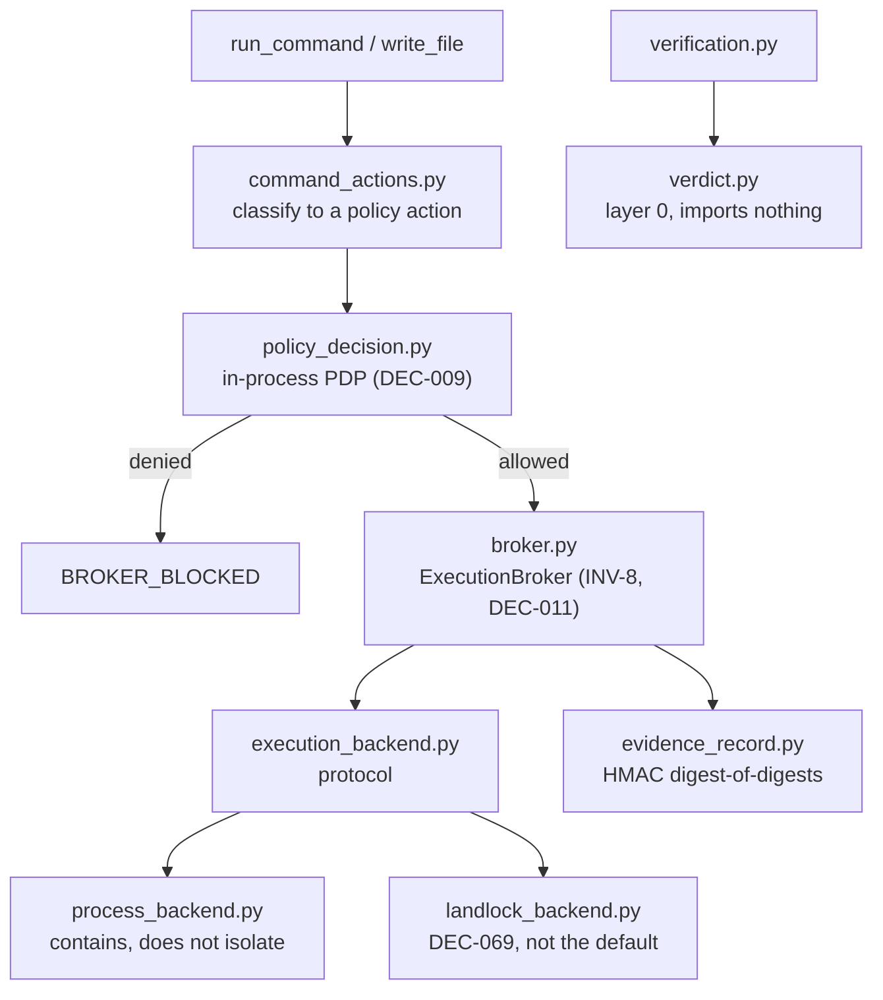

# AGENTS.md — Governance kernel

**Scope:** `broker.py`, `command_actions.py`, `policy_decision.py`, `verification.py`, `verdict.py`, `execution_backend.py`, `evidence_record.py`
**Owner:** nemotron-reasoner → implementer; changes here are reviewed as security changes
**Protected path:** yes — `harness/shared/governance/**`. A write needs `ALLOW_GITHUB_CHANGES=1`, the `infra-reviewed` label and an attestation row. The in-loop reasoner is refused at tool-call time by `write_policy.write_denial_reason` (DEC-007).
**Reviewed:** 2026-09-19

## What this does

This is the layer that decides and the layer that executes, kept apart. Policy
evaluation answers *may this happen*; the broker and its backends answer *and
what actually ran*. Everything an agent does that touches the world outside its
own reasoning passes through here, so a mistake in this directory is not a bug
in a feature — it is the absence of a control the rest of the repository
assumes is present.

## Map

## Key files

| File | Role |
| --- | --- |
| `broker.py` | `ExecutionBroker`. Every `run_command` routes here: pinned cwd, bounded runtime, capped output, credentials stripped from the child environment. |
| `command_actions.py` | Shell command → declared policy action. **Fails closed to `destructive`**, which no role holds. |
| `policy_decision.py` | The in-process policy decision point; mirrors `control-plane/tool_broker_reference.py`. |
| `verification.py` | `VerificationRunner`. Refuses to grade when a protected file changed since the loop started. |
| `verdict.py` | The verdict vocabulary. Layer 0 — it imports nothing first-party, by test. |
| `evidence_record.py` | INV-13 digest-of-digests and JSONL sink. Must not import `broker.py`. |
| `attestation.py` | Derives the protected-path attestation table from the diff. |
| `sandbox_policy.py` | INV-13 in-memory isolation policy (R-AEI-14). |

## Invariants

- **Import direction is enforced by AST.** Nothing here may import
  `authority_graph.py`, `authority_call_sites.py`, `graph_topology.py`,
  `write_policy.py`, `read_policy.py` or `agent_authority.py`
  (`test_import_direction.py`).
- **C-AEI-5:** `evidence_manifest`, `evidence_record`, `execution_backend`,
  `capability_probe`, `sandbox_policy`, `landlock_restrict` and
  `landlock_backend` must not import `broker.py`, and each is declared in that
  module's `LAYERS` map.
- **Fail closed, always.** An unclassified command is `destructive`; an
  unmapped tool is withheld; a missing policy key raises rather than
  substituting a default.
- **No hard-coded thresholds.** Every number comes from
  `governance-policy.json` through `policy_loader`.
- The broker **contains**; it does not isolate. Say so in any doc or comment
  that describes it — `.governance/agent-policy.json` carries the same caveat
  deliberately.

## Commands

| Task | Command |
| --- | --- |
| Gate this directory | `make test-governance` |
| Full deterministic gate | `make ci` |
| Invariants only | `make validate` |
| Prove a gate catches its defect | the `gate-mutation-proof` skill |

## Agents and skills

| Stage | Agent | Skills |
| --- | --- | --- |
| plan | `.mango/agents/planner.md` | `spec-authoring`, `openspec-peer-review` |
| build | `.mango/agents/nemotron-reasoner.md` | `boundary-invariant-review`, `evidence-signing`, `protected-path-attestation` |
| verify | `.mango/agents/verifier.md` | `validation-runner`, `gate-mutation-proof`, `shadow-channel-analysis` |

## Gotchas

- **The direct doors are not the whole surface.** `read_file .env`,
  `write_file .git/hooks/x` and `curl` are all correctly denied, but executing
  a workspace script (`python x.py`, `make <target>`) grades as `test_execute`,
  which every role holds. The 2026 standards audit reproduced a verdict forged
  through that path. Treat any change that widens command classification as a
  security change.
- **A new module here needs a `LAYERS` entry** if it belongs to the C-AEI-5 set,
  and needs to import nothing upward regardless. `test_import_direction.py`
  fails with the cycle spelled out.
- **`GNUmakefile` is not `Makefile`.** `write_denial_reason("GNUmakefile")`
  returned `None`; protected-path patterns are literal, so a new control surface
  needs its own pattern in `governance-policy.json`.
- Editing anything here without the `infra-reviewed` label fails CI at the
  protected-path gate. That is the gate working, not a misconfiguration.
