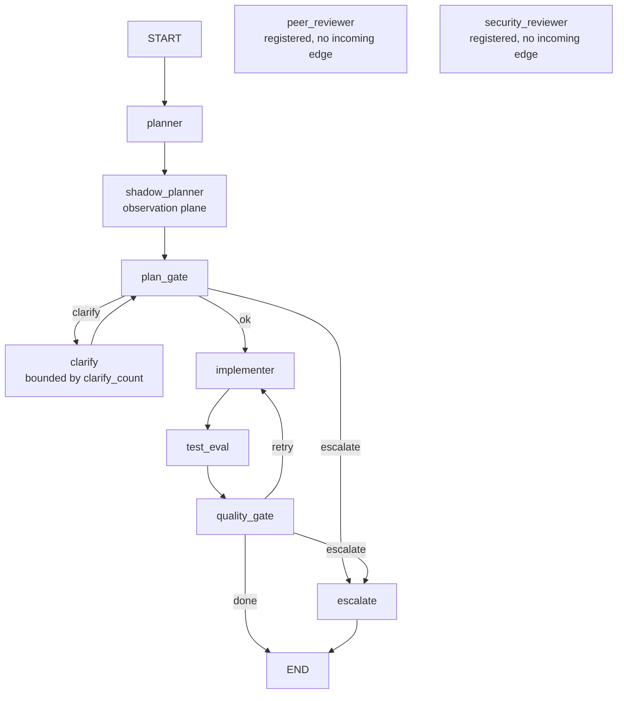

# AGENTS.md — Parked StateGraph

**Scope:** `graph.py`, `state.py`, `nodes.py`, `errors.py`, `node_reasons.py`, the optional `langgraph` extra
**Owner:** nemotron-reasoner → implementer; changes here are reviewed as security changes
**Protected path:** yes — `harness/shared/langgraph/**`. A write needs `ALLOW_GITHUB_CHANGES=1`, the `infra-reviewed` label and an attestation row.
**Reviewed:** 2026-09-19

## What this does

This is an **accepted-parked** experiment (DEC-053), not the production orchestrator —
the live loop is `orchestrator/loop.py`. The park is a decision, not neglect: the
graph stays tested, coverage-measured and fail-closed so it remains recoverable, and
DEC-053's named sunset moves it under `experimental/langgraph/` behind PEP 562 shims
when its release lands. Treat it as a subsystem you may repair and must not wire onto
a runtime path.

## Map

## Key files

| File | Role |
| --- | --- |
| `graph.py` | The `StateGraph` builder: ten registered nodes, conditional edges for both gates. |
| `state.py` | `MangoState`, the 12-channel typed state. LWW channels carry no reducer; accumulators use `operator.add`. |
| `nodes.py` | The node functions. Three are real wrappers; the rest return minimal updates for topology validation. |
| `errors.py` | Grades a contained error as blocking or not. The consumer the `errors` channel previously lacked. |
| `node_reasons.py` | Gate reason constants, so a deterministic failure escalates instead of burning revision budget. |
| `node_executors.py` | The agent-executing nodes, wrapped by `@with_authority` and `@budgeted`. |
| `decorators.py` | `@with_authority` / `@budgeted`; they import downward into governance and nothing imports back. |
| `ablation.py` | MCTS hypotheticals kept off the primary channels, so a rollout cannot mutate `MangoState`. |

## Invariants

- **The park is enforced, not minuted.** `test_graph_topology_parked.py` pins the
  *absence* of a topology CI target to DEC-053's `accepted` status, and pins
  `peer_reviewer` and `security_reviewer` as edgeless against DEC-052's recorded
  state. Both fail in either direction.
- **`graph_topology.py` reads this package's source, never imports it.** That is what
  lets an ordinary test check the topology with no optional extra and no `skipif`
  hunting an INV-2 waiver.
- **Blocking is a floor, not a default.** A record may raise itself to blocking;
  nothing it declares may lower it below its node's classification, and an
  unrecognised node grades blocking (R-LGH-6). An observation-plane failure must not
  decide the control path — that is INV-16.
- **`revision_count` is last-write-wins on purpose.** Under `operator.add` a
  quality-gate retry loop counts 1, 3, 6, 10 instead of 1, 2, 3, 4.
- **Every channel value stays JSON-serializable**, `Path` included, for checkpointer
  compatibility.

## Commands

| Task | Command |
| --- | --- |
| The graph suites plus their regression | `make test-langgraph` |
| Ablation and LATS state forking | `make test-lats` |
| Whole Python suite | `make test-python` |
| Governance-marked gates only | `make test-governance` |
| Full deterministic gate | `make ci` |

## Agents and skills

| Stage | Agent | Skills |
| --- | --- | --- |
| plan | `.mango/agents/planner.md` | `spec-authoring`, `openspec-peer-review` |
| build | `.mango/agents/nemotron-reasoner.md` | `boundary-invariant-review`, `protected-path-attestation` |
| verify | `.mango/agents/verifier.md` | `validation-runner`, `shadow-channel-analysis`, `gate-mutation-proof` |

## Gotchas

- **Wiring this onto the live path is out of scope without a revival spec.** DEC-053
  rejected promotion explicitly. Deepening the stack costs an optional extra, coverage
  carve-outs, a deselection env var and a protected-path attestation on every PR.
- **These tests are deselected, never skipped.** A CI leg that cannot install the
  extra sets the env var named by `coverage.optional_extras`, so the `langgraph`-marked
  suites are deselected — INV-2 counts a skip as a failure. Local runs without the
  library keep the `skipif`, so what you see locally is not what CI does.
- **This directory shadows the real `langgraph` distribution** whenever
  `harness/shared/` reaches the head of `sys.path`. A probe that does not strip its
  own directory reports the extra installed when nothing is.
- **Containment is not consequence.** Every node wraps side effects in `try/except`
  and appends to `errors`; before `errors.py` nothing *read* that channel, so a denied
  planner produced a `VERIFIED` verdict over an empty plan. Adding a node without
  classifying it is safe by construction — it grades blocking.
- **Half the nodes are still stubs**, and they say so in their own docstrings —
  `peer_reviewer`, `security_reviewer`, `clarify`, `escalate` and a shadow planner
  that always reports 0.0 divergence (DEC-053's audit finding). `test_langgraph_graph.py`
  asserts the node *set*, which a stub satisfies; a green run is not "the node works".
- **No side effects before an `interrupt()`.** Nodes may re-execute.
