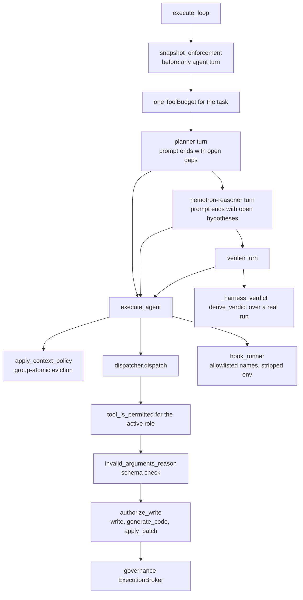

# AGENTS.md — Live agent loop

**Scope:** `loop.py`, `dispatcher.py`, `hook_runner.py`, `__init__.py`
**Owner:** nemotron-reasoner → implementer; changes here are reviewed as security changes
**Protected path:** yes — `harness/shared/orchestrator/**`. A write needs `ALLOW_GITHUB_CHANGES=1`, the `infra-reviewed` label and an attestation row. This is the runtime enforcement layer DEC-042 protected: an agent that could edit it could widen its own next write mid-task.
**Reviewed:** 2026-09-19

## What this does

This is the production planner → reasoner → verifier loop — the one that actually
runs, as opposed to the parked `StateGraph` next door. It decides what each role is
allowed to call, spends one bounded budget across all three turns, and derives a
verdict from a verification run rather than from anything the model said. Its job is
to be the narrow place where a model's output becomes an action, so every check the
rest of the repository declares has exactly one path to be applied on.

## Map

## Key files

| File | Role |
| --- | --- |
| `loop.py` | `ExecutionLoop`: the three turns, the shared budget, the context-window policy, the enforcement baseline and the derived verdict. |
| `dispatcher.py` | `ToolDispatcher`: role permission, argument schema check, then the executor. Every write-shaped tool passes `authorize_write` first. |
| `hook_runner.py` | `HookRunner`: runs only names in `PERMITTED_HOOK_NAMES`, with a policy-resolved timeout and an environment stripped of credentials. |
| `__init__.py` | The package's three public names; nothing else is exported. |

## Invariants

- **One budget per task, not per role.** `ToolBudget(max_tool_calls_per_task)` is
  built once in `execute_loop` and passed to all three turns. Handing each role a
  fresh allowance enforced the declared limit at three times its value — found by the
  2026 standards audit (M1), pinned by `test_orchestrator_agent_loop.py`.
- **The verdict is derived, never asserted.** `_harness_verdict` runs the
  verification target and grades the result; an unconfigured or re-entrant runner
  returns an explicit non-verdict rather than a pass (`governance/verdict.py`).
- **The enforcement baseline is taken before any agent turn.** A baseline recorded
  after the reasoner would digest the forgery as its own reference; a protected file
  that changed mid-loop makes `VerificationRunner` refuse to grade
  (`regression/test_verdict_forgery_regression.py`).
- **No unbounded construction.** `HookRunner` resolves `orchestrator.tool_timeout_sec`
  itself; a `None` timeout reaching `subprocess.run` hung the loop and, through
  `run_in_threadpool`, an API worker (R-CQ-7).
- **Hook names are an allowlist.** An unrecognised name is refused, so a hook the
  orchestrator could not have constructed cannot be invoked through it.

## Commands

| Task | Command |
| --- | --- |
| The four orchestrator suites and the rest | `make test-python` |
| Dispatch edge cases and budget handling | `make test-regression` |
| Governance-marked gates only | `make test-governance` |
| Full deterministic gate | `make ci` |
| Attestation table for this branch | `make attestation` |

## Agents and skills

| Stage | Agent | Skills |
| --- | --- | --- |
| plan | `.mango/agents/planner.md` | `spec-authoring`, `openspec-peer-review` |
| build | `.mango/agents/nemotron-reasoner.md` | `protected-path-attestation`, `boundary-invariant-review`, `agent-memory-manager` |
| verify | `.mango/agents/verifier.md` | `validation-runner`, `gate-mutation-proof`, `regression-pin-author` |

## Gotchas

- **The in-loop reasoner cannot edit this directory, by design.** `write_policy`
  refuses the tool call at runtime; CI refuses the diff without the label. Both
  firing is the control working, not a misconfiguration.
- **Permission, arguments and write authority are three separate checks.** A tool the
  role holds can still be refused for a malformed argument, and a well-formed write
  can still be refused by `authorize_write`. Short-circuiting any one of them to fix
  a test removes a control the other two do not cover.
- **`execute_sequential_thinking_loop` is public surface.** DEC-027 removed the
  private orchestrator pass-throughs that existed only for tests, but kept this one:
  `orchestrator-tool-registry.md` R-ORCH-4 pins it and R-VP-11 requires its prose
  return. Address `dispatcher` and `hook_runner` directly from tests instead.
- **Context eviction is group-atomic.** Dropping half a tool-call group leaves a
  transcript the model cannot answer; `context_policy.apply_context_policy` evicts
  whole groups, and `regression/test_context_window_budget_regression.py` pins it.
- **A hook will not see your token.** `credential_env_names()` sweeps any variable
  whose name marks it as a credential out of the hook subprocess environment, so a
  hook that reads `MY_TOKEN` gets nothing.
