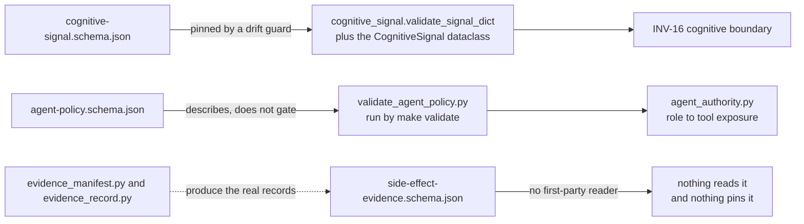

# AGENTS.md — Documentation schemas

**Scope:** `agent-policy.schema.json`, `cognitive-signal.schema.json`, `side-effect-evidence.schema.json`
**Owner:** planner → spec-analyst
**Protected path:** no
**Reviewed:** 2026-09-19

## What this does

These three JSON Schema documents describe the shapes the repository exchanges, and
**none of them is the enforcement**. No `jsonschema` dependency is declared anywhere
in the project, so nothing loads these files to validate anything; the enforced
validators are Python, and they are the authority. The documents exist so a reader —
human or adopter — can see a shape whole rather than reconstructing it from
validator branches. Their one real risk is drifting away from the code they describe.

## Map

## Key files

| File | Role |
| --- | --- |
| `cognitive-signal.schema.json` | The v1 envelope crossing the cognitive boundary. Its own `description` names the Python validator as the enforced one. The only file here with a drift guard. |
| `agent-policy.schema.json` | The shape of `agent-policy.json`: `default_deny`, `high_risk_actions`, `limits`, per-agent `allowed_actions` and `human_approval_required_for`. |
| `side-effect-evidence.schema.json` | Trace, actor, action, resource, policy id and version, decision, timestamp — the evidence INV-7 asks each side effect to carry. |

## Invariants

- **The Python validator is the authority, always.** A disagreement between a
  document here and the code is a defect in the document. Never relax a validator to
  match a schema.
- **The cognitive envelope may not drift.** `test_cognitive_signal.py` asserts that
  `properties` equals the `CognitiveSignal` dataclass fields, that `required` equals
  `_REQUIRED_STR_FIELDS` plus `payload`, that `additionalProperties` is `false`, and
  that `schema_version.const` equals `ACCEPTED_SCHEMA_VERSION`.
- **`schema_version` is an exact pin, not a floor.** Any shape change to the envelope
  is a breaking change and gets a new version.
- **Identity and telemetry only (INV-16, C-MMI-2).** No field of a cognitive signal
  grants, transfers or modifies authority — `confidence` and producer identity
  included. A field proposed here that a control path would read is out of scope.
- **The policy shape is enforced by `validate_agent_policy.py`**, not by this
  document: required roles present, `default_deny` true, delegation within
  `max_delegation_depth`, approvals a subset of allowed actions, and every high-risk
  allowed action approval-gated.

## Commands

| Task | Command |
| --- | --- |
| Run the policy validator that actually gates | `make validate` |
| The cognitive-envelope drift guard | `make test-governance` |
| Whole Python suite | `make test-python` |
| Full deterministic gate | `make ci` |

## Agents and skills

| Stage | Agent | Skills |
| --- | --- | --- |
| plan | `.mango/agents/planner.md` | `spec-authoring`, `openspec-peer-review` |
| build | `.mango/agents/nemotron-reasoner.md` | `boundary-invariant-review`, `harness-engineering` |
| verify | `.mango/agents/verifier.md` | `validation-runner`, `evidence-signing` |

## Gotchas

- **`side-effect-evidence.schema.json` has no reader and no drift guard.** Nothing in
  the repository imports, loads or compares it, so it can fall out of step with
  `evidence_record.py` silently and indefinitely. Changing evidence fields without
  touching this file will not fail any gate — check it by hand, or give it a guard.
- **Two of the three accept unknown keys.** Only the cognitive envelope declares
  `additionalProperties: false`. Even if a validator were wired up tomorrow, the
  policy and evidence documents would pass a payload carrying fields nobody declared.
- **Editing the document is not editing the contract.** Adding a property here grants
  nothing; the validator, the dataclass and `agent-policy.json` are where a field
  becomes real. For the cognitive envelope the drift guard will tell you immediately;
  for the other two, nothing will.
- **`agent-policy.json` itself is a protected path** even though this directory is
  not. Changing the shape described here usually means changing that file too, which
  needs `ALLOW_GITHUB_CHANGES=1`, the `infra-reviewed` label and an attestation row.
- **A schema is not a spec.** Acceptance criteria belong in `docs/specs/`, where
  `make specs` and the INV-17 plan rules can read them.
