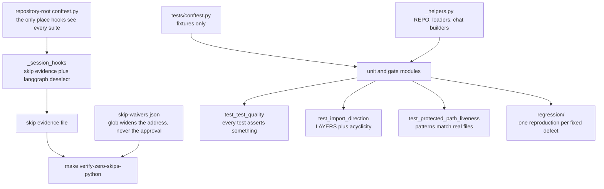

# AGENTS.md — Python AQA engine

**Scope:** `conftest.py`, `_helpers.py`, `skip-waivers.json`, `regression/`, `pytest`
**Owner:** verifier → test-eval
**Protected path:** no
**Reviewed:** 2026-09-19

## What this does

This is not only a unit-test suite. A large share of the modules here assert nothing
about a function: they gate the repository itself — protected-path patterns, CI
wiring, import direction, documentation truth, policy consistency, and the suite's
own quality floor. That is why so many carry `pytest.mark.governance` and why
`make test-governance` selects by marker rather than by a hand-kept list. A test here
is frequently the *only* enforcement a written invariant has.

## Map

## Key files

| File | Role |
| --- | --- |
| `conftest.py` | Fixtures only — `api_key`, `project_root`, `shared_dir`, `tmp_git_repo`, `governance_workspace`, and the `POSIX_ONLY` marker. Protected. |
| `_helpers.py` | `REPO`, `load_module_by_path` for the unimportable `control-plane` package, and OpenAI-shaped chat builders. Underscore-prefixed so pytest does not collect it. |
| `_session_hooks.py` | The logic the **root** conftest wires: skip evidence and langgraph deselection, sharing one env-var name with the coverage waiver. |
| `skip-waivers.json` | The Python half of INV-2. Each waiver names a decision id the skip reason must repeat. |
| `test_import_direction.py` | The `LAYERS` map plus whole-graph acyclicity; `verdict.py` imports nothing first-party. |
| `test_test_quality.py` | The suite's own floor: a test that cannot fail is worse than a missing test. |
| `test_protected_path_liveness.py` | Every `protected_paths` pattern matches real files, or is declared dormant with a reason. Protected. |
| `regression/` | The tier holding one standalone reproduction per defect that reached `main`. |

## Invariants

- **INV-2: a skip is a failure** unless that individual test has a live,
  decision-backed waiver. `make verify-zero-skips-python` reads the evidence the root
  conftest writes against `skip-waivers.json`, and the skip reason must carry the
  waiver's `DEC-` id — the glob widens the address, never the approval.
- **A waiver glob is scoped to the class or nodeid carrying the skip condition**,
  never a whole module: a module-wide glob pre-approves skips nobody has written yet
  (R-GT-7).
- **Session hooks belong at the repository root.** Pytest scopes a conftest's
  per-item hooks to its own directory, so while they lived here a skip under
  `harness/api_server/tests` was never recorded (DEC-030, R-TDH-26).
- **Every test asserts something.** `ASSERTION_FREE_WAIVERS` is empty; keep it empty.
- **Every scan carries a positive control.** A gate whose walker matches nothing
  reports success for free, which is why the suite is full of `TestTheScanWorks`
  (`test_invariant_liveness.py`), `TestTheGateIsNotVacuous` and `*_is_not_vacuous`.
- **Test modules stay under `limits.test_size_budget_lines`**, enforced by
  `validate_invariants.py` like any other file.

## Commands

| Task | Command |
| --- | --- |
| Whole suite, seeded random order | `make test-python` |
| Governance-marked gates only | `make test-governance` |
| The Python half of INV-2 | `make verify-zero-skips-python` |
| Waiver file shape, no pytest needed | `make verify-skip-waivers` |
| Coverage floors from policy | `make coverage-python` |
| Full deterministic gate | `make ci` |

## Agents and skills

| Stage | Agent | Skills |
| --- | --- | --- |
| plan | `.mango/agents/planner.md` | `spec-authoring`, `openspec-peer-review` |
| build | `.mango/agents/nemotron-reasoner.md` | `harness-engineering`, `regression-pin-author` |
| verify | `.mango/agents/verifier.md` | `validation-runner`, `gate-mutation-proof`, `coverage-gate` |

## Gotchas

- **`conftest.py` is a protected path** (`**/conftest.py`) although this directory is
  not, and so are `test_protected_path_liveness.py`, `test_coverage_policy_enforcement.py`
  and anything matching `tests/*ci_gate*.py`. The verifier's verdict is a
  `make test-python` run that imports the root conftest — that is why.
- **Deselected is not skipped.** A leg without the `langgraph` extra sets the env var
  from `coverage.optional_extras` and the marked suites are deselected; they vanish
  from the run without becoming skips. Locally they hit `skipif` instead, so a clean
  local run and a clean CI run mean different things.
- **A new marker must be registered in `pyproject.toml`.** `--strict-markers` is on,
  and the default `addopts` already apply `-m 'not live'`, `--disable-socket` and
  `--allow-unix-socket`; a test needing a real socket has to say so explicitly.
- **Helpers must start with an underscore**, or pytest collects the module and a
  helper named `test_*` runs as a test.
- **Writing a gate is not the same as wiring one.** A check that never runs from a
  `make` target is invisible to `test_ci_gate_coverage.py`, which maps every
  `ci_required_targets` entry to something CI actually reaches.
- **Prove a new gate catches its defect.** Mutate the thing it guards and watch it go
  red first — the `gate-mutation-proof` skill is the procedure.
