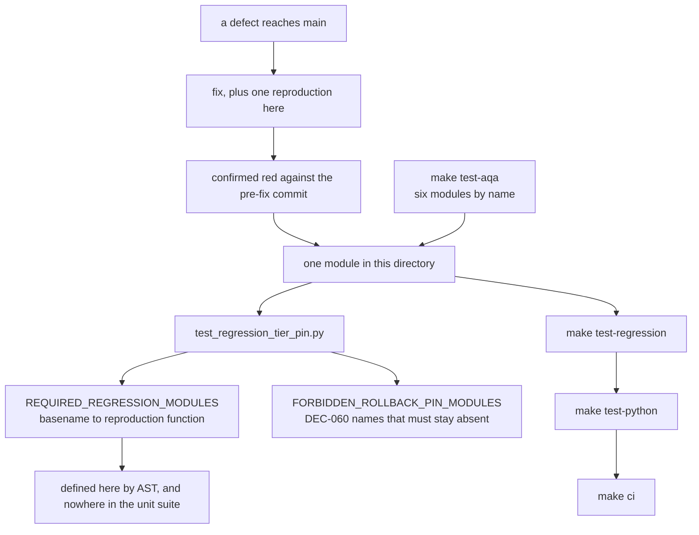

# AGENTS.md — Regression tier

**Scope:** `test_regression_tier_pin.py`, `conftest.py`, `test_verdict_forgery_regression.py`, `pytest`
**Owner:** verifier → test-eval
**Protected path:** no
**Reviewed:** 2026-09-19

## What this does

One standalone reproduction per defect that already reached `main`. Every module here
was confirmed **failing against the pre-fix commit** before its fix landed, because a
test in this directory that cannot fail is worse than no test — it converts an open
question into a false assurance. The tier is selected by **path**, not by a marker:
the directory is already the selector, so a marker would need registering in
`pyproject.toml` for no extra selectivity.

## Map

## Key files

| File | Role |
| --- | --- |
| `test_regression_tier_pin.py` | The tier's own gate: which reproductions must live here, under which function name, and which retired filenames must stay gone. |
| `conftest.py` | Tier-local fixtures — `agent_workspace`, `no_ambient_credentials`. The parent conftest still applies. Protected. |
| `test_verdict_forgery_regression.py` | A verdict forged by changing a protected file mid-loop; the baseline refuses to grade. |
| `test_langgraph_regression.py` | StateGraph invariants, calling conventions, reductions and the fail-closed verdict. |
| `test_cross_platform_regression.py` | Path, environment and secret invariants that only break off Linux. |
| `test_gaps_memory_integrity.py` | MEM-1: the stub detector is driven through the real writer, not read from ambient memory. |
| `test_capability_probe_vocabulary_regression.py` | AQA-007: host inventory JSON is not `BackendCapabilities` and must never be passed as it. |
| `test_process_backend_isolation_regression.py` | AQA-006: a recording backend with a probe override is always available. |

## Invariants

- **One reproduction per fixed defect**, standalone, confirmed red before its fix.
- **A pinned module is pinned three ways.** `REQUIRED_REGRESSION_MODULES` maps a
  basename to a function that must be *defined* there — parsed with `ast`, not
  grepped — and that same name must not be defined anywhere under the unit suite.
- **Retired names stay retired.** DEC-060 deleted the inverted NS-17 / NS-21 rollback
  pins; reviving either filename fails until that decision is superseded. The defect
  being reproduced is the revival itself, so the pin asserts *absence*.
- **The tier runs inside `make test-python`**, and therefore inside `make ci` —
  pinned by `test_makefile_contracts.py`, so it cannot quietly become opt-in.
- **INV-2 applies here too.** A skip in this directory is a failure unless it has a
  decision-backed waiver in `../skip-waivers.json` whose id the reason repeats.

## Commands

| Task | Command |
| --- | --- |
| The tier alone | `make test-regression` |
| The six-module AQA subset | `make test-aqa` |
| The whole Python suite, which includes it | `make test-python` |
| Graph suites plus their regression | `make test-langgraph` |
| Full deterministic gate | `make ci` |

## Agents and skills

| Stage | Agent | Skills |
| --- | --- | --- |
| plan | `.mango/agents/planner.md` | `spec-authoring`, `openspec-peer-review` |
| build | `.mango/agents/nemotron-reasoner.md` | `regression-pin-author`, `harness-engineering` |
| verify | `.mango/agents/verifier.md` | `validation-runner`, `gate-mutation-proof`, `coverage-gate` |

## Gotchas

- **Dropping a file here does not pin it.** Only a row in `REQUIRED_REGRESSION_MODULES`
  makes a reproduction survive a future rename or move. Without one, the file can be
  deleted and every gate stays green.
- **Renaming the reproduction *function* breaks the pin**, not just renaming the file.
  The pin names both, and it fails in both directions — copying the function up into
  the unit suite fails it too.
- **`make test-aqa` is a subset, not the tier.** It names six modules; a green
  `test-aqa` says nothing about the other reproductions.
- **Do not assert over ambient runtime state.** `test_gaps_memory_integrity.py` was
  renamed from a test that read one machine's `.mango/memory/` store — gitignored
  state a clean checkout never has, so the assertion was vacuous there. Drive the
  defect through the real writer instead.
- **The parent `conftest.py` still applies.** Pytest walks the whole chain, so the
  hermetic-environment autouse fixture is inherited; repeating it here creates two
  sources of truth for one setup.
- **`test_regression_tier_pin.py` computes its own repo root at `parents[4]`.**
  Moving this directory one level changes that number silently, and a wrong root
  still resolves to *a* directory — the assertions then check the wrong files.
