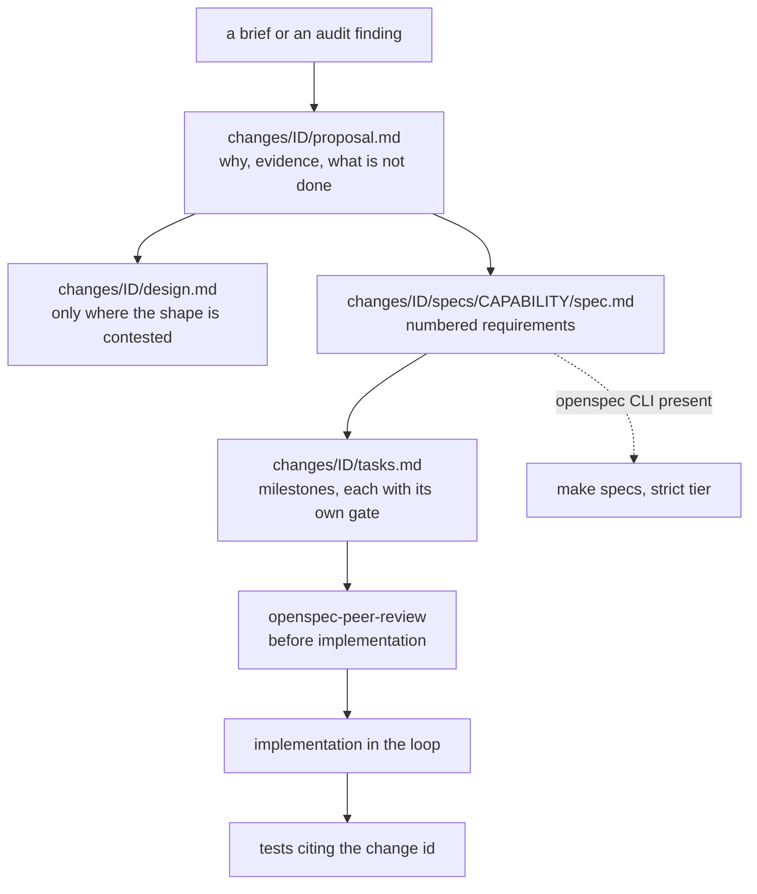

# AGENTS.md — Change proposals

**Scope:** `changes/`, `changes/add-egress-floor/proposal.md`, `changes/add-neurosym-governed-synthesis/design.md`, `changes/fix-protected-path-portability/tasks.md`
**Owner:** planner → spec-analyst; plans and delegates only, never implements from this directory
**Protected path:** no — `openspec/**` matches no `protected_paths` pattern, so a proposal lands under ordinary review. The code a landed proposal touches usually *is* protected, which is what the review before implementation is for.
**Reviewed:** 2026-09-19

## What this does

A change package is written, reviewed and agreed *before* anything is
implemented, so the verifier has an objective target rather than a
reconstruction of what the reasoner happened to do. Each `changes/<change-id>/`
holds the argument (`proposal.md`), the sequenced work (`tasks.md`), the
normative requirements (`specs/<capability>/spec.md`) and, where the shape is
contested, the alternatives considered (`design.md`). Three are live.

## Map

## Key files

| File | Role |
| --- | --- |
| `changes/` | Every change package. One directory per change id; the id is what tests and decision records cite. |
| `changes/add-egress-floor/` | Proving absence of network egress rather than arranging it: socket floor, transport seam, negative control that works inside the control. |
| `changes/add-neurosym-governed-synthesis/` | The largest live package — four capabilities (`neuro-symbolic-synthesis`, `code-execution`, `agent-evaluation`, `governance-control-plane`) and the only one carrying a `design.md`. |
| `changes/fix-protected-path-portability/` | Protected-path matching that survives platform differences; pinned by `harness/shared/tests/test_protected_path_portability.py`, which names this change id in its docstring. |
| `changes/add-egress-floor/proposal.md` | The shape every proposal follows: status line, `## Why`, evidence quoted from real files, and an explicit account of what the commonly cited prior art does *not* do. |
| `changes/add-egress-floor/tasks.md` | Milestones, each closing with a **Gate:** line naming the command that proves it. A milestone with no gate is not done, it is asserted. |
| `changes/add-egress-floor/specs/egress-floor/spec.md` | Problem statement, status, and numbered requirements the verifier checks against. |
| `changes/add-neurosym-governed-synthesis/design.md` | Alternatives and the reason for the one chosen; written only when the decision is not obvious from the proposal. |

## Invariants

- **Reviewed before implemented.** The spec is the contract; CLAUDE.md forbids
  implementing a non-trivial change without one, and the verifier grades
  against its acceptance criteria rather than against the diff.
- **A requirement is falsifiable or it is not a requirement.** The structural
  tier rejects unfalsifiable acceptance language and unfilled template
  scaffold; the rules live in `harness/shared/plan_rules.py`.
- **A change id is a citation.** Tests and decision records name it, so
  renaming a directory breaks references that no compiler checks.
- **Every milestone names its own gate**, as an exact command, not a promise.

## Commands

| Task | Command |
| --- | --- |
| Validate spec documents (all three tiers) | `make specs` |
| Scaffold a new `docs/specs/<feature>.md` | `make spec NAME=<feature>` |
| Pre-PR review checklist | `make review` |
| Full deterministic gate | `make ci` |

## Agents and skills

| Stage | Agent | Skills |
| --- | --- | --- |
| plan | `.mango/agents/planner.md` | `spec-authoring`, `openspec-peer-review` |
| build | `.mango/agents/nemotron-reasoner.md` | `harness-engineering` |
| verify | `.mango/agents/verifier.md` | `validation-runner`, `repo-invariant-review` |

## Gotchas

- **`make specs` does not read this directory by default.** `SPEC_DIR` in
  `harness/shared/validate_specs.sh` defaults to `docs/specs`, so the
  structural and plan tiers examine that tree, not this one. A malformed
  package here passes CI in silence.
- **The strict tier is unenforced at root.** `openspec` is pinned nowhere, so
  `validate_specs.sh` takes its WARNING branch on every root run;
  `REQUIRE_STRICT_SPEC_VALIDATOR=1` is set only in the adopter workflow
  templates under `harness/node/` and `harness/jvm/`, which GitHub never
  executes. `test_ci_gate_coverage.py` records this as a known, deliberate gap.
- **A status line is prose, not a gate.** `Status: proposed` in a proposal and
  `Status: APPROVED` in its spec are checked by nobody; `[DONE]` on a milestone
  is a claim until the gate command's output is in the PR.
- **`openspec/` and `docs/specs/` are different things.** Change packages live
  here; the feature specs the gates run over live there. A change that needs
  mechanical validation needs a `docs/specs/<feature>.md` counterpart too.
- **The plan tier only examines plans git reports as modified**, so a run that
  touches no spec examines nothing — it says so on stdout rather than
  reporting a silent pass. Read the output, not the exit code.
