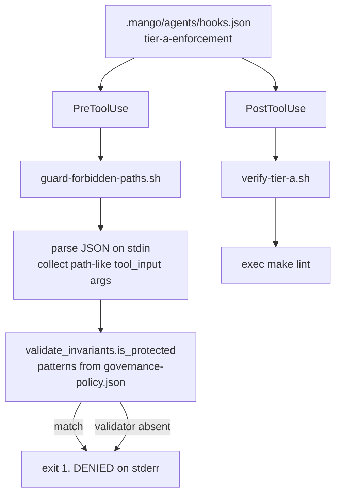

# AGENTS.md — Hook shims

**Scope:** `guard-forbidden-paths.sh`, `verify-tier-a.sh`, `PreToolUse`, `PostToolUse`
**Owner:** verifier → security-reviewer; one of these is a deny decision, so it is reviewed as a security change
**Protected path:** no — `scripts/**` matches no `protected_paths` pattern. What they delegate *to* is protected: `harness/shared/validate_invariants.py` and the root `Makefile` both are, so the policy stays behind a gate even though its callers do not.
**Reviewed:** 2026-09-19

## What this does

Exactly two shims, and the discipline is that they stay shims. Each is a thin
delegator from a tool-use hook to the canonical gate that already exists —
never a second copy of the rule. A guard that reimplemented protected-path
matching would drift from `governance-policy.json` silently and start allowing
writes the policy denies, which is the whole failure mode `make check-dedup`
exists to catch elsewhere in the repository.

## Map

## Key files

| File | Role |
| --- | --- |
| `guard-forbidden-paths.sh` | PreToolUse. Reads the hook payload from stdin, pulls every `tool_input` value whose key contains `path` or `file` (or is `target`/`destination`), resolves each against the repo root, and checks it with `is_protected` / `load_protected_patterns` from `harness/shared/validate_invariants.py`. **Fails closed**: a missing validator exits 1 before any path is examined. |
| `verify-tier-a.sh` | PostToolUse. `exec make lint` from the repo root. `make ci` is deliberately not used — it is far too slow to run on every tool call, and the fast style/type pass is the right scope for per-tool-use enforcement. |

## Invariants

- **Thin delegators, no policy.** The protected-path predicate lives in
  `validate_invariants.py` and the lint recipe in the `Makefile`;
  `test_guard_shim_uses_validate_invariants` and
  `test_verify_tier_a_delegates_to_makefile` fail a shim that stops delegating.
- **No hard-coded paths of any kind** — Windows drive letters, `/home/...`,
  `/Users/...`, `/root/...`, literal project names
  (`test_hook_shim_has_no_hardcoded_paths`). The repo root is derived with
  `git rev-parse --show-toplevel` and a directory-relative fallback
  (`test_guard_shim_uses_dynamic_repo_root`).
- **Both exist and carry a bash shebang** (`test_hook_shim_exists`,
  `test_hook_shim_has_bash_shebang`). The whole file is pinned by
  `harness/shared/tests/regression/test_scripts_hook_shims.py` (AQA-001).
- **Fail closed, always.** A missing validator is a denial, not a pass; an
  unparseable payload exits 0 only because there is then no path to judge.

## Commands

| Task | Command |
| --- | --- |
| What `verify-tier-a.sh` runs | `make lint` |
| The validator the guard calls into | `make validate` |
| The regression tier that pins these shims | `make test-regression` |
| Full deterministic gate | `make ci` |

## Agents and skills

| Stage | Agent | Skills |
| --- | --- | --- |
| plan | `.mango/agents/planner.md` | `spec-authoring` |
| build | `.mango/agents/nemotron-reasoner.md` | `harness-engineering`, `protected-path-attestation` |
| verify | `.mango/agents/verifier.md` | `validation-runner`, `gate-mutation-proof`, `boundary-invariant-review` |

## Gotchas

- **Nothing in this repository fires these today.** Their only binding is the
  `tier-a-enforcement` profile in `.mango/agents/hooks.json`, and
  `.claude/settings.json` — the file Claude Code reads — registers SessionStart
  alone. They are correct, tested, and unreached unless an external runner
  loads that profile. Do not cite `guard-forbidden-paths.sh` as the reason a
  protected path is safe; the CI gate is.
- **A PostToolUse pass is not a CI pass.** `make lint` is ruff, ruff-format,
  mypy, vulture and the compat check — not tests, not coverage, not
  `validate_invariants`. Green here says nothing about `make ci`.
- **`exec` replaces the shell.** Anything appended after the `exec make lint`
  line in `verify-tier-a.sh` will never run, and nothing will tell you.
- **The guard only sees arguments it recognises.** A tool whose payload names
  its destination something other than `*path*`, `*file*`, `target` or
  `destination` slips past with exit 0. Widening that key set is a security
  change, not a convenience fix.
- **Adding a third script here is a decision.** Two shims are the budget the
  regression pin is written against; a new one needs its own binding, its own
  test, and a reason it cannot be a target in the `Makefile` instead.
